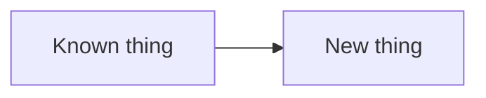

# Chapter Template

## Chapter Metadata

Start each substantive chapter with a short metadata block before the reader-facing content. Keep values plain and explicit so future maintainers and review agents can reason about the chapter without reconstructing context from prose.

```yaml
chapter_id: part-01-xx-short-slug
status: draft | reviewed | published | later-draft
safety_level: conceptual | local-lab | local-routing-daemon | tunnel-lab | dn42-facing
lab_id: none | experiments/labs/<lab-name>
depends_on:
  - prior chapter or named checkpoint
transcript: none | experiments/transcripts/<tracked-transcript>.txt
source_ids:
  - source-id-from-research-sources
tested_environment:
  host: "macOS + OrbStack | Linux VM | research required"
  distro: "Ubuntu 24.04 | research required"
  kernel: "recorded value or research required"
  bird: "recorded value | not used | research required"
  wireguard_tools: "recorded value | not used | research required"
technical_review:
  required: true | false
  reviewer: pending | reviewer-name
  status: pending | deferred | complete
```

Use `required: true` for BIRD, WireGuard, DN42, firewall, DNS, routing-policy, or real-network operational chapters. For purely editorial or mechanical changes, set `required: false` and explain the reason in the issue closeout.

## Reader Starting Point

State what the reader is expected to know before this chapter. If a required idea has not already been introduced, introduce it here instead of assuming it.

Use `docs/reader-knowledge.md` as the source of truth for what prior chapters have taught.

## Concept

Explain the stable networking idea in plain language. Use concrete nouns before acronyms.

State how this chapter helps answer the guiding question: how does an Internet emerge from a collection of computers exchanging routes?

Apply `docs/authoring-templates/internet-readiness-standard.md`. State what Internet concept this chapter teaches, what capability the reader gains, and what real-network gap remains.

## New Terms

Define every new term before using it as if the reader already knows it.

| Term | Plain-language meaning | Concrete example in this chapter |
| --- | --- | --- |
| `term` | Short explanation. | Command, packet, route, interface, or object. |

Update `docs/reader-knowledge.md` for every term this chapter teaches for the first time.

Add new terms to `docs/glossary.md` by default. Add a term to `includes/abbreviations.md` only when it should appear as a high-value global tooltip: acronyms, proper tools or protocols, safety-critical concepts, or ideas readers commonly confuse after introduction. Common nouns such as route, address, prefix, interface, service, and port should usually stay glossary-only after they have been taught.

## Why It Matters

Explain what breaks if the reader does not understand this.

When the chapter is intentionally tedious, say so directly. Name the friction in plain language, then explain which later concept or tool the friction prepares the reader to appreciate. Keep this restrained: one or two short notes are usually enough.

Examples:

- Static routes are annoying to maintain by hand. That is why BGP will feel useful later.
- Manual tunnel setup exposes the moving parts. Reusable configuration comes after the reader has seen those parts.

## Mental Model

Describe the smallest useful model the reader should hold in their head.

Include a diagram when the chapter introduces a new topology, packet path, table, or control-plane/data-plane relationship.



## Lab / Experiment

Use `docs/safety.md` to identify the lab safety level, boundary, state changes, and rollback checks.

If the chapter includes commands, state whether the lab is standalone, dependent on a named checkpoint, or an extension of a still-running prior lab before the first command appears.

### Goal

State the observable outcome.

### Setup

List assumptions and required packages.

List required capabilities explicitly:

- root or `sudo`,
- `CAP_NET_ADMIN` when namespaces, links, routes, or WireGuard interfaces are created,
- `iproute2`,
- BIRD version when BIRD config appears,
- WireGuard tooling when tunnel commands appear,
- Python or other runtime when services are started.

If a capability is optional, say what part of the chapter can still be read or performed without it.

### Predict Before Running

Ask the reader to predict one or more observable outcomes before running commands.

- What route should Linux choose?
- Which interface should packets leave from?
- Which command should fail before the missing state is added?

### Steps

Use commands only after they have been tested or clearly marked as research required. Explain what each command changes before showing the command.

Labs should be manual-first. Show the reader the commands that build the state step by step. Scripts are allowed as repeatable validation and transcript capture, but they should not be the primary learning path unless the setup is too large or unsafe to type manually.

### Code Block Conventions

Use MkDocs Material code block features when they reduce reader confusion:

- Add a title to command blocks when execution context matters, such as `Run from the root Linux shell` or `Run inside pocket-as1`.
- Add a title to generated config blocks naming the file being written.
- Keep commands, generated config, expected output, and interpretation in separate blocks.
- For config blocks longer than about 20 lines, annotate only the lines that carry the new concept: router ID, local AS, neighbor address, peer AS, source address, import filter, export filter, or listener bind address.
- Use line highlighting sparingly for values the reader must compare across namespaces.
- Do not use formatting to hide manual-first commands. The reader should still build the important state directly.

### Evidence Callouts

After major inspection commands, add a concise paired callout when readers might overread the result:

```md
!!! success "What this proves"
    State the narrow claim the command output supports.

!!! warning "What this does not prove"
    State the stronger claim the command output does not support.
```

Use these callouts sparingly. Good places include `ip route get`, `ping`, `birdc show route`, `ip route show ... proto bird`, `wg show`, and `curl` when the command distinguishes route lookup, route-table state, BIRD state, tunnel state, packet delivery, or service reachability.

### Lab State Continuity

State whether the lab is:

- standalone: it builds all required state from a clean environment,
- dependent: it starts from a clearly named prior checkpoint,
- extension: it assumes the previous chapter's lab is still running.

Prefer standalone labs for published chapters until the project has a durable checkpoint pattern. If a lab depends on prior state, include the exact checkpoint commands that prove the prerequisite state exists, and say what to do when it does not.

Validation scripts should default to cleanup so they are safe to rerun. If a future helper intentionally leaves state running, it must be opt-in, clearly named, and include the matching cleanup command.

### Long-Running Processes

For beginner labs, prefer a command-based background process pattern over requiring a second shell:

1. Start the process in the background.
2. Write its PID to a file under the lab's temporary directory.
3. Sleep briefly or poll until the listener is visible.
4. Inspect listener state with commands such as `ss`.
5. Inspect logs from a file when useful.
6. Stop the process by PID during rollback.

A second shell can be mentioned as an option, but it should not be the only path through the lesson.

## Expected Observations

Describe what the reader should see and why.

For lab chapters, include the expected state shape:

- expected namespaces,
- expected interfaces and addresses,
- expected route-table entries,
- expected daemon/process state,
- expected listener/socket state,
- expected cleanup state after rollback.

## What Changed

Explain the before/after state:

- What state existed before the command?
- What state was added, removed, or changed?
- Why did the observable output change?

## Troubleshooting Notes

Use branches:

- If you see X, check Y.
- If command A succeeds but command B fails, suspect Z.

## Connection to Later Chapters

Map this chapter's small lab to later Pocket Internet, interconnect, or DN42 concepts.

- What will WireGuard replace?
- What will BIRD automate?
- What remains ordinary Linux kernel behavior?

## How the Real Internet Does This

Compare the lab to public Internet practice without pretending DN42 is identical.

Name at least one thing the chapter does not yet prepare the reader to do safely on DN42 or the public Internet.

## Technical Review

Use this section when `technical_review.required` is true in the metadata block.

Record:

- reviewer or review source,
- date,
- files or configs reviewed,
- accepted findings,
- deferred findings and linked issues,
- rejected findings with reasons.

Technical review is different from beginner review. Beginner review asks whether the reader can follow the material. Technical review asks whether commands, configs, safety claims, current-practice claims, and simplifications are technically defensible.

## Verify Before Proceeding

- [ ] Safety level and lab boundary are stated.
- [ ] Metadata block is complete.
- [ ] Required capabilities are listed.
- [ ] Expected route/interface/process state is stated for labs.
- [ ] Route lookup matches the expected interface.
- [ ] No unintended default route exists.
- [ ] Export policy is explicit.
- [ ] Internet-readiness gaps are named rather than hidden.
- [ ] New concepts are added to `docs/reader-knowledge.md`.
- [ ] Beginner review has been run, or deferral is recorded with a reason.
- [ ] Accepted beginner-review findings are addressed.
- [ ] Technical review has been run, or deferral is recorded with a reason, when `technical_review.required` is true.
- [ ] Validation commands are listed and pass.

## Rollback

List exact rollback commands. Include the verification commands that prove rollback worked.

## References

- `source-id`: short reason used.
