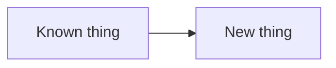

# Chapter Template

## Reader Starting Point

State what the reader is expected to know before this chapter. If a required idea has not already been introduced, introduce it here instead of assuming it.

Use `docs/reader-knowledge.md` as the source of truth for what prior chapters have taught.

## Concept

Explain the stable networking idea in plain language. Use concrete nouns before acronyms.

State how this chapter helps answer the guiding question: how does an Internet emerge from a collection of computers exchanging routes?

## New Terms

Define every new term before using it as if the reader already knows it.

| Term | Plain-language meaning | Concrete example in this chapter |
| --- | --- | --- |
| `term` | Short explanation. | Command, packet, route, interface, or object. |

Update `docs/reader-knowledge.md` for every term this chapter teaches for the first time.

## Why It Matters

Explain what breaks if the reader does not understand this.

When the chapter is intentionally tedious, say so directly. Name the friction in plain language, then explain which later concept or tool the friction prepares the reader to appreciate. Keep this restrained: one or two short notes are usually enough.

Examples:

- Static routes are annoying to maintain by hand. That is why BGP will feel useful later.
- Manual tunnel setup exposes the moving parts. Reusable configuration comes after the reader has seen those parts.

## Mental Model

Describe the smallest useful model the reader should hold in their head.

Include a diagram when the chapter introduces a new topology, packet path, table, or control-plane/data-plane relationship.

## Lab / Experiment

### Goal

State the observable outcome.

### Setup

List assumptions and required packages.

### Predict Before Running

Ask the reader to predict one or more observable outcomes before running commands.

- What route should Linux choose?
- Which interface should packets leave from?
- Which command should fail before the missing state is added?

### Steps

Use commands only after they have been tested or clearly marked as research required. Explain what each command changes before showing the command.

Labs should be manual-first. Show the reader the commands that build the state step by step. Scripts are allowed as repeatable validation and transcript capture, but they should not be the primary learning path unless the setup is too large or unsafe to type manually.

## Expected Observations

Describe what the reader should see and why.

## What Changed

Explain the before/after state:

- What state existed before the command?
- What state was added, removed, or changed?
- Why did the observable output change?

## Troubleshooting Notes

Use branches:

- If you see X, check Y.
- If command A succeeds but command B fails, suspect Z.

## Connection to Later Chapters

Map this chapter's small lab to later Pocket Internet, interconnect, or DN42 concepts.

- What will WireGuard replace?
- What will BIRD automate?
- What remains ordinary Linux kernel behavior?

## How the Real Internet Does This

Compare the lab to public Internet practice without pretending DN42 is identical.

## Verify Before Proceeding

- [ ] Route lookup matches the expected interface.
- [ ] No unintended default route exists.
- [ ] Export policy is explicit.
- [ ] New concepts are added to `docs/reader-knowledge.md`.
- [ ] Beginner review has been run, or deferral is recorded with a reason.
- [ ] Accepted beginner-review findings are addressed.

## Rollback

List exact rollback commands.

## References

- `source-id`: short reason used.
