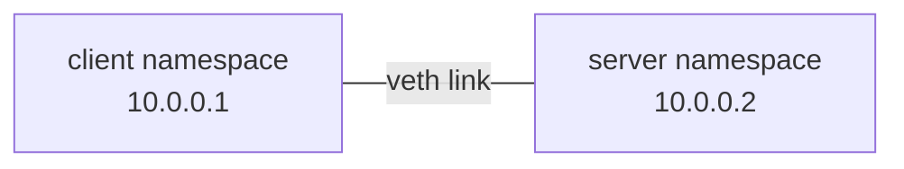

# Diagram Conventions

Use diagrams to reduce working memory, not to decorate a page.

## Default Pattern

Use Mermaid for conceptual visuals:

- topology,
- packet path,
- control-plane and data-plane relationships,
- state transitions,
- before-and-after network shapes.

Use text blocks for literal terminal output, commands, config, and compact lab maps where the exact interface/address tuple is the thing the reader should compare while typing.

Do not turn command output into Mermaid. Output should stay copyable and visually close to what the reader sees in the shell.

## Mermaid Style

Use simple `flowchart` diagrams unless another Mermaid type is genuinely clearer.

Prefer stable node labels:



Keep diagrams small enough to scan. If a diagram needs many annotations, split it into two diagrams or use prose plus a table.

## Text Topology Blocks

Text topology blocks are allowed when they act like a lab inventory:

```text
pocket-left left0 10.10.1.2/30  <---- veth ---->  10.10.1.1/30 rtr-left0 pocket-router
```

Use this form sparingly. If the block is explaining relationships rather than listing exact lab objects, use Mermaid instead.

## Review Checklist

Before publishing a chapter, check:

- Does every diagram answer a specific reader question?
- Is the diagram readable in light and dark mode?
- Is any ASCII/text topology block intentionally kept because it is command-adjacent?
- Does the surrounding prose say what the reader should notice?
