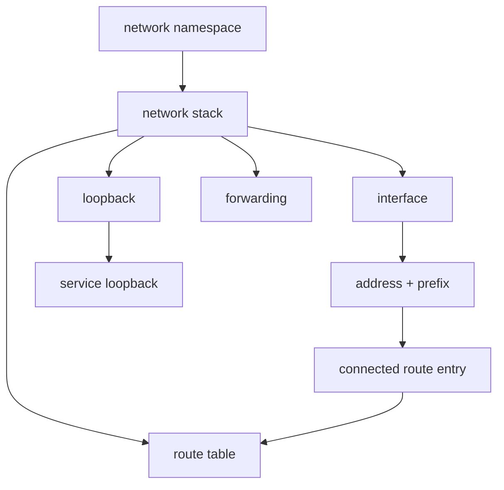
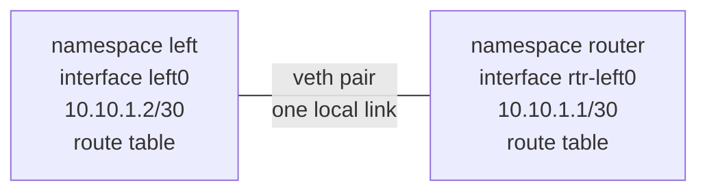

# Linux Networking Objects

This page is a map for the objects that appear throughout Pocket Internet.

Use it when a chapter mentions a namespace, interface, veth pair, connected route, next hop, loopback, route table, or forwarding and you need the pieces back in one picture.

## One Stack

A network namespace is an isolated Linux networking world. It contains its own network stack: interfaces, addresses, routes, loopback, and forwarding settings.

```text
network namespace
└── network stack
    ├── interfaces
    │   └── addresses and prefixes
    │       └── create connected route entries
    ├── loopback
    │   └── optional service loopback address
    ├── route table
    │   ├── connected route entries
    │   └── routes to remote destinations
    └── forwarding setting
```

The namespace is the container-like boundary. The network stack is the set of networking objects inside that boundary.



## Two Stacks Joined By A Veth Pair

A veth pair is a virtual cable. Each end is an interface. Each end can live in a different namespace.



The veth pair moves a packet across one local link. A route lookup decides which outgoing interface, and possibly which next hop, should receive the packet from this stack.

## Address, Prefix, And Connected Route

When you assign an address with a prefix to an interface, Linux learns two facts:

```text
ip addr add 10.10.1.2/30 dev left0
            │         │       │
            │         │       └── interface
            │         └────────── prefix length
            └──────────────────── interface address
```

Linux then creates a connected route:

```text
10.10.1.0/30 dev left0
```

Read that as:

> Addresses inside `10.10.1.0/30` are local to `left0`.

That connected route is why a next hop such as `10.10.1.1` can be used through `left0`.

## Route Table And Next Hop

A route table is a list of instructions. Each route answers:

```text
for this destination, send packets this way
```

Example:

```text
10.10.2.0/30 via 10.10.1.1 dev left0
```

Read it as:

```text
destination prefix: 10.10.2.0/30
next hop:           10.10.1.1
outgoing interface: left0
```

The next hop must be reachable through the outgoing interface's connected route. In this example, `10.10.1.1` is inside the connected `10.10.1.0/30 dev left0` route.

## Loopback And Service Loopback

Every namespace has a loopback interface named `lo`.

For Pocket Internet, a service loopback is a stable address on `lo`:

```text
lo
└── 172.20.1.1/32
```

The `/32` means one exact IPv4 address. It does not describe a cable or local link. It represents a stable service address that other namespaces can learn to reach.

That distinction matters:

| Object | What it represents |
| --- | --- |
| interface address: `10.10.1.2/30` on `left0` | one address on a link to another interface |
| connected route: `10.10.1.0/30 dev left0` | the route-table entry Linux creates from that interface address |
| service loopback: `172.20.1.1/32` on `lo` | one stable service address inside the namespace |

## Forwarding

Forwarding is what makes a namespace behave like a router.

Without forwarding:

```text
packet arrives -> destination is not me -> drop
```

With forwarding:

```text
packet arrives -> destination is not me -> route lookup -> send onward
```

Forwarding does not create routes. It only allows Linux to use its route table for packets passing through the namespace.

## Packet Path Checklist

When a packet should cross multiple namespaces, check the objects in this order:

1. Does the source namespace have a route for the destination?
2. Is the route's next hop reachable through a connected route?
3. Does the packet leave through the expected interface?
4. If a middle namespace receives the packet, is forwarding enabled?
5. Does every later namespace have the next route it needs?
6. Does the destination, or the destination's router, have a return path?

Most early Pocket Internet failures are one of these objects missing or pointing at the wrong place.
