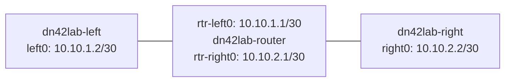

# Linux as a Router

## Reader Starting Point

This chapter assumes you can run shell commands, but it does not assume you have used Linux network namespaces before.

The goal is to prove one small fact: Linux can act as a router when it has interfaces, addresses, routes, and forwarding enabled.

DN42 will later add WireGuard tunnels, BIRD (a routing daemon), registry objects, and peer policy. Those pieces matter, but they all sit on top of ordinary Linux packet forwarding.

## New Terms

| Term | Plain-language meaning | Example in this lab |
| --- | --- | --- |
| Network stack | The part of an operating system that owns interfaces, addresses, routes, and packet handling. | Each namespace has its own route table. |
| Namespace | An isolated copy of a Linux network stack. | `dn42lab-left` cannot see interfaces inside `dn42lab-right`. |
| Interface | A place where packets enter or leave a network stack. | `left0` is the interface inside the left namespace. |
| veth pair | A virtual Ethernet cable with two ends. A packet sent into one end comes out the other. | `left0` connects to `rtr-left0`. |
| Address | A label assigned to an interface so packets can name a source or destination. | `10.10.1.2/30` belongs to `left0`. |
| Route | An instruction that tells Linux where to send packets for a destination. | `10.10.2.0/30 via 10.10.1.1`. |
| Next hop | The next router a packet should be sent to. | `10.10.1.1` is left's next hop toward right. |
| Route lookup | Asking Linux which route it would use for a packet. | `ip route get 10.10.2.2`. |
| Forwarding | Receiving a packet that is not for this machine and sending it onward. | The router namespace forwards left-to-right pings. |
| TTL | Time To Live, a hop counter that decreases each time a packet crosses a router. | Ping replies show `ttl=63`, meaning one router hop happened. |

## Mental Model

Think of a network namespace as a tiny Linux machine living inside the real Linux host. It has its own interfaces and route table.

This lab creates three tiny machines:



The left and right namespaces are not directly connected. They can only reach each other if the router namespace forwards packets between its two interfaces.

## Why It Matters

DN42 nodes are routers. A DN42 router usually has tunnel interfaces to peers, routes learned from BIRD, and forwarding done by the Linux kernel.

When something breaks, you need to know which layer failed:

- Did Linux choose a route?
- Did the packet leave the expected interface?
- Did a middle router forward it?
- Did the other side know how to send a reply?

This lab teaches those checks before any DN42-specific tooling is involved.

## Lab

The validated lab script lives at:

```text
experiments/labs/linux-routing-namespaces/run.sh
```

The transcript used for this chapter is:

```text
experiments/transcripts/linux-routing-namespaces-20260615T205343Z.txt
```

Run it from the repository root on Linux or inside the OrbStack Linux machine:

```sh
bash experiments/labs/linux-routing-namespaces/run.sh
```

On macOS with OrbStack:

```sh
orb bash experiments/labs/linux-routing-namespaces/run.sh
```

The script uses temporary namespaces named `dn42lab-left`, `dn42lab-router`, and `dn42lab-right`. It removes them at the end.

## Step 1: Create Three Isolated Network Stacks

The lab starts by deleting any old lab namespaces, then creates three new ones:

```sh
ip netns add dn42lab-left
ip netns add dn42lab-router
ip netns add dn42lab-right
```

After this, `ip netns list` shows:

```text
dn42lab-right
dn42lab-router
dn42lab-left
```

At this point there are three isolated network stacks, but they are not connected to anything useful yet.

## Step 2: Add Virtual Cables

A namespace needs an interface before it can send packets. The lab creates two veth pairs:

```sh
ip link add left0 type veth peer name rtr-left0
ip link add right0 type veth peer name rtr-right0
```

Then it moves each cable end into the correct namespace:

```sh
ip link set left0 netns dn42lab-left
ip link set rtr-left0 netns dn42lab-router
ip link set right0 netns dn42lab-right
ip link set rtr-right0 netns dn42lab-router
```

Now the topology exists, but the interfaces still need addresses and must be brought up.

## Step 3: Add Addresses

The lab gives each interface an IPv4 address:

```sh
ip -n dn42lab-left addr add 10.10.1.2/30 dev left0
ip -n dn42lab-router addr add 10.10.1.1/30 dev rtr-left0
ip -n dn42lab-router addr add 10.10.2.1/30 dev rtr-right0
ip -n dn42lab-right addr add 10.10.2.2/30 dev right0
```

The `-n dn42lab-left` part means "run this `ip` operation inside the `dn42lab-left` namespace."

The `/30` prefix creates a tiny subnet with two usable interface addresses. That is enough for a point-to-point link:

- `10.10.1.2` talks to `10.10.1.1`.
- `10.10.2.1` talks to `10.10.2.2`.

## Step 4: Bring Interfaces Up

Linux interfaces can exist while administratively down. The lab enables loopback and veth interfaces inside each namespace:

```sh
ip -n dn42lab-left link set lo up
ip -n dn42lab-left link set left0 up
ip -n dn42lab-router link set lo up
ip -n dn42lab-router link set rtr-left0 up
ip -n dn42lab-router link set rtr-right0 up
ip -n dn42lab-right link set lo up
ip -n dn42lab-right link set right0 up
```

Once addresses are configured and links are up, Linux automatically creates connected routes.

The left namespace route table contains only its local link:

```text
10.10.1.0/30 dev left0 proto kernel scope link src 10.10.1.2
```

The router namespace has both directly connected links:

```text
10.10.1.0/30 dev rtr-left0 proto kernel scope link src 10.10.1.1
10.10.2.0/30 dev rtr-right0 proto kernel scope link src 10.10.2.1
```

The right namespace contains only its local link:

```text
10.10.2.0/30 dev right0 proto kernel scope link src 10.10.2.2
```

## Predict Before Running: Can Left Reach Right?

Before adding any static routes, predict what Linux should do with a packet from left to `10.10.2.2`.

Left knows only this:

```text
10.10.1.0/30 dev left0
```

The destination is:

```text
10.10.2.2
```

That destination is not inside `10.10.1.0/30`. There is no default route. There is no route to the right-side subnet.

So the route lookup should fail.

The transcript confirms it:

```sh
ip -n dn42lab-left route get 10.10.2.2
```

```text
RTNETLINK answers: Network is unreachable
```

Ping fails for the same reason:

```sh
ip netns exec dn42lab-left ping -c 1 -W 1 10.10.2.2
```

```text
ping: connect: Network is unreachable
```

This is a good failure. It proves Linux is using the route table rather than guessing.

## Step 5: Add the Missing Routes

Left needs an instruction for the right-side subnet:

```sh
ip -n dn42lab-left route add 10.10.2.0/30 via 10.10.1.1 dev left0
```

Read that as:

> To reach `10.10.2.0/30`, send packets to the next hop `10.10.1.1` through `left0`.

Right needs the matching return route:

```sh
ip -n dn42lab-right route add 10.10.1.0/30 via 10.10.2.1 dev right0
```

Read that as:

> To reach `10.10.1.0/30`, send packets to the next hop `10.10.2.1` through `right0`.

The return route matters. Ping is not one packet. It is a request and a reply. If left can send a request to right but right cannot send the reply back, the ping still fails.

## Step 6: Enable Forwarding

Routes on the edge namespaces are necessary, but they are not enough.

The middle namespace must be willing to forward packets that are not addressed to itself. Linux controls this with:

```sh
ip netns exec dn42lab-router sysctl -w net.ipv4.ip_forward=1
```

The transcript shows:

```text
net.ipv4.ip_forward = 1
```

Without this setting, the router namespace can talk to both connected networks itself, but it will not behave as a router for traffic passing through it.

## Predict Before Running: What Should Route Lookup Say Now?

Left now has a route for `10.10.2.0/30`. Predict the selected route for `10.10.2.2`.

It should name:

- destination: `10.10.2.2`
- next hop: `10.10.1.1`
- outgoing interface: `left0`
- source address: `10.10.1.2`

The transcript confirms it:

```sh
ip -n dn42lab-left route get 10.10.2.2
```

```text
10.10.2.2 via 10.10.1.1 dev left0 src 10.10.1.2 uid 0
    cache
```

Right has the mirror image route:

```sh
ip -n dn42lab-right route get 10.10.1.2
```

```text
10.10.1.2 via 10.10.2.1 dev right0 src 10.10.2.2 uid 0
    cache
```

Route lookup predicts packet path before a packet is sent. Use it often.

## Step 7: Prove Forwarding with Ping

Now left can ping right:

```sh
ip netns exec dn42lab-left ping -c 2 -W 1 10.10.2.2
```

The transcript shows two replies:

```text
64 bytes from 10.10.2.2: icmp_seq=1 ttl=63 time=0.041 ms
64 bytes from 10.10.2.2: icmp_seq=2 ttl=63 time=0.056 ms
```

Right can ping left:

```sh
ip netns exec dn42lab-right ping -c 2 -W 1 10.10.1.2
```

The transcript shows two replies again:

```text
64 bytes from 10.10.1.2: icmp_seq=1 ttl=63 time=0.043 ms
64 bytes from 10.10.1.2: icmp_seq=2 ttl=63 time=0.096 ms
```

The `ttl=63` is a clue. Linux commonly starts IPv4 ping packets with TTL 64. Crossing one router decrements the TTL to 63. That is evidence that the packet crossed the router namespace.

## Step 8: Inspect the Router

The router namespace saw packets on both veth interfaces:

```sh
ip -n dn42lab-router -s link show rtr-left0
ip -n dn42lab-router -s link show rtr-right0
```

The transcript shows nonzero RX and TX packet counters on both links.

The router's own route lookup is simple because both edge addresses are directly connected from its point of view:

```sh
ip -n dn42lab-router route get 10.10.2.2
```

```text
10.10.2.2 dev rtr-right0 src 10.10.2.1 uid 0
    cache
```

And the other direction:

```sh
ip -n dn42lab-router route get 10.10.1.2
```

```text
10.10.1.2 dev rtr-left0 src 10.10.1.1 uid 0
    cache
```

The router does not need a next hop for these destinations because both destination subnets are directly connected to it.

## Rollback

The lab removes all three namespaces:

```sh
ip netns delete dn42lab-left
ip netns delete dn42lab-router
ip netns delete dn42lab-right
```

Deleting a namespace also removes the interfaces inside it. The transcript's final namespace check prints no lab namespace names, which confirms rollback.

## What Changed

Before the lab:

- There were no lab namespaces.
- There were no lab veth interfaces.
- There were no lab routes.

During the lab:

- Three isolated network stacks were created.
- Two virtual cables connected them.
- Addresses created connected routes.
- Static routes told the edge namespaces where remote subnets lived.
- `net.ipv4.ip_forward=1` allowed the middle namespace to forward packets.

After rollback:

- The namespaces and veth interfaces were removed.
- Temporary lab state was gone.

## Troubleshooting Notes

- If `ip route get` says `Network is unreachable`, the namespace has no selected route for that destination.
- If `ip route get` is correct but ping fails, check forwarding on the middle namespace.
- If one direction works but the other does not, check the return route.
- If connected routes are missing, check interface addresses and whether the link is up.
- If the router can ping both sides but the sides cannot ping through it, check `net.ipv4.ip_forward`.

## Connection to Later Chapters

This lab is small, but it is the foundation for the rest of the book.

Later, WireGuard will replace the veth pairs:

```text
veth pair in this lab -> WireGuard tunnel to a peer
```

Later, BIRD will replace the hand-written static routes. BIRD speaks routing protocols such as BGP (Border Gateway Protocol) and asks the Linux kernel to install the routes it learns:

```text
ip route add ... -> BIRD installs routes after BGP learns them
```

Forwarding remains ordinary Linux behavior:

```text
net.ipv4.ip_forward=1 and kernel route lookup still matter
```

DN42 adds new control-plane tools, but packets still cross Linux interfaces because the kernel has a route and forwarding is enabled.

## Verify Before Proceeding

- [ ] You can explain why the first `route get` failed.
- [ ] You can explain why both edge namespaces need routes.
- [ ] You can explain why the router namespace needs forwarding enabled.
- [ ] You can identify the next hop and outgoing interface in `ip route get` output.
- [ ] You can explain why `ttl=63` suggests one router hop.

## References

- `linux-ip-route`: route lookup and route table behavior.
- `dn42-network-settings`: forwarding and asymmetric routing warnings for later DN42 labs.
- Transcript: `experiments/transcripts/linux-routing-namespaces-20260615T205343Z.txt`.
