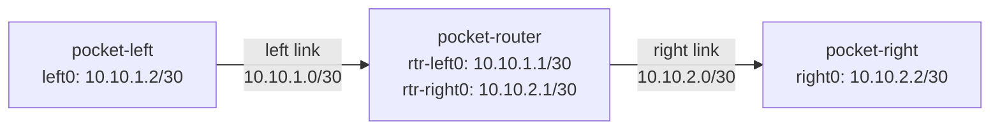
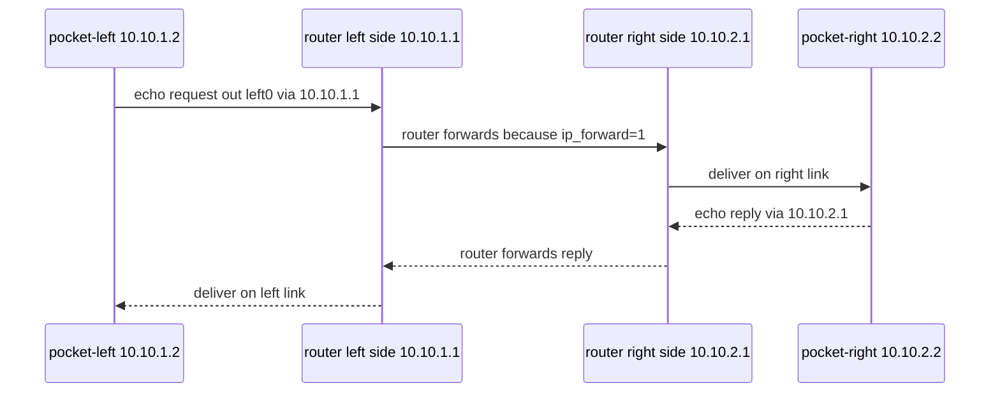

# Linux as a Router

## Reader Starting Point

This chapter assumes you can run shell commands, but it does not assume you have used Linux network namespaces before.

The goal is to prove one small fact: Linux can act as a router when it has interfaces, addresses, routes, and forwarding enabled.

Keep [Linux Networking Objects](../linux-networking-objects.md) nearby if the object names start to blur together. This chapter builds the first working version of that map.

DN42 will later add WireGuard tunnels, BIRD (a routing daemon), registry objects, and peer policy. Those pieces matter, but they all sit on top of ordinary Linux packet forwarding.

## New Terms

| Term | Plain-language meaning | Example in this lab |
| --- | --- | --- |
| Network stack | The part of an operating system that owns interfaces, addresses, routes, and packet handling. | Each namespace has its own route table. |
| Namespace | An isolated copy of a Linux network stack. | `pocket-left` cannot see interfaces inside `pocket-right`. |
| Interface | A place where packets enter or leave a network stack. | `left0` is the interface inside the left namespace. |
| veth pair | A virtual Ethernet cable with two ends. A packet sent into one end comes out the other. | `left0` connects to `rtr-left0`. |
| Address | A label assigned to an interface so packets can name a source or destination. | `10.10.1.2` belongs to `left0`. |
| Prefix | A group of addresses written as a starting address plus a length. | `10.10.1.0/30` is the left-side link prefix. |
| Local link | A network segment that can be reached directly through one interface. | `left0` can directly reach `rtr-left0`. |
| Route | An instruction that tells Linux where to send packets for a destination. | `10.10.2.0/30 via 10.10.1.1`. |
| Next hop | The next router a packet should be sent to. | `10.10.1.1` is left's next hop toward right. |
| Route lookup | Asking Linux which route it would use for a packet. | `ip route get 10.10.2.2`. |
| Forwarding | Receiving a packet that is not for this machine and sending it onward. | The router namespace forwards left-to-right pings. |
| TTL | Time To Live, a hop counter that decreases each time a packet crosses a router. | Ping replies show `ttl=63`, which is consistent with one router hop in this lab. |

## Mental Model

Think of a network namespace as a tiny Linux machine living inside the real Linux host. It has its own interfaces and route table.

Linux makes two different decisions that are easy to blur together:

- Local-link delivery: "This destination is on a network directly attached to one of my interfaces."
- IP routing: "This destination is somewhere else, so I need to send the packet to a next-hop router."

The local link carries the packet across one cable. The route lookup decides which cable to use and, when needed, which next-hop router should receive the packet.

This lab creates three tiny machines:



The left and right namespaces are not directly connected. They can only reach each other if the router namespace forwards packets between its two interfaces.

The two `/30` prefixes are two separate links. `10.10.1.0/30` exists only on the left-to-router cable. `10.10.2.0/30` exists only on the router-to-right cable.

## Address and Prefix Primer

An IPv4 address names one interface. In this lab, `10.10.1.2` names `left0`.

A prefix names a group of addresses. The `/30` part says how large the group is. You do not need the binary math yet; for this lab, remember that each `/30` gives us a tiny point-to-point link with two usable interface addresses:

| Prefix | Used by | Interface addresses in this lab |
| --- | --- | --- |
| `10.10.1.0/30` | left link | `10.10.1.1` on `rtr-left0`, `10.10.1.2` on `left0` |
| `10.10.2.0/30` | right link | `10.10.2.1` on `rtr-right0`, `10.10.2.2` on `right0` |

When Linux sees a route like `10.10.1.0/30 dev left0`, it means: "addresses in this prefix are directly reachable through `left0`."

When Linux sees a route like `10.10.2.0/30 via 10.10.1.1 dev left0`, it means: "addresses in this prefix are not directly attached here; send them to the next-hop router `10.10.1.1` through `left0`."

Think about a laptop on a home Wi-Fi network:

```text
laptop: 192.168.1.23/24
printer: 192.168.1.80
router: 192.168.1.1
```

The laptop gets a connected route like:

```text
192.168.1.0/24 dev wlan0
```

That route means the laptop treats `192.168.1.80` and `192.168.1.1` as local-link neighbors. They are not inside the laptop, but they are in the same local neighborhood from the laptop's point of view. To reach them, the laptop sends directly on Wi-Fi instead of sending to another IP router first.

This lab uses tiny `/30` neighborhoods instead of a home-sized `/24`, but the idea is the same. Assigning `10.10.1.2/30` to `left0` tells Linux:

> `left0` has address `10.10.1.2`, and the local neighborhood on that link is `10.10.1.0/30`.

That is why Linux creates the connected route automatically.

## Two Ways to Run Commands in a Namespace

This chapter uses two command forms:

```sh
ip -n pocket-left route
```

and:

```sh
ip netns exec pocket-left ping -c 1 10.10.2.2
```

`ip -n NAME ...` is a shortcut built into the `ip` command. It means "run this `ip` operation against namespace `NAME`."

`ip netns exec NAME ...` runs any command inside namespace `NAME`. Use it when the command is not an `ip` subcommand, such as `ping` or `sysctl`.

## Why It Matters

DN42 nodes are routers. A DN42 router usually has tunnel interfaces to peers, routes learned from BIRD, and forwarding done by the Linux kernel.

When something breaks, you need to know which layer failed:

- Did Linux choose a route?
- Did the packet leave the expected interface?
- Did a middle router forward it?
- Did the other side know how to send a reply?

This lab teaches those checks before any DN42-specific tooling is involved.

## Lab

Build this lab manually. The script is useful for validation and repeat runs, but the lesson is in creating each piece of network state yourself.

These commands require root privileges because creating network namespaces and veth interfaces changes Linux kernel networking state. If you see `Operation not permitted`, rerun the command with `sudo` or switch to a root shell inside the lab machine.

On macOS, use an OrbStack shell:

```sh
orb
```

Then run the commands from that Linux shell as root, or prefix them with `sudo`.

## Step 1: Create Three Isolated Network Stacks

Start by deleting any old lab namespaces:

```sh
ip netns delete pocket-left 2>/dev/null || true
ip netns delete pocket-router 2>/dev/null || true
ip netns delete pocket-right 2>/dev/null || true
```

Then create three new ones:

```sh
ip netns add pocket-left
ip netns add pocket-router
ip netns add pocket-right
```

After this, `ip netns list` shows:

```text
pocket-right
pocket-router
pocket-left
```

At this point there are three isolated network stacks, but they are not connected to anything useful yet.

## Step 2: Add Virtual Cables

A namespace needs an interface before it can send packets. The lab creates two veth pairs:

```sh
ip link add left0 type veth peer name rtr-left0
ip link add right0 type veth peer name rtr-right0
```

Then it moves each cable end into the correct namespace:

```sh
ip link set left0 netns pocket-left
ip link set rtr-left0 netns pocket-router
ip link set right0 netns pocket-right
ip link set rtr-right0 netns pocket-router
```

Now the topology exists, but the interfaces still need addresses and must be brought up.

The lab checks that intermediate state with:

```sh
ip -all netns exec ip link show
```

Read that command as: "for all network namespaces, run `ip link show` inside each one."

The transcript shows each namespace has its own `lo` interface. It also shows the veth ends in their new homes:

```text
pocket-left: left0
pocket-router: rtr-left0 and rtr-right0
pocket-right: right0
```

At this point the veth links exist, but they are still `state DOWN` and have no IP addresses. That is the difference between creating a cable and making the cable usable for IP traffic.

## Step 3: Add Addresses

The lab gives each interface an IPv4 address:

```sh
ip -n pocket-left addr add 10.10.1.2/30 dev left0
ip -n pocket-router addr add 10.10.1.1/30 dev rtr-left0
ip -n pocket-router addr add 10.10.2.1/30 dev rtr-right0
ip -n pocket-right addr add 10.10.2.2/30 dev right0
```

The `/30` prefix creates a tiny subnet with two usable interface addresses. That is enough for a point-to-point link:

- `10.10.1.2` talks to `10.10.1.1`.
- `10.10.2.1` talks to `10.10.2.2`.

## Step 4: Bring Interfaces Up

Linux interfaces can exist while administratively down. The lab enables loopback and veth interfaces inside each namespace:

```sh
ip -n pocket-left link set lo up
ip -n pocket-left link set left0 up
ip -n pocket-router link set lo up
ip -n pocket-router link set rtr-left0 up
ip -n pocket-router link set rtr-right0 up
ip -n pocket-right link set lo up
ip -n pocket-right link set right0 up
```

Once addresses are configured and links are up, Linux automatically creates connected routes.

The lab shows all three namespace route tables with:

```sh
ip -all netns exec ip route
```

Read that as: "for all network namespaces, run `ip route` inside each one."

The lab also starts with forwarding disabled so the forwarding step is visible and deterministic:

```sh
ip netns exec pocket-router sysctl -w net.ipv4.ip_forward=0
```

The left namespace route table contains only its local link:

```text
10.10.1.0/30 dev left0 proto kernel scope link src 10.10.1.2
```

The router namespace has both directly connected links:

```text
10.10.1.0/30 dev rtr-left0 proto kernel scope link src 10.10.1.1
10.10.2.0/30 dev rtr-right0 proto kernel scope link src 10.10.2.1
```

The right namespace contains only its local link:

```text
10.10.2.0/30 dev right0 proto kernel scope link src 10.10.2.2
```

This is the first route-table snapshot that matters. Each edge namespace knows only its own directly connected `/30` link. The router namespace knows both directly connected `/30` links because it has one interface on each side.

## Predict Before Running: Can Left Reach Right?

Before adding any static routes, predict what Linux should do with a packet from left to `10.10.2.2`.

Left knows only this:

```text
10.10.1.0/30 dev left0
```

The destination is:

```text
10.10.2.2
```

That destination is not inside `10.10.1.0/30`. There is no default route. There is no route to the right-side subnet.

So the route lookup should fail.

The transcript confirms it:

```sh
ip -n pocket-left route get 10.10.2.2
```

```text
RTNETLINK answers: Network is unreachable
```

Ping fails for the same reason:

```sh
ip netns exec pocket-left ping -c 1 -W 1 10.10.2.2
```

```text
ping: connect: Network is unreachable
```

This is a good failure. It proves Linux is using the route table rather than guessing.

!!! success "What this proves"
    `pocket-left` has no selected route to `10.10.2.2`, so Linux refuses to send the packet.

!!! warning "What this does not prove"
    It does not prove the veth links are broken. The connected links can be fine while the route table is still missing an instruction.

## Step 5: Add the Missing Routes

Left needs an instruction for the right-side subnet:

```sh
ip -n pocket-left route add 10.10.2.0/30 via 10.10.1.1 dev left0
```

Read that as:

> To reach `10.10.2.0/30`, send packets to the next hop `10.10.1.1` through `left0`.

Right needs the matching return route.

Before revealing it, derive it from the topology:

- Right wants to reach the left-side subnet: `10.10.1.0/30`.
- Right's next hop toward that subnet is the router's right-side address: `10.10.2.1`.
- Right reaches that next hop through its own interface: `right0`.

??? question "Reveal the matching return-route command"

    ```sh
    ip -n pocket-right route add 10.10.1.0/30 via 10.10.2.1 dev right0
    ```

    Read that as:

    > To reach `10.10.1.0/30`, send packets to the next hop `10.10.2.1` through `right0`.

The return route matters. Ping is not one packet. It is a request and a reply. If left can send a request to right but right cannot send the reply back, the ping still fails.

## Predict Before Running: What Should Route Lookup Say Now?

Left now has a route for `10.10.2.0/30`. Predict the selected route for `10.10.2.2`.

It should name:

- destination: `10.10.2.2`
- next hop: `10.10.1.1`
- outgoing interface: `left0`
- source address: `10.10.1.2`

The transcript confirms it:

```sh
ip -n pocket-left route get 10.10.2.2
```

```text
10.10.2.2 via 10.10.1.1 dev left0 src 10.10.1.2 uid 0
    cache
```

Right has the mirror image route:

```sh
ip -n pocket-right route get 10.10.1.2
```

```text
10.10.1.2 via 10.10.2.1 dev right0 src 10.10.2.2 uid 0
    cache
```

Route lookup predicts packet path before a packet is sent. Use it often.

!!! success "What this proves"
    Linux has selected a next hop, outgoing interface, and source address for this destination.

!!! warning "What this does not prove"
    It does not prove the packet will be delivered. A later hop can still drop traffic, and the return path can still be missing.

## Step 6: Prove Routes Are Not Forwarding

Routes on the edge namespaces are necessary, but they are not enough.

The lab checks forwarding before trying ping:

```sh
ip netns exec pocket-router sysctl net.ipv4.ip_forward
```

The transcript shows:

```text
net.ipv4.ip_forward = 0
```

Now left has a route to right, but the router namespace is not willing to forward packets that are not addressed to itself:

```sh
ip netns exec pocket-left ping -c 1 -W 1 10.10.2.2
```

The transcript shows:

```text
1 packets transmitted, 0 received, 100% packet loss
```

This is the second useful failure in the lab:

- before static routes, left did not know where to send the packet;
- after static routes but before forwarding, left knows where to send it, but the middle namespace drops transit traffic.

!!! success "What this proves"
    The edge route is not enough by itself. The middle namespace must be willing to forward transit packets.

!!! warning "What this does not prove"
    It does not prove the static routes are wrong. In this step, the route lookup is correct but forwarding is disabled.

## Step 7: Enable Forwarding

The middle namespace must be willing to forward packets that are not addressed to itself. Linux controls this with:

```sh
ip netns exec pocket-router sysctl -w net.ipv4.ip_forward=1
```

The transcript shows:

```text
net.ipv4.ip_forward = 1
```

Without this setting, the router namespace can talk to both connected networks itself, but it will not behave as a router for traffic passing through it.

## Step 8: One Ping Packet's Path

After routes and forwarding are in place, a ping from left to right has a concrete path:



1. `pocket-left` creates an ICMP echo request from `10.10.1.2` to `10.10.2.2`.
2. Left looks up `10.10.2.2` in its route table.
3. Left matches `10.10.2.0/30 via 10.10.1.1 dev left0`.
4. Left sends the packet out `left0` to the next hop `10.10.1.1`.
5. The veth pair carries the packet across the left local link to `rtr-left0`.
6. `pocket-router` receives the packet. The destination is not one of the router's own addresses.
7. Because `net.ipv4.ip_forward=1`, the router does its own route lookup for `10.10.2.2`.
8. The router matches its connected route `10.10.2.0/30 dev rtr-right0`.
9. The router sends the packet out `rtr-right0`.
10. The second veth pair carries the packet across the right local link to `right0`.
11. `pocket-right` receives a packet addressed to its own `10.10.2.2` address and sends an echo reply back.
12. The reply follows the mirror-image route through `10.10.2.1`, the router namespace, `10.10.1.1`, and finally `left0`.

The important split is this: veth links move packets across one local link, while IP route lookups decide the next link to use.

## Step 9: Prove Forwarding with Ping

Now left can ping right:

```sh
ip netns exec pocket-left ping -c 2 -W 1 10.10.2.2
```

The transcript shows two replies:

```text
64 bytes from 10.10.2.2: icmp_seq=1 ttl=63 time=0.069 ms
64 bytes from 10.10.2.2: icmp_seq=2 ttl=63 time=0.104 ms
```

Right can ping left:

```sh
ip netns exec pocket-right ping -c 2 -W 1 10.10.1.2
```

The transcript shows two replies again:

```text
64 bytes from 10.10.1.2: icmp_seq=1 ttl=63 time=0.046 ms
64 bytes from 10.10.1.2: icmp_seq=2 ttl=63 time=0.080 ms
```

The `ttl=63` is supporting evidence in this lab. Linux commonly starts IPv4 ping packets with TTL 64, and crossing one router decrements the TTL by one. That makes `ttl=63` consistent with one router hop here. Do not treat a single TTL value as universal proof on every operating system or every network.

!!! success "What this proves"
    Packets can now travel from one edge namespace to the other and receive replies.

!!! warning "What this does not prove"
    It does not prove every future destination is reachable. It proves this route, return route, and forwarding path work for this pair of addresses.

## Step 10: Inspect the Router

The router namespace saw packets on both veth interfaces:

```sh
ip -n pocket-router -s link show rtr-left0
ip -n pocket-router -s link show rtr-right0
```

The transcript shows nonzero RX and TX packet counters on both links.

The router's own route lookup is simple because both edge addresses are directly connected from its point of view:

```sh
ip -n pocket-router route get 10.10.2.2
```

```text
10.10.2.2 dev rtr-right0 src 10.10.2.1 uid 0
    cache
```

And the other direction:

```sh
ip -n pocket-router route get 10.10.1.2
```

```text
10.10.1.2 dev rtr-left0 src 10.10.1.1 uid 0
    cache
```

The router does not need a next hop for these destinations because both destination subnets are directly connected to it.

## Rollback

The lab removes all three namespaces:

```sh
ip netns delete pocket-left
ip netns delete pocket-router
ip netns delete pocket-right
```

Deleting a namespace also removes the interfaces inside it. The transcript's final namespace check prints no lab namespace names, which confirms rollback.

## Repeat With the Validation Script

After you have built the lab manually, you can rerun the validated script when you want a clean repeat or transcript:

```sh
bash experiments/labs/pocket-internet-linux-router/run.sh
```

On macOS with OrbStack:

```sh
orb bash experiments/labs/pocket-internet-linux-router/run.sh
```

The transcript used to validate this chapter is:

```text
experiments/transcripts/pocket-internet-linux-router-20260617T183713Z.txt
```

The script uses temporary namespaces named `pocket-left`, `pocket-router`, and `pocket-right`. It removes them at the end.

## What Changed

Before the lab:

- There were no lab namespaces.
- There were no lab veth interfaces.
- There were no lab routes.

During the lab:

- Three isolated network stacks were created.
- Two virtual cables connected them.
- Addresses created connected routes.
- Static routes told the edge namespaces where remote subnets lived.
- `net.ipv4.ip_forward=1` allowed the middle namespace to forward packets.

After rollback:

- The namespaces and veth interfaces were removed.
- Temporary lab state was gone.

## Troubleshooting Notes

- If `ip netns add` or `ip link add` says `Operation not permitted`, the command was not run with root privileges. Use the lab script, which invokes `sudo`, or run the command as root inside the Linux lab machine.
- If `ip route get` says `Network is unreachable`, the namespace has no selected route for that destination.
- If `ip route get` is correct but ping fails through a middle namespace, check forwarding on the middle namespace.
- If one direction works but the other does not, check the return route.
- If connected routes are missing, check interface addresses and whether the link is up.
- If the router can ping both sides but the sides cannot ping through it, check `net.ipv4.ip_forward`.

## Connection to Later Chapters

This lab is small, but it is the foundation for the rest of the book.

Later, WireGuard will replace the veth pairs:

```text
veth pair in this lab -> WireGuard tunnel to a peer
```

Later, BIRD will replace the hand-written static routes. BIRD speaks routing protocols such as BGP (Border Gateway Protocol) and asks the Linux kernel to install the routes it learns:

```text
ip route add ... -> BIRD installs routes after BGP learns them
```

Forwarding remains ordinary Linux behavior:

```text
net.ipv4.ip_forward=1 and kernel route lookup still matter
```

DN42 adds new control-plane tools, but packets still cross Linux interfaces because the kernel has a route and forwarding is enabled.

## Verify Before Proceeding

- [ ] You can explain why the first `route get` failed.
- [ ] You can explain why the second `route get` succeeded before ping worked.
- [ ] You can explain why both edge namespaces need routes.
- [ ] You can explain why the router namespace needs forwarding enabled.
- [ ] You can identify the next hop and outgoing interface in `ip route get` output.
- [ ] You can explain why `ttl=63` supports, but does not universally prove, the one-hop explanation in this lab.

## Before You Continue

You can now explain:

- how namespaces act like separate Linux network stacks,
- how veth pairs connect those stacks,
- how interface addresses create connected routes,
- why both forward and return routes matter,
- why forwarding must be enabled on a namespace that routes packets for others.

Still okay if fuzzy:

- the exact address math behind `/30`,
- why Linux chooses one route over another when several routes match,
- source address selection in `ip route get` output.

Next we need:

- a clearer way to think about addresses and prefixes,
- a rule for predicting which route wins when more than one route could match.

## References

- `linux-ip-route`: use this later when you want the exact Linux meanings of route fields such as `via`, `dev`, `src`, and `scope link`.
- `dn42-network-settings`: use this later when forwarding, reverse-path filtering, or asymmetric routing becomes relevant on a real DN42 node.
- Transcript: `experiments/transcripts/pocket-internet-linux-router-20260617T183713Z.txt`.
