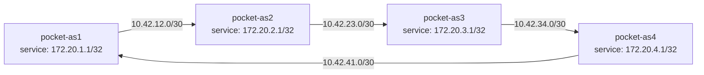

# Pocket Internet with Static Routes

## Reader Starting Point

This experiment assumes you have completed Linux as a Router. You should know what a namespace, interface, veth pair, route, next hop, route lookup, local link, prefix, and forwarding are.

This experiment does not assume you understand BGP, BIRD, real DN42 registry objects, or real autonomous system numbers yet.

The goal is to expand from one router to a small local Internet.

## New Terms

- Autonomous system: for now, one independently controlled network boundary. In real Internet routing this has more formal meaning; here it is a teaching shape.
- AS-shaped namespace: a namespace used as a local autonomous-system model in the lab. It is not a real registered AS.
- Loopback: the `lo` interface inside a namespace. It is always inside that namespace rather than on a veth link.
- Service loopback: a stable address on `lo` that represents something the namespace could advertise later.
- Point-to-point link: a link with one device on each end. In this lab, each veth pair is used this way.
- Static route: a route written by hand. It stays in place until something changes or removes it.
- Transit namespace: a namespace that forwards packets between two other namespaces.
- Alternate physical path: another connected set of links that could carry packets if the route tables pointed that way.

## Question

Can four Linux namespaces behave like a small Internet before BIRD, WireGuard, or DN42 are introduced?

## Hypothesis

If each namespace has links, service loopbacks, forwarding, and explicit static routes, then one AS-shaped namespace can reach another AS-shaped namespace's service address across a transit namespace.

If the selected transit link breaks, reachability will fail even when another physical path exists, because static routes do not adapt by themselves.

## Mental Model



The first selected path from `pocket-as1` to `pocket-as3` is clockwise:

```text
pocket-as1 -> pocket-as2 -> pocket-as3
```

The backup physical path exists, but static routing will not use it until the route tables are changed:

```text
pocket-as1 -> pocket-as4 -> pocket-as3
```

## Safety Boundaries

- The lab uses only temporary Linux network namespaces.
- The lab does not add host default routes.
- The lab does not touch public DN42 peers.
- Rollback deletes the namespaces, which also removes the veth links and routes inside them.

## Lab

Read the procedure map before running the full script. The script is the validated execution path, but the point is to understand each state change rather than copy a block of commands.

These commands must run with root privileges inside the Linux environment because network namespaces and links are system-level objects. The script uses `sudo` when it is not already running as root.

The validated lab script lives at:

```text
experiments/labs/pocket-internet-static-routing/run.sh
```

The transcript used for this experiment is:

```text
experiments/transcripts/pocket-internet-static-routing-20260616T122902Z.txt
```

Run it from the repository root on Linux or inside the OrbStack Linux machine:

```sh
bash experiments/labs/pocket-internet-static-routing/run.sh
```

On macOS with OrbStack:

```sh
orb bash experiments/labs/pocket-internet-static-routing/run.sh
```

## Procedure Map

| Script section | Representative command | State changed | Expected observation |
| --- | --- | --- | --- |
| Create AS-shaped namespaces | `ip netns add pocket-as1` | Adds separate network stacks. | `ip netns list` shows four `pocket-as*` namespaces. |
| Create veth links | `ip link add as1-as2 type veth peer name as2-as1` | Adds point-to-point links between namespaces. | Each namespace gets two link interfaces. |
| Configure loopbacks | `ip -n pocket-as1 addr add 172.20.1.1/32 dev lo` | Adds a stable service address inside a namespace. | Service addresses exist on `lo`. |
| Configure link addresses | `ip -n pocket-as1 addr add 10.42.12.1/30 dev as1-as2` | Gives each local link an address pair. | Connected routes appear for each `/30` link. |
| Enable forwarding | `sysctl -w net.ipv4.ip_forward=1` | Allows a namespace to forward transit packets. | Transit namespaces can pass packets that are not addressed to them. |
| Check baseline | `ip -n pocket-as1 route get 172.20.3.1` | No route has been added yet. | Route lookup fails. |
| Add static routes | `ip -n pocket-as1 route add 172.20.3.1/32 via 10.42.12.2 dev as1-as2` | Writes service reachability by hand. | Route lookup points to the selected next hop. |
| Test packet flow | `ping -I 172.20.1.1 172.20.3.1` | Sends packets between service loopbacks. | Ping succeeds. |
| Break selected link | `ip -n pocket-as2 link set as2-as3 down` | Removes the link the static route depends on. | Ping fails even though another path exists. |
| Repair routes | `ip -n pocket-as1 route replace ... via 10.42.41.1` | Points traffic at the alternate path. | Ping succeeds again. |
| Roll back | `ip netns delete pocket-as1` | Deletes temporary namespaces. | Lab namespaces disappear. |

## What the Script Builds

The script creates four namespaces:

```text
pocket-as1
pocket-as2
pocket-as3
pocket-as4
```

Each namespace gets:

- a loopback service address,
- two point-to-point veth links,
- IPv4 forwarding enabled,
- static routes for the service addresses used in the test.

The service addresses are:

| Namespace | Service loopback |
| --- | --- |
| `pocket-as1` | `172.20.1.1/32` |
| `pocket-as2` | `172.20.2.1/32` |
| `pocket-as3` | `172.20.3.1/32` |
| `pocket-as4` | `172.20.4.1/32` |

## Predict Before Running

Before static service routes exist, predict what `pocket-as1` should do with a packet to `172.20.3.1`.

`pocket-as1` has connected routes for its two local links:

```text
10.42.12.0/30 dev as1-as2
10.42.41.0/30 dev as1-as4
```

But `172.20.3.1` is not inside either link prefix. There is no route to that service loopback yet.

The transcript confirms the route lookup failure:

```sh
ip -n pocket-as1 route get 172.20.3.1
```

```text
RTNETLINK answers: Network is unreachable
```

## Static Routes Create Reachability

The script installs clockwise static routes for traffic between `pocket-as1` and `pocket-as3`.

On `pocket-as1`:

```sh
ip -n pocket-as1 route add 172.20.3.1/32 via 10.42.12.2 dev as1-as2
```

Read that as:

> To reach `pocket-as3`'s service loopback, send packets to `pocket-as2` over the `as1-as2` link.

On `pocket-as2`:

```sh
ip -n pocket-as2 route add 172.20.3.1/32 via 10.42.23.2 dev as2-as3
```

Read that as:

> To keep forwarding toward `pocket-as3`, send packets over the `as2-as3` link.

The return path is also explicit:

```sh
ip -n pocket-as3 route add 172.20.1.1/32 via 10.42.23.1 dev as3-as2
ip -n pocket-as2 route add 172.20.1.1/32 via 10.42.12.1 dev as2-as1
```

With those routes installed, the route lookups show the selected path:

```text
172.20.3.1 from 172.20.1.1 via 10.42.12.2 dev as1-as2
172.20.3.1 via 10.42.23.2 dev as2-as3
```

Then the service-loopback ping works:

```text
2 packets transmitted, 2 received, 0% packet loss
```

## Forward and Reply Routes

The forward path and reply path are separate route-table facts.

Forward path from `pocket-as1` to `pocket-as3`:

| Namespace doing lookup | Destination | Route needed |
| --- | --- | --- |
| `pocket-as1` | `172.20.3.1/32` | `via 10.42.12.2 dev as1-as2` |
| `pocket-as2` | `172.20.3.1/32` | `via 10.42.23.2 dev as2-as3` |

Reply path from `pocket-as3` back to `pocket-as1`:

| Namespace doing lookup | Destination | Route needed |
| --- | --- | --- |
| `pocket-as3` | `172.20.1.1/32` | `via 10.42.23.1 dev as3-as2` |
| `pocket-as2` | `172.20.1.1/32` | `via 10.42.12.1 dev as2-as1` |

If any one of those entries is missing, ping can fail. A request and a reply are two different packets.

## Packet Observation

The lab uses interface counters as packet-observation evidence:

```sh
ip -n pocket-as2 -s link show as2-as1
ip -n pocket-as2 -s link show as2-as3
```

The transcript shows nonzero RX and TX packet counts on both `pocket-as2` transit links. These counters are supporting evidence, not a packet-perfect trace. They include the ping traffic plus other small link traffic such as neighbor-resolution packets. The important observation is that packets appeared on both transit interfaces while the service-loopback ping succeeded.

## Break the Selected Link

The script disables the selected `pocket-as2` to `pocket-as3` link:

```sh
ip -n pocket-as2 link set as2-as3 down
```

`pocket-as1` still has the old static route:

```text
172.20.3.1 from 172.20.1.1 via 10.42.12.2 dev as1-as2
```

That route still points at `pocket-as2`. Static routing does not notice that the better next step is now the other side of the square.

The ping fails:

```text
From 10.42.12.2 icmp_seq=1 Destination Net Unreachable
1 packets transmitted, 0 received, +1 errors, 100% packet loss
```

The useful lesson is not merely "a link broke." The useful lesson is:

> Static routes keep saying what you wrote, even when the topology changes.

## Repair the Route Manually

The alternate physical path exists:

```text
pocket-as1 -> pocket-as4 -> pocket-as3
```

The script proves Linux still has connected routes for those alternate local links, then changes the static routes:

```sh
ip -n pocket-as1 route replace 172.20.3.1/32 via 10.42.41.1 dev as1-as4
ip -n pocket-as4 route add 172.20.3.1/32 via 10.42.34.1 dev as4-as3
ip -n pocket-as3 route replace 172.20.1.1/32 via 10.42.34.2 dev as3-as4
ip -n pocket-as4 route add 172.20.1.1/32 via 10.42.41.2 dev as4-as1
```

After the route change, the selected path from `pocket-as1` points to `pocket-as4`:

```text
172.20.3.1 from 172.20.1.1 via 10.42.41.1 dev as1-as4
```

The ping works again:

```text
2 packets transmitted, 2 received, 0% packet loss
```

## What Changed

Before the lab:

- no Pocket Internet namespaces existed,
- no Pocket Internet veth links existed,
- no Pocket Internet service loopbacks existed,
- no static service routes existed.

During the lab:

- four AS-shaped namespaces formed a square topology,
- loopback service addresses represented future advertised prefixes,
- static routes created reachability across a transit namespace,
- a link failure broke the selected static path,
- manual route changes restored reachability through the alternate path.

After rollback:

- the namespaces and all temporary state were removed.

## Troubleshooting Branches

- If `route get` says `Network is unreachable`, the namespace has no selected route for that service address.
- If the forward ping works but replies do not return, check the return route.
- If route lookup still points at a broken link, remember that static routes do not adapt.
- If connected link routes are missing, check interface addresses and link state.
- If transit packets do not move, check forwarding with `sysctl net.ipv4.ip_forward`.

## Connection to Later Chapters

This experiment creates the local shape that BIRD will automate later.

Static routes are the manual version of reachability:

```text
ip route add 172.20.3.1/32 via ...
```

You do not need to understand BIRD or BGP yet. Keep only this idea for now: later, a routing program will write the same kind of kernel route for us.

BIRD and BGP will eventually replace those handwritten routes with learned routes:

```text
neighbor advertises prefix -> BIRD selects route -> kernel installs route
```

WireGuard will later replace one veth link. The routing idea stays the same: a packet leaves through an interface toward a next hop.

## Verify Before Proceeding

- [ ] You can explain why `pocket-as1` cannot reach `172.20.3.1` before static routes exist.
- [ ] You can identify the selected next hop from `ip route get`.
- [ ] You can explain why both forward and return routes matter.
- [ ] You can explain why the alternate physical path does not help until static routes are changed.
- [ ] You can explain what BIRD will automate later.

## References

- `linux-ip-route`: use this for exact Linux route syntax and route lookup behavior.
- Transcript: `experiments/transcripts/pocket-internet-static-routing-20260616T122902Z.txt`.
