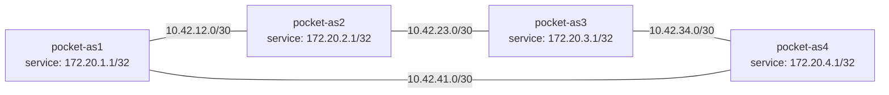

# Pocket Internet with Static Routes

## Reader Starting Point

This experiment assumes you have completed Linux as a Router and Addresses, Prefixes, and Longest Match. You should know what a namespace, interface, veth pair, route, next hop, route lookup, local link, prefix, connected route, host route, `/32`, and forwarding are.

This experiment does not assume you understand BGP, BIRD, real DN42 registry objects, or real autonomous system numbers yet.

The goal is to expand from one router to a small local Internet.

This lab combines most of the objects from [Linux Networking Objects](../linux-networking-objects.md): namespaces, veth pairs, route tables, loopback addresses, connected routes, next hops, and forwarding.

You have already seen one Linux namespace forward packets between two links, and you have seen how Linux chooses the most specific matching route. Now you will build four namespaces, give each one a stable service address, and write the route tables by hand.

## New Terms

| Term | Plain-language meaning | Example in this lab |
| --- | --- | --- |
| Autonomous system | For now, one independently controlled network boundary. In real Internet routing this has a more formal meaning. | `pocket-as1` |
| AS-shaped namespace | A namespace used as a local autonomous-system model. It is not a real registered AS. | `pocket-as3` |
| Loopback | The `lo` interface inside a namespace. It stays inside that namespace instead of living on a veth link. | `lo` in `pocket-as1` |
| Service loopback | A stable address on `lo` that represents something the namespace could advertise later. | `172.20.1.1/32` |
| Point-to-point link | A link with one device on each end. | `pocket-as1` to `pocket-as2` |
| Static route | A route written by hand. It stays in place until something changes or removes it. | `route add 172.20.3.1/32 via ...` |
| Transit namespace | A namespace that forwards packets between two other namespaces. | `pocket-as2` on the first path |
| Alternate physical path | Another connected set of links that could carry packets if the route tables pointed that way. | `pocket-as1 -> pocket-as4 -> pocket-as3` |

## Question

Can four Linux namespaces behave like a small Internet before BIRD, WireGuard, or DN42 are introduced?

## Hypothesis

If each namespace has links, service loopbacks, forwarding, and explicit static routes, then one AS-shaped namespace can reach another AS-shaped namespace's service address across a transit namespace.

If the selected transit link breaks, reachability will fail even when another physical path exists, because static routes do not adapt by themselves.

## Mental Model



!!! note "Lab-only prefixes"

    The `172.20.x.x` service loopbacks are local Pocket Internet examples. They are useful because they look like real routed service addresses, but they are not permission to announce anything outside this lab.

Legend:

```text
--- physical link
==> selected service route
```

The first selected path from `pocket-as1` to `pocket-as3` will be clockwise:

```text
pocket-as1 -> pocket-as2 -> pocket-as3
```

The alternate physical path exists, but static routing will not use it until you change the route tables:

```text
pocket-as1 -> pocket-as4 -> pocket-as3
```

This is the first important Pocket Internet lesson:

> Links create possible paths. Routes choose the path that packets actually use.

## Safety Boundaries

- The lab uses only temporary Linux network namespaces.
- The lab does not add host default routes.
- The lab does not touch public DN42 peers.
- Rollback deletes the namespaces, which also removes the veth links and routes inside them.

## Lab

Build this lab manually. The repeated typing is intentional: you are teaching your hands and eyes how namespaces, veth links, loopbacks, route tables, and forwarding fit together.

These commands must run with root privileges inside the Linux environment because network namespaces and links are system-level objects. On macOS, use an OrbStack shell:

```sh
orb
```

Then run the commands from that Linux shell as root, or prefix them with `sudo`.

The repeatable validation script lives at:

```text
experiments/labs/pocket-internet-static-routing/run.sh
```

The validated transcript for this experiment is:

```text
experiments/transcripts/pocket-internet-static-routing-20260616T192307Z.txt
```

## What You Will Build

You will create four namespaces:

```text
pocket-as1
pocket-as2
pocket-as3
pocket-as4
```

Each namespace gets:

- one loopback service address,
- two point-to-point veth links,
- IPv4 forwarding enabled,
- static routes for the service addresses used in this lab.

The service loopbacks are:

| Namespace | Service loopback |
| --- | --- |
| `pocket-as1` | `172.20.1.1/32` |
| `pocket-as2` | `172.20.2.1/32` |
| `pocket-as3` | `172.20.3.1/32` |
| `pocket-as4` | `172.20.4.1/32` |

The service loopback addresses are not on the veth links. They are stable addresses inside each namespace. Later, BGP will advertise this kind of address as reachable. For now, you will write the reachability by hand.

## Step 1: Clean Up Any Old Lab State

If you ran this lab before, delete the old namespaces first:

```sh
ip netns delete pocket-as1 2>/dev/null || true
ip netns delete pocket-as2 2>/dev/null || true
ip netns delete pocket-as3 2>/dev/null || true
ip netns delete pocket-as4 2>/dev/null || true
```

Confirm they are gone:

```sh
ip netns list | grep -E '^(pocket-as1|pocket-as2|pocket-as3|pocket-as4)( |$)' || true
```

No output is the expected result.

The delete commands hide the harmless error you get when a namespace does not exist. The check command prints a namespace only if it is still present.

## Step 2: Create Four AS-Shaped Namespaces

Create the namespaces:

```sh
ip netns add pocket-as1
ip netns add pocket-as2
ip netns add pocket-as3
ip netns add pocket-as4
```

Check that Linux sees them:

```sh
ip netns list
```

Expected output includes:

```text
pocket-as4
pocket-as3
pocket-as2
pocket-as1
```

The order may differ. The important point is that all four namespaces exist.

## Step 3: Create Point-to-Point Links

Create the first veth pair:

```sh
ip link add as1-as2 type veth peer name as2-as1
ip link set as1-as2 netns pocket-as1
ip link set as2-as1 netns pocket-as2
```

Read those names as:

- `as1-as2` is the end of the link inside `pocket-as1`,
- `as2-as1` is the end of the same link inside `pocket-as2`.

Create the remaining three links:

```sh
ip link add as2-as3 type veth peer name as3-as2
ip link set as2-as3 netns pocket-as2
ip link set as3-as2 netns pocket-as3

ip link add as3-as4 type veth peer name as4-as3
ip link set as3-as4 netns pocket-as3
ip link set as4-as3 netns pocket-as4

ip link add as4-as1 type veth peer name as1-as4
ip link set as4-as1 netns pocket-as4
ip link set as1-as4 netns pocket-as1
```

Now inspect the interfaces in every namespace:

```sh
ip -all netns exec ip link show
```

Expected observation:

- `pocket-as1` has `as1-as2` and `as1-as4`,
- `pocket-as2` has `as2-as1` and `as2-as3`,
- `pocket-as3` has `as3-as2` and `as3-as4`,
- `pocket-as4` has `as4-as3` and `as4-as1`.

The links exist, but they are not useful for IP traffic yet. They still need addresses and must be brought up.

State snapshot:

```text
Physical links exist, but they do not have IP addresses yet.

pocket-as1 --as1-as2-- pocket-as2 --as2-as3-- pocket-as3
    |                                             |
 as1-as4                                      as3-as4
    |                                             |
    +---------------- pocket-as4 -----------------+
```

## Step 4: Add Service Loopbacks

Assign one service loopback address to each namespace:

```sh
ip -n pocket-as1 addr add 172.20.1.1/32 dev lo
ip -n pocket-as2 addr add 172.20.2.1/32 dev lo
ip -n pocket-as3 addr add 172.20.3.1/32 dev lo
ip -n pocket-as4 addr add 172.20.4.1/32 dev lo
```

The `/32` means each service loopback is exactly one IPv4 address. It is not a link-sized subnet. It is a stable address that belongs inside that namespace.

Inspect one service loopback:

```sh
ip -n pocket-as1 addr show lo
```

Expected output includes:

```text
inet 172.20.1.1/32 scope global lo
```

You will test reachability from `pocket-as1`'s service loopback to `pocket-as3`'s service loopback:

```text
172.20.1.1 -> 172.20.3.1
```

State snapshot:

```text
Physical links still exist. Each namespace now also has a service address.
No service routes exist yet.

pocket-as1[172.20.1.1/32] --- pocket-as2[172.20.2.1/32]
          |                                  |
          |                                  |
pocket-as4[172.20.4.1/32] --- pocket-as3[172.20.3.1/32]
```

## Step 5: Add Link Addresses

Give each point-to-point link a tiny `/30` prefix:

```sh
ip -n pocket-as1 addr add 10.42.12.1/30 dev as1-as2
ip -n pocket-as2 addr add 10.42.12.2/30 dev as2-as1

ip -n pocket-as2 addr add 10.42.23.1/30 dev as2-as3
ip -n pocket-as3 addr add 10.42.23.2/30 dev as3-as2

ip -n pocket-as3 addr add 10.42.34.1/30 dev as3-as4
ip -n pocket-as4 addr add 10.42.34.2/30 dev as4-as3

ip -n pocket-as4 addr add 10.42.41.1/30 dev as4-as1
ip -n pocket-as1 addr add 10.42.41.2/30 dev as1-as4
```

The link prefixes are:

| Link | Prefix | Addresses |
| --- | --- | --- |
| `pocket-as1` to `pocket-as2` | `10.42.12.0/30` | `.1` on AS1, `.2` on AS2 |
| `pocket-as2` to `pocket-as3` | `10.42.23.0/30` | `.1` on AS2, `.2` on AS3 |
| `pocket-as3` to `pocket-as4` | `10.42.34.0/30` | `.1` on AS3, `.2` on AS4 |
| `pocket-as4` to `pocket-as1` | `10.42.41.0/30` | `.1` on AS4, `.2` on AS1 |

These `/30` prefixes describe local links. They are what make next-hop addresses like `10.42.12.2` look reachable through the matching interface.

Inspect one link address:

```sh
ip -n pocket-as1 addr show as1-as2
```

Expected output includes:

```text
inet 10.42.12.1/30 scope global as1-as2
```

That output proves `pocket-as1` has one address on the `pocket-as1` to `pocket-as2` link.

## Step 6: Bring Interfaces Up

Bring up loopback in every namespace:

```sh
ip -n pocket-as1 link set lo up
ip -n pocket-as2 link set lo up
ip -n pocket-as3 link set lo up
ip -n pocket-as4 link set lo up
```

Bring up the veth interfaces:

```sh
ip -n pocket-as1 link set as1-as2 up
ip -n pocket-as1 link set as1-as4 up
ip -n pocket-as2 link set as2-as1 up
ip -n pocket-as2 link set as2-as3 up
ip -n pocket-as3 link set as3-as2 up
ip -n pocket-as3 link set as3-as4 up
ip -n pocket-as4 link set as4-as3 up
ip -n pocket-as4 link set as4-as1 up
```

Now inspect the route tables:

```sh
ip -n pocket-as1 route
ip -n pocket-as2 route
ip -n pocket-as3 route
ip -n pocket-as4 route
```

Expected observation:

- each namespace has connected routes for its two link prefixes,
- no namespace has routes to the other service loopbacks yet.

For example, `pocket-as1` should have connected routes for:

```text
10.42.12.0/30 dev as1-as2
10.42.41.0/30 dev as1-as4
```

Those are possible exits. They are not yet routes to `pocket-as3`'s service loopback.

The service loopback addresses exist too, but the plain `ip route` view is focused on the main route table. For this lab, the connected link routes are the routes to pay attention to.

State snapshot:

```text
The links are usable now. Service routes still do not exist.

              10.42.12.0/30
pocket-as1 ------------------ pocket-as2
    |                              |
    | 10.42.41.0/30                | 10.42.23.0/30
    |                              |
pocket-as4 ------------------ pocket-as3
              10.42.34.0/30

Known to pocket-as1:
- 10.42.12.0/30 is directly connected
- 10.42.41.0/30 is directly connected
- 172.20.3.1/32 is still unknown
```

## Step 7: Enable Forwarding

Each AS-shaped namespace may need to pass traffic through to another namespace. Enable IPv4 forwarding in all four:

```sh
ip netns exec pocket-as1 sysctl -w net.ipv4.ip_forward=1
ip netns exec pocket-as2 sysctl -w net.ipv4.ip_forward=1
ip netns exec pocket-as3 sysctl -w net.ipv4.ip_forward=1
ip netns exec pocket-as4 sysctl -w net.ipv4.ip_forward=1
```

Forwarding means a namespace may receive a packet that is not addressed to itself and send it onward according to its route table.

Forwarding alone does not create routes. It only allows transit behavior after routes exist.

Inspect forwarding in one namespace:

```sh
ip netns exec pocket-as1 sysctl net.ipv4.ip_forward
```

Expected output:

```text
net.ipv4.ip_forward = 1
```

## Predict Before Adding Static Routes

Before static service routes exist, predict what `pocket-as1` should do with a packet to `172.20.3.1`.

`pocket-as1` knows its two directly connected link prefixes:

```text
10.42.12.0/30 dev as1-as2
10.42.41.0/30 dev as1-as4
```

The destination is:

```text
172.20.3.1
```

That destination is not inside either connected link prefix. There is no route to `pocket-as3`'s service loopback.

Ask Linux:

```sh
ip -n pocket-as1 route get 172.20.3.1
```

Expected output:

```text
RTNETLINK answers: Network is unreachable
```

This is a useful failure. It proves Linux will not guess a path just because links exist.

Ping fails for the same reason:

```sh
ip netns exec pocket-as1 ping -c 1 -W 1 -I 172.20.1.1 172.20.3.1
```

Expected output includes:

```text
1 packets transmitted, 0 received, 100% packet loss
```

Route lookup explains why the packet test fails: `pocket-as1` has no selected route to `172.20.3.1` yet.

## Step 8: Add Clockwise Static Routes

Create the forward path from `pocket-as1` to `pocket-as3` through `pocket-as2`:

```sh
ip -n pocket-as1 route add 172.20.3.1/32 via 10.42.12.2 dev as1-as2
ip -n pocket-as2 route add 172.20.3.1/32 via 10.42.23.2 dev as2-as3
```

Read the first route as:

> To reach `172.20.3.1`, send packets to `10.42.12.2` through `as1-as2`.

Read the second route as:

> If `pocket-as2` receives traffic for `172.20.3.1`, send it to `10.42.23.2` through `as2-as3`.

Now create the reply path from `pocket-as3` back to `pocket-as1` through `pocket-as2`:

```sh
ip -n pocket-as3 route add 172.20.1.1/32 via 10.42.23.1 dev as3-as2
ip -n pocket-as2 route add 172.20.1.1/32 via 10.42.12.1 dev as2-as1
```

Ping is a request and a reply. If you write only the forward routes, the request may arrive but the reply will not know how to return.

If this feels annoying, that is the point. You have four namespaces, a few links, and only two service addresses you care about, and you are already writing routes in both directions. This is the maintenance work BGP will reduce later: learning routes, choosing usable paths, and updating the kernel route table when the network changes.

## Step 9: Inspect the Selected Paths

Ask `pocket-as1` how it reaches `pocket-as3`'s service loopback:

```sh
ip -n pocket-as1 route get 172.20.3.1 from 172.20.1.1
```

Expected output:

```text
172.20.3.1 from 172.20.1.1 via 10.42.12.2 dev as1-as2
```

Ask `pocket-as2` how it continues forwarding toward `pocket-as3`:

```sh
ip -n pocket-as2 route get 172.20.3.1
```

Expected output:

```text
172.20.3.1 via 10.42.23.2 dev as2-as3
```

Ask `pocket-as3` how it sends replies back to `pocket-as1`:

```sh
ip -n pocket-as3 route get 172.20.1.1 from 172.20.3.1
```

Expected output:

```text
172.20.1.1 from 172.20.3.1 via 10.42.23.1 dev as3-as2
```

The forward path and reply path are separate route-table facts.

Forward path:

| Namespace doing lookup | Destination | Selected route |
| --- | --- | --- |
| `pocket-as1` | `172.20.3.1/32` | `via 10.42.12.2 dev as1-as2` |
| `pocket-as2` | `172.20.3.1/32` | `via 10.42.23.2 dev as2-as3` |

Reply path:

| Namespace doing lookup | Destination | Selected route |
| --- | --- | --- |
| `pocket-as3` | `172.20.1.1/32` | `via 10.42.23.1 dev as3-as2` |
| `pocket-as2` | `172.20.1.1/32` | `via 10.42.12.1 dev as2-as1` |

If any one of those entries is missing, ping can fail.

State snapshot:

```text
Selected static routes now use the clockwise path.

Physical links:
pocket-as1 --- pocket-as2 --- pocket-as3
    |                         |
    +------ pocket-as4 -------+

Selected forward request:
pocket-as1 ==> pocket-as2 ==> pocket-as3
172.20.1.1                  172.20.3.1

Selected reply:
pocket-as3 ==> pocket-as2 ==> pocket-as1
172.20.3.1                  172.20.1.1
```

## Step 10: Test Service Reachability

Send a ping from `pocket-as1`'s service loopback to `pocket-as3`'s service loopback:

```sh
ip netns exec pocket-as1 ping -c 2 -W 1 -I 172.20.1.1 172.20.3.1
```

Expected output includes:

```text
2 packets transmitted, 2 received, 0% packet loss
```

The `-I 172.20.1.1` option tells ping to use the service loopback as the source address. That makes the reply-route lesson visible: `pocket-as3` must know how to reach `172.20.1.1`.

## Step 11: Observe Transit Counters

Look at packet counters on `pocket-as2`, the transit namespace in the selected path:

```sh
ip -n pocket-as2 -s link show as2-as1
ip -n pocket-as2 -s link show as2-as3
```

Expected observation:

- both transit interfaces show nonzero RX or TX counters,
- the exact numbers may vary,
- counters include ping traffic plus small link traffic such as neighbor-resolution packets.

The counters are not a packet-perfect trace. They are supporting evidence that packets appeared on both sides of the transit namespace while the service-loopback ping succeeded.

## Step 12: Break the Selected Link

Disable the selected `pocket-as2` to `pocket-as3` link:

```sh
ip -n pocket-as2 link set as2-as3 down
```

Ask `pocket-as1` what route it still has:

```sh
ip -n pocket-as1 route get 172.20.3.1 from 172.20.1.1
```

Expected output still points at `pocket-as2`:

```text
172.20.3.1 from 172.20.1.1 via 10.42.12.2 dev as1-as2
```

The route did not change. Static routing keeps saying what you wrote, even when the topology changes.

Try the ping again:

```sh
ip netns exec pocket-as1 ping -c 1 -W 1 -I 172.20.1.1 172.20.3.1
```

Expected output includes failure:

```text
Destination Net Unreachable
1 packets transmitted, 0 received
```

The useful lesson is not merely "a link broke." The useful lesson is:

> A possible alternate path does not matter until route tables point at it.

State snapshot:

```text
The route still points clockwise, but the AS2-AS3 link is down.

Physical links:
pocket-as1 --- pocket-as2 =X= pocket-as3
    |                         |
    +------ pocket-as4 -------+

Selected forward route still says:
pocket-as1 ==> pocket-as2 =X= pocket-as3

Unused physical path still exists:
pocket-as1 --- pocket-as4 --- pocket-as3

Static routing does not move to the alternate path by itself.
```

## Step 13: Prove the Alternate Physical Path Exists

The alternate path is:

```text
pocket-as1 -> pocket-as4 -> pocket-as3
```

Check the local link from `pocket-as1` to `pocket-as4`:

```sh
ip -n pocket-as1 route get 10.42.41.1
```

Expected output:

```text
10.42.41.1 dev as1-as4
```

Check the local link from `pocket-as4` to `pocket-as3`:

```sh
ip -n pocket-as4 route get 10.42.34.1
```

Expected output:

```text
10.42.34.1 dev as4-as3
```

Check the reverse local link from `pocket-as3` back to `pocket-as4`:

```sh
ip -n pocket-as3 route get 10.42.34.2
```

Expected output:

```text
10.42.34.2 dev as3-as4
```

The alternate links are still reachable in both directions. The packet failure happened because the selected static service routes pointed at the broken clockwise path.

## Step 14: Repair Reachability by Changing Routes

Replace `pocket-as1`'s route to `pocket-as3` so it points at `pocket-as4`:

```sh
ip -n pocket-as1 route replace 172.20.3.1/32 via 10.42.41.1 dev as1-as4
```

Teach `pocket-as4` how to continue toward `pocket-as3`:

```sh
ip -n pocket-as4 route add 172.20.3.1/32 via 10.42.34.1 dev as4-as3
```

Repair the reply path too:

```sh
ip -n pocket-as3 route replace 172.20.1.1/32 via 10.42.34.2 dev as3-as4
ip -n pocket-as4 route add 172.20.1.1/32 via 10.42.41.2 dev as4-as1
```

Later, convergence will mean routing recovering after a change. Here, nothing converges until you edit the routes yourself.

Now inspect the repaired forward path:

```sh
ip -n pocket-as1 route get 172.20.3.1 from 172.20.1.1
ip -n pocket-as4 route get 172.20.3.1
```

Expected output:

```text
172.20.3.1 from 172.20.1.1 via 10.42.41.1 dev as1-as4
172.20.3.1 via 10.42.34.1 dev as4-as3
```

Now inspect the repaired reply path:

```sh
ip -n pocket-as3 route get 172.20.1.1 from 172.20.3.1
ip -n pocket-as4 route get 172.20.1.1
```

Expected output:

```text
172.20.1.1 from 172.20.3.1 via 10.42.34.2 dev as3-as4
172.20.1.1 via 10.42.41.2 dev as4-as1
```

The selected path now runs through `pocket-as4` in both directions.

Repaired forward path:

| Namespace doing lookup | Destination | Selected route |
| --- | --- | --- |
| `pocket-as1` | `172.20.3.1/32` | `via 10.42.41.1 dev as1-as4` |
| `pocket-as4` | `172.20.3.1/32` | `via 10.42.34.1 dev as4-as3` |

Repaired reply path:

| Namespace doing lookup | Destination | Selected route |
| --- | --- | --- |
| `pocket-as3` | `172.20.1.1/32` | `via 10.42.34.2 dev as3-as4` |
| `pocket-as4` | `172.20.1.1/32` | `via 10.42.41.2 dev as4-as1` |

State snapshot:

```text
Selected static routes now use the alternate path through pocket-as4.

Physical links:
pocket-as1 --- pocket-as2 =X= pocket-as3
    |                         |
    +------ pocket-as4 -------+

Selected forward request:
pocket-as1 ==> pocket-as4 ==> pocket-as3
172.20.1.1                  172.20.3.1

Selected reply:
pocket-as3 ==> pocket-as4 ==> pocket-as1
172.20.3.1                  172.20.1.1
```

## Step 15: Verify the Repaired Path

Run the service-loopback ping again:

```sh
ip netns exec pocket-as1 ping -c 2 -W 1 -I 172.20.1.1 172.20.3.1
```

Expected output includes:

```text
2 packets transmitted, 2 received, 0% packet loss
```

Observe counters on the new transit namespace:

```sh
ip -n pocket-as4 -s link show as4-as1
ip -n pocket-as4 -s link show as4-as3
```

Expected observation:

- packets now appear on `pocket-as4`'s transit interfaces,
- the path changed because you changed the route tables by hand.

## Step 16: Roll Back

Delete the temporary namespaces:

```sh
ip netns delete pocket-as1
ip netns delete pocket-as2
ip netns delete pocket-as3
ip netns delete pocket-as4
```

Confirm cleanup:

```sh
ip netns list | grep -E '^(pocket-as1|pocket-as2|pocket-as3|pocket-as4)( |$)' || true
```

No output is the expected result.

## Repeat With the Validation Script

After you have built the lab manually, you can rerun the validated path from the repository root:

```sh
bash experiments/labs/pocket-internet-static-routing/run.sh
```

On macOS with OrbStack:

```sh
orb bash experiments/labs/pocket-internet-static-routing/run.sh
```

The script follows the same state changes. Local reruns save transcripts under the ignored directory:

```text
experiments/transcripts/local/
```

Maintainers can intentionally refresh a checked-in validation transcript by setting `LAB_TRANSCRIPT_PATH` to the exact tracked transcript path before running the script.

## What Changed

Before the lab:

- no Pocket Internet namespaces existed,
- no Pocket Internet veth links existed,
- no Pocket Internet service loopbacks existed,
- no static service routes existed.

During the lab:

- four AS-shaped namespaces formed a square topology,
- loopback service addresses represented future advertised prefixes,
- static routes created reachability across a transit namespace,
- a link failure broke the selected static path,
- manual route changes restored reachability through the alternate path.

After rollback:

- the namespaces and all temporary state were removed.

## Troubleshooting Branches

- If `route get` says `Network is unreachable`, the namespace has no selected route for that service address.
- If the forward ping works but replies do not return, check the return route.
- If route lookup still points at a broken link, remember that static routes do not adapt.
- If connected link routes are missing, check interface addresses and link state.
- If transit packets do not move, check forwarding with `sysctl net.ipv4.ip_forward`.
- If `ip route add ... via ...` says the gateway is invalid, check that the next-hop address is inside a connected route for the interface named by `dev`.

## Connection to Later Chapters

This experiment creates the local shape that BIRD will automate later.

Static routes are the manual version of reachability:

```text
ip route add 172.20.3.1/32 via ...
```

You do not need to understand BIRD or BGP yet. Keep only this idea for now: later, a routing program will write the same kind of kernel route for us.

The point of doing it by hand was to see the work. Every route you typed is a thing a routing system will eventually learn, choose, install, or withdraw for you.

BIRD and BGP will eventually replace those handwritten routes with learned routes:

```text
neighbor advertises prefix -> BIRD selects route -> kernel installs route
```

WireGuard will later replace one veth link. The routing idea stays the same: a packet leaves through an interface toward a next hop.

## Verify Before Proceeding

- [ ] You can explain why `pocket-as1` cannot reach `172.20.3.1` before static routes exist.
- [ ] You can identify the selected next hop from `ip route get`.
- [ ] You can explain why both forward and return routes matter.
- [ ] You can explain why the alternate physical path does not help until static routes are changed.
- [ ] You can explain why hand-written routes become tedious and fragile.

## Before You Continue

You can now explain:

- how four namespaces can form a small routed network,
- why service loopbacks need explicit routes,
- why request and reply traffic require separate route-table entries,
- why static routes keep pointing at a broken path until you change them,
- why hand-written routes become tedious and fragile.

Still okay if fuzzy:

- real autonomous system rules,
- the details of routing programs,
- how routers will learn routes later,
- how broad and specific service routes interact inside a larger route table.

Next we need:

- to revisit route selection inside a Pocket Internet router,
- to see what happens when broad routes and more-specific routes overlap,
- to prepare for a routing program to install routes instead of typing every route by hand.

## References

- `linux-ip-route`: use this for exact Linux route syntax and route lookup behavior.
- Transcript: `experiments/transcripts/pocket-internet-static-routing-20260616T192307Z.txt`.
