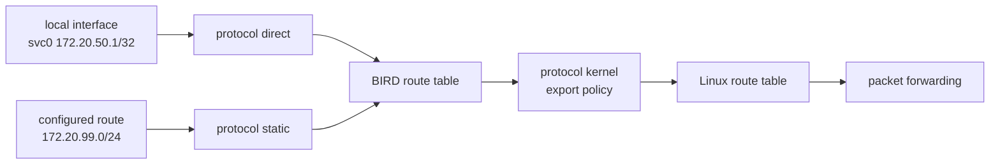
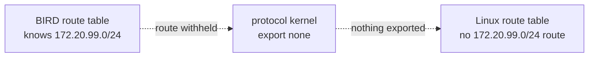
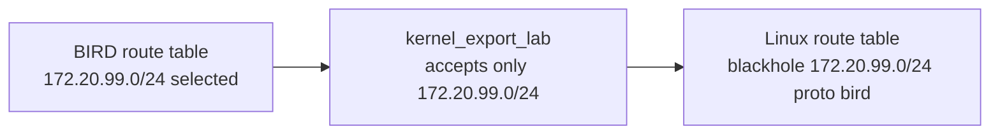

# BIRD as a Route Manager

??? info "Maintainer metadata"
    ```yaml
    chapter_id: part-01-05-bird-route-manager
    status: published-draft
    safety_level: local-routing-daemon
    lab_id: experiments/labs/bird-route-manager
    depends_on:
      - part-01-04-route-selection
    transcript: experiments/transcripts/bird-route-manager-20260619T144400Z.txt
    source_ids:
      - bird-docs
      - linux-ip-route
    tested_environment:
      host: macOS + OrbStack
      distro: recorded in transcript
      kernel: recorded in transcript
      bird: recorded in transcript
      wireguard_tools: not used
    beginner_review:
      status: complete
      note: Beginner-review pass incorporated in the BIRD chapter hardening sequence.
    technical_review:
      required: true
      status: deferred
      note: Lab commands validated locally; production BIRD guidance still requires technical review.
    ```

## Reader Starting Point

This chapter assumes you have completed Pocket Internet with Static Routes and Pocket Internet Route Selection. You should know what a namespace, interface, address, prefix, connected route, static route, route table, route lookup, and longest-prefix match are.

You have also felt the pain that creates the need for better tooling: route tables are not hard because one route is hard. They are hard because the network keeps changing and every router needs the right answer at the same time.

Before BIRD speaks BGP to another router, it can do a smaller job:

> BIRD can keep its own routing table and, when explicitly allowed, copy selected routes into Linux.

That is the whole point of this chapter.

## New Terms

| Term | Plain-language meaning | Example in this lab |
| --- | --- | --- |
| Routing daemon | A background program that manages routes. | `bird` |
| BIRD | The routing daemon used by this book. | One manually started BIRD process |
| BIRD route table | BIRD's own view of known routes. | `birdc show route all` |
| Direct protocol | A BIRD protocol that learns routes from local interfaces. | Learn `172.20.50.1/32` from `svc0` |
| Static protocol | A BIRD protocol that creates configured routes inside BIRD. | Create `172.20.99.0/24` inside BIRD |
| Kernel protocol | A BIRD protocol that exchanges routes with the Linux kernel route table. | Export one selected route into Linux |
| Import filter | A rule for deciding which routes enter a table or protocol. | `import none` from Linux into BIRD |
| Export filter | A rule for deciding which routes leave a table or protocol. | Export only `172.20.99.0/24` to Linux |

## Question

Can BIRD know a route before Linux can forward with that route?

## Hypothesis

If BIRD has a static route in its own route table, but `protocol kernel` is configured with `export none`, then `birdc` should show the route while `ip route` should not.

If we then change `protocol kernel` to export that one route, Linux should show it as a `proto bird` route.

## Mental Model

So far, the route table has meant the Linux route table:

```text
you type ip route add -> Linux route table -> packets move
```

BIRD adds another route table in front of Linux:



BIRD knowing a route is not the same thing as Linux using a route.

That distinction matters. BIRD can learn many routes, compare them, reject some, prefer others, and export only selected routes. In this chapter, there are no peers and no BGP yet. The only boundary is between BIRD and Linux.

## Why This Matters

BGP is going to make BIRD busier. Once routers exchange routes, BIRD will have to answer several questions:

- Which routes did I learn?
- Which routes should I keep?
- Which routes should I announce?
- Which routes should Linux actually use for forwarding?

Trying to meet all of that at once is a lot. This chapter isolates the last question: when does a route move from BIRD into Linux?

## Safety Boundaries

Safety level: local routing-daemon lab.

- The lab uses one temporary Linux network namespace.
- The lab starts BIRD manually inside that namespace.
- The lab does not start or modify the host's system BIRD service.
- The lab does not create BGP sessions.
- The lab does not create WireGuard interfaces.
- The lab does not add a default route.
- The lab does not touch DN42.
- Rollback stops the lab BIRD process and deletes the namespace.

Before the lab, capture the host baseline:

```sh
ip netns list
ip route get 1.1.1.1
```

After rollback, the namespace list should not contain `birdlab`.

## Lab Requirements

Build this lab manually. The validation script exists so you can rerun the experiment later, but the learning path is the manual path.

These commands need root privileges inside the Linux environment because network namespaces and BIRD sockets are system-level objects. On macOS, use an OrbStack shell:

```sh
orb
```

Then run the commands from that Linux shell as root, or prefix them with `sudo`.

Check the required tools before building the lab:

```sh
id
ip -V
bird --version
command -v birdc
```

Expected observations:

- `id` should show `uid=0(root)` if you are using a root lab shell.
- `ip -V` should print the installed `iproute2` version.
- `bird --version` should report BIRD 2.
- `command -v birdc` should print a path.

On Ubuntu:

```sh
apt update
apt install -y bird2
```

The repeatable validation script lives at:

```text
experiments/labs/bird-route-manager/run.sh
```

The checked validation transcript is:

```text
experiments/transcripts/bird-route-manager-20260619T144400Z.txt
```

## Lab Continuity Note

This chapter is self-contained. It creates one temporary BIRD namespace and does not require a checkpoint from an earlier lab.

## Step 1: Clean Up Any Previous Run

```sh
if ip netns list | grep -q '^birdlab'; then
  ip netns delete birdlab
fi

rm -rf /tmp/bird-route-manager
mkdir -p /tmp/bird-route-manager
```

Check:

```sh
ip netns list | grep '^birdlab' || true
```

Expected result: no output.

## Step 2: Create One Network Namespace

```sh
ip netns add birdlab
ip -n birdlab link set lo up
```

This namespace is a tiny isolated network stack. It has its own interfaces and its own Linux route table.

Add one dummy interface:

```sh
ip -n birdlab link add svc0 type dummy
ip -n birdlab addr add 172.20.50.1/32 dev svc0
ip -n birdlab link set svc0 up
```

A dummy interface is a local-only interface. It is useful when you want an address to exist inside a namespace without building a link to another namespace.

Inspect it:

```sh
ip -n birdlab addr show svc0
```

You should see `172.20.50.1/32` on `svc0`.

## Step 3: Inspect Linux Before BIRD

```sh
ip -n birdlab route show
ip -n birdlab route show 172.20.99.0/24
ip -n birdlab route get 172.20.99.1
```

Expected result:

- there is no route for `172.20.99.0/24`,
- `route get` says the network is unreachable.

That destination is not special yet. Linux has no instruction for it.

## Step 4: Write a BIRD Config That Does Not Export to Linux

Create the first config:

```sh title="Write /tmp/bird-route-manager/bird.conf"
cat >/tmp/bird-route-manager/bird.conf <<'EOF'
log stderr all;
router id 172.20.50.1;

protocol device {
  scan time 1;
}

protocol direct direct_service {
  ipv4;
  interface "svc0";
}

protocol static static_lab {
  ipv4;
  route 172.20.99.0/24 blackhole;
}

protocol kernel kernel_ipv4 {
  ipv4 {
    import none;
    export none;
  };
  scan time 1;
}
EOF
```

Read the config in plain English:

- `router id 172.20.50.1` gives this BIRD process a stable identifier.
- `protocol device` watches interface state.
- `protocol direct` learns from the address configured on `svc0`. In this lab, it is not copying that route from Linux's main route table.
- `protocol static` creates a route inside BIRD for `172.20.99.0/24`.
- `protocol kernel` controls movement between BIRD and Linux.
- `import none` means "do not learn routes from Linux into BIRD through this protocol."
- `export none` means "do not write BIRD routes into Linux through this protocol."

The static route is a `blackhole` route. That means "drop matching packets." We use it because the route is easy to observe and safe: it does not send traffic anywhere.

Validate the config before starting BIRD:

```sh
bird -p -c /tmp/bird-route-manager/bird.conf
```

Expected result: no output and a zero exit status.

## Step 5: Start BIRD Inside the Namespace

```sh
ip netns exec birdlab bird \
  -c /tmp/bird-route-manager/bird.conf \
  -s /tmp/bird-route-manager/bird.ctl \
  -P /tmp/bird-route-manager/bird.pid
```

This starts one lab-scoped BIRD process. The socket and PID file live under `/tmp/bird-route-manager` so you can inspect and stop this exact process without touching any system BIRD service.

Check the protocols:

```sh
ip netns exec birdlab birdc \
  -s /tmp/bird-route-manager/bird.ctl \
  show protocols
```

You should see `direct_service`, `static_lab`, and `kernel_ipv4` in the `up` state.

Now inspect BIRD's route table:

```sh
ip netns exec birdlab birdc \
  -s /tmp/bird-route-manager/bird.ctl \
  show route all
```

Expected result: BIRD shows both routes:

- `172.20.50.1/32` learned by `direct_service`,
- `172.20.99.0/24` created by `static_lab`.

Now ask Linux again:

```sh
ip -n birdlab route show 172.20.99.0/24
ip -n birdlab route get 172.20.99.1
```

Expected result:

- Linux still shows no route for `172.20.99.0/24`,
- `route get` still says the network is unreachable.

!!! success "What this proves"
    BIRD can know a route that Linux is not using for forwarding.

!!! warning "What this does not prove"
    This does not prove BGP is working. There are no neighbors, no ASNs, and no route advertisements yet. This only proves that BIRD has its own route table and that `protocol kernel` controls whether selected BIRD routes enter Linux.

At this point, the diagram looks like this:



## Step 6: Add an Explicit Kernel Export Filter

Now change only the kernel boundary.

Rewrite the config:

```sh title="Rewrite /tmp/bird-route-manager/bird.conf"
cat >/tmp/bird-route-manager/bird.conf <<'EOF'
log stderr all;
router id 172.20.50.1;

protocol device {
  scan time 1;
}

protocol direct direct_service {
  ipv4;
  interface "svc0";
}

protocol static static_lab {
  ipv4;
  route 172.20.99.0/24 blackhole;
}

filter kernel_export_lab {
  if net = 172.20.99.0/24 then accept;
  reject;
}

protocol kernel kernel_ipv4 {
  ipv4 {
    import none;
    export filter kernel_export_lab;
  };
  scan time 1;
}
EOF
```

Validate it:

```sh
bird -p -c /tmp/bird-route-manager/bird.conf
```

Reload BIRD:

```sh
ip netns exec birdlab birdc \
  -s /tmp/bird-route-manager/bird.ctl \
  configure
```

Read the new lines carefully:

```text
filter kernel_export_lab {
  if net = 172.20.99.0/24 then accept;
  reject;
}
```

This is a small export filter. It allows exactly one route to leave BIRD through the kernel protocol. Everything else is rejected.

The word "export" is not only for BGP. In BIRD, export means "routes leaving this table toward this protocol." Later, BGP export will mean routes leaving BIRD toward a neighbor. Here, kernel export means routes leaving BIRD toward Linux.

## Step 7: Inspect Linux After Export

```sh
ip netns exec birdlab birdc \
  -s /tmp/bird-route-manager/bird.ctl \
  show route 172.20.99.0/24 all
```

BIRD should still show the static route.

Now inspect Linux:

```sh
ip -n birdlab route show 172.20.99.0/24
```

Expected result:

```text
blackhole 172.20.99.0/24 proto bird metric 32
```

The exact metric may vary. The important part is `proto bird`: Linux now has a route that came from BIRD.

Try route lookup again:

```sh
ip -n birdlab route get 172.20.99.1
```

Because this is a blackhole route, Linux may answer with an error such as `Invalid argument`. That is fine. The interesting change is not successful delivery. The interesting change is that Linux now has a matching route installed by BIRD.

!!! success "What this proves"
    A route can move from BIRD's route table into Linux only when the kernel protocol exports it.

!!! warning "What this does not prove"
    This does not prove traffic can reach a real service. A blackhole route intentionally drops traffic. This also does not prove that a route is safe to export to another router. Route export is a boundary, and every boundary needs a policy.

After the export filter, the route crosses the kernel boundary:



## Step 8: Roll Back

Stop the lab BIRD process:

```sh
if [ -f /tmp/bird-route-manager/bird.pid ]; then
  ip netns exec birdlab kill "$(cat /tmp/bird-route-manager/bird.pid)" || true
fi
```

Delete the namespace and temporary files:

```sh
ip netns delete birdlab || true
rm -rf /tmp/bird-route-manager
```

Confirm cleanup:

```sh
ip netns list | grep '^birdlab' || true
```

Expected result: no output.

## What You Should Take Away

BIRD is not just "the BGP program."

In this chapter, BIRD did not speak to any neighbor. It still:

- watched a local interface through `protocol direct`,
- created a local route through `protocol static`,
- kept those routes in its own route table,
- withheld a route from Linux when `export none` was set,
- installed a selected route into Linux when an export filter allowed it.

The small lightbulb is this:

> Linux forwards packets. BIRD decides which routes Linux should learn.

That sentence is not complete enough for every real network, but it is the right working model for the next chapter.

## Troubleshooting

If `bird -p -c` fails, fix the config before starting BIRD. BIRD is strict about braces, semicolons, and block placement.

If `birdc` cannot connect, make sure you are using the lab socket:

```sh
ip netns exec birdlab birdc -s /tmp/bird-route-manager/bird.ctl show status
```

If `ip route` does not show `proto bird` after reload, check that:

- `birdc show route 172.20.99.0/24 all` shows the route in BIRD,
- `birdc configure` reported `Reconfigured`,
- the kernel protocol says `export filter kernel_export_lab`.

If cleanup fails, list the namespace and delete it directly:

```sh
ip netns list
ip netns delete birdlab
```

## Next We Need

Now BIRD can manage routes locally. Next, BIRD will speak BGP to other BIRD processes.

That is the moment when route maintenance starts to feel less like long division by hand. We still need to understand the hard way, but we no longer need to live there.

## References

- `bird-docs`
