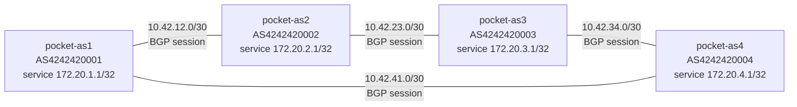
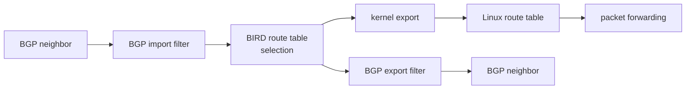

# BGP Before DN42

## Reader Starting Point

This chapter assumes you have completed Pocket Internet with Static Routes, Pocket Internet Route Selection, and BIRD as a Route Manager. You should know what a namespace, interface, veth pair, address, prefix, route, next hop, connected route, route lookup, service loopback, static route, return path, forwarding, longest-prefix match, routing daemon, BIRD route table, and kernel export are.

You have used BIRD locally, but you have not made routers exchange routes yet. That was deliberate.

By now, the annoying part should be visible: the links are easy to create, but keeping every route correct by hand gets old quickly. A tiny four-router lab already needs forward routes, return routes, repairs, and enough mental bookkeeping to make mistakes likely.

This chapter gives BIRD a new job:

> BIRD learns routes from other routers, chooses usable routes, and asks Linux to install selected routes.

BGP is the language BIRD will speak to other BIRD instances.

## New Terms

| Term | Plain-language meaning | Example in this lab |
| --- | --- | --- |
| BGP | A protocol routers use to exchange reachability. | `pocket-as1` learns `172.20.3.1/32` from a neighbor |
| BGP session | One BGP conversation between two routers. | `pocket-as1` talking to `pocket-as2` |
| Neighbor | The router on the other side of a BGP session. | `10.42.12.2` from `pocket-as1` |
| Local AS | The autonomous system number this router uses for itself. | `4242420001` |
| Peer AS | The autonomous system number expected from the neighbor. | `4242420002` |
| Route advertisement | Telling a neighbor that a prefix is reachable. | Advertising `172.20.1.1/32` |
| BGP import filter | A rule for deciding which received neighbor routes to accept. | Accept only Pocket Internet service loopbacks |
| BGP export filter | A rule for deciding which routes to announce to a neighbor. | Announce only Pocket Internet service loopbacks |
| Convergence | The network settling on new routes after a change. | A route disappears after a link fails, then returns |

## Question

Can the Pocket Internet learn service loopback routes automatically instead of writing static routes by hand?

## Hypothesis

If each AS-shaped namespace runs BIRD, and each BIRD instance has BGP sessions to its directly connected neighbors, then service loopback routes can move across the Pocket Internet without static routes.

If a BGP link fails, BIRD should withdraw the affected route from Linux. When the link returns, BIRD should learn and install the route again.

## Mental Model

The physical topology is the same four-router ring you already built:



!!! note "Lab-only prefixes and ASNs"

    The `172.20.x.x` service loopbacks and `AS424242000x` labels are Pocket Internet resources for this local lab. They are not DN42 authorization. The export filters in this chapter keep those routes inside the lab topology.

The new part is the control plane:

```text
Before:
you type route -> Linux route table -> packets move

Now:
BGP advertisement -> BIRD route table -> Linux route table -> packets move
```

The packet forwarding rule has not changed. Linux still forwards using installed routes. BIRD and BGP change how those routes arrive.

## Why It Matters

DN42 is not magic on the other side of the book. It is the same shape with real peers:

- a link exists,
- BGP runs across that link,
- each side announces selected prefixes,
- filters decide what is accepted and exported,
- BIRD installs selected routes into Linux,
- Linux forwards packets using the route table.

This lab keeps all of that local. If something breaks, it breaks inside temporary namespaces.

## Safety Boundaries

Safety level: routing-daemon lab.

- The lab uses only temporary Linux network namespaces.
- The lab starts BIRD manually inside those namespaces.
- The lab does not start or modify the host's system BIRD service.
- The lab does not add host default routes.
- The lab does not touch public DN42 peers.
- BGP import and export filters allow only the four Pocket Internet service loopbacks.
- Pocket Internet service loopbacks are not exported to DN42.
- Rollback stops the lab BIRD processes and deletes the namespaces.

Before the lab, capture the host baseline:

```sh
ip netns list
ip route get 1.1.1.1
```

The public route check should still point through your normal Internet connection after the lab.

## Lab

Build this lab manually. The validation script exists so you can rerun the experiment later, but the learning path is the manual path.

These commands must run with root privileges inside the Linux environment because network namespaces, links, and BIRD sockets are system-level objects. On macOS, use an OrbStack shell:

```sh
orb
```

Then run the commands from that Linux shell as root, or prefix them with `sudo`.

You also need BIRD 2 installed inside the Linux environment:

```sh
bird --version
command -v birdc
```

On Ubuntu, the package is usually:

```sh
apt update
apt install -y bird2
```

The repeatable validation script lives at:

```text
experiments/labs/pocket-internet-bgp/run.sh
```

The validated transcript for this experiment is:

```text
experiments/transcripts/pocket-internet-bgp-20260617T191953Z.txt
```

## What You Will Build

You will reuse the four Pocket Internet namespaces:

| Namespace | Local AS | Service loopback |
| --- | --- | --- |
| `pocket-as1` | `4242420001` | `172.20.1.1/32` |
| `pocket-as2` | `4242420002` | `172.20.2.1/32` |
| `pocket-as3` | `4242420003` | `172.20.3.1/32` |
| `pocket-as4` | `4242420004` | `172.20.4.1/32` |

Each namespace will run one BIRD process.

Each BIRD process will:

- learn the namespace's own service loopback,
- establish BGP sessions to directly connected neighbors,
- import only the four expected service loopbacks,
- export only the four expected service loopbacks,
- install accepted routes into the Linux kernel route table.

The AS numbers are lab-only numbers. They are shaped like DN42 ASNs, but they are not registry claims.

## Step 1: Clean Up Any Old Lab State

If you ran this lab before, stop old lab BIRD processes and delete old namespaces:

```sh
for ns in pocket-as1 pocket-as2 pocket-as3 pocket-as4; do
  if [ -f "/tmp/pocket-internet-bgp/${ns}.pid" ]; then
    ip netns exec "$ns" kill "$(cat "/tmp/pocket-internet-bgp/${ns}.pid")" 2>/dev/null || true
  fi
done

ip netns delete pocket-as1 2>/dev/null || true
ip netns delete pocket-as2 2>/dev/null || true
ip netns delete pocket-as3 2>/dev/null || true
ip netns delete pocket-as4 2>/dev/null || true
rm -rf /tmp/pocket-internet-bgp
```

Confirm they are gone:

```sh
ip netns list | grep -E '^(pocket-as1|pocket-as2|pocket-as3|pocket-as4)( |$)' || true
```

No output is the expected result.

## Step 2: Create the Pocket Internet Topology

Create the namespaces:

```sh
ip netns add pocket-as1
ip netns add pocket-as2
ip netns add pocket-as3
ip netns add pocket-as4
```

Create the four point-to-point links:

```sh
ip link add as1-as2 type veth peer name as2-as1
ip link set as1-as2 netns pocket-as1
ip link set as2-as1 netns pocket-as2

ip link add as2-as3 type veth peer name as3-as2
ip link set as2-as3 netns pocket-as2
ip link set as3-as2 netns pocket-as3

ip link add as3-as4 type veth peer name as4-as3
ip link set as3-as4 netns pocket-as3
ip link set as4-as3 netns pocket-as4

ip link add as4-as1 type veth peer name as1-as4
ip link set as4-as1 netns pocket-as4
ip link set as1-as4 netns pocket-as1
```

Add service loopbacks:

```sh
ip -n pocket-as1 addr add 172.20.1.1/32 dev lo
ip -n pocket-as2 addr add 172.20.2.1/32 dev lo
ip -n pocket-as3 addr add 172.20.3.1/32 dev lo
ip -n pocket-as4 addr add 172.20.4.1/32 dev lo
```

Add link addresses:

```sh
ip -n pocket-as1 addr add 10.42.12.1/30 dev as1-as2
ip -n pocket-as2 addr add 10.42.12.2/30 dev as2-as1

ip -n pocket-as2 addr add 10.42.23.1/30 dev as2-as3
ip -n pocket-as3 addr add 10.42.23.2/30 dev as3-as2

ip -n pocket-as3 addr add 10.42.34.1/30 dev as3-as4
ip -n pocket-as4 addr add 10.42.34.2/30 dev as4-as3

ip -n pocket-as4 addr add 10.42.41.1/30 dev as4-as1
ip -n pocket-as1 addr add 10.42.41.2/30 dev as1-as4
```

Bring up loopbacks and links:

```sh
for ns in pocket-as1 pocket-as2 pocket-as3 pocket-as4; do
  ip -n "$ns" link set lo up
  ip netns exec "$ns" sysctl -w net.ipv4.ip_forward=1
done

ip -n pocket-as1 link set as1-as2 up
ip -n pocket-as1 link set as1-as4 up
ip -n pocket-as2 link set as2-as1 up
ip -n pocket-as2 link set as2-as3 up
ip -n pocket-as3 link set as3-as2 up
ip -n pocket-as3 link set as3-as4 up
ip -n pocket-as4 link set as4-as3 up
ip -n pocket-as4 link set as4-as1 up
```

At this point, you have links and connected routes, but no service-loopback routes between namespaces.

Check from `pocket-as1`:

```sh
ip -n pocket-as1 route show 172.20.3.1
ip -n pocket-as1 route get 172.20.3.1
```

Expected result:

- `route show` prints no route for `172.20.3.1`,
- `route get` says the network is unreachable.

This is exactly where the earlier static-routing lab became tedious. This time, do not add static routes.

## Step 3: Create the Lab BIRD Directory

Create a temporary directory for BIRD config, sockets, and PID files:

```sh
mkdir -p /tmp/pocket-internet-bgp
```

BIRD needs a config file per namespace because each namespace has a different router ID, local AS, and neighbor list.

## Step 4: Read One Full BIRD Config

The first config is for `pocket-as1`.

Read the main blocks before typing it:

- `router id` gives BIRD a stable identifier.
- `protocol direct` learns the service loopback route from `lo`.
- `protocol kernel` exports selected BIRD routes into Linux.
- `pocket_import` rejects unexpected received prefixes.
- `pocket_export` rejects unexpected announced prefixes.
- each `protocol bgp` block defines one neighbor session.

Write the full `pocket-as1` config:

```sh title="Write /tmp/pocket-internet-bgp/pocket-as1.conf"
cat >/tmp/pocket-internet-bgp/pocket-as1.conf <<'EOF'
log stderr all;
router id 172.20.1.1;                 # (1)

protocol device {
  scan time 1;
}

protocol direct direct_loopbacks {    # (2)
  ipv4;
  interface "lo";
}

protocol kernel kernel_ipv4 {         # (3)
  ipv4 {
    import none;
    export all;                       # (4)
  };
  scan time 1;
}

filter pocket_import {                # (5)
  if net = 172.20.1.1/32 then accept;
  if net = 172.20.2.1/32 then accept;
  if net = 172.20.3.1/32 then accept;
  if net = 172.20.4.1/32 then accept;
  reject;
}

filter pocket_export {                # (6)
  if net = 172.20.1.1/32 then accept;
  if net = 172.20.2.1/32 then accept;
  if net = 172.20.3.1/32 then accept;
  if net = 172.20.4.1/32 then accept;
  reject;
}

protocol bgp to_as2 {                 # (7)
  local as 4242420001;                # (8)
  neighbor 10.42.12.2 as 4242420002;  # (9)
  source address 10.42.12.1;          # (10)
  check link yes;
  ipv4 {
    import filter pocket_import;      # (11)
    export filter pocket_export;      # (12)
  };
}

protocol bgp to_as4 {
  local as 4242420001;
  neighbor 10.42.41.1 as 4242420004;
  source address 10.42.41.2;
  check link yes;
  ipv4 {
    import filter pocket_import;
    export filter pocket_export;
  };
}
EOF
```

Read the annotations:

1. `router id` is BIRD's stable ID for this router.
2. `protocol direct` learns the service loopback from `lo`.
3. `protocol kernel` is the BIRD-to-Linux boundary.
4. `export all` writes selected BIRD routes into Linux. This is lab-only convenience, not a DN42 policy.
5. `pocket_import` decides which BGP-learned prefixes are accepted.
6. `pocket_export` decides which prefixes may be announced to BGP neighbors.
7. Each `protocol bgp` block is one neighbor session.
8. `local as` is this namespace's AS number.
9. `neighbor` names the peer address and peer AS number.
10. `source address` is the local address BIRD uses for that session.
11. BGP import applies the received-route safety filter.
12. BGP export applies the announced-route safety filter.

!!! warning "Lab-only kernel export"
    `protocol kernel export all` is acceptable here because the lab accepts only four service loopbacks and runs inside temporary namespaces. Do not read it as "export everything to DN42." BGP export policy and kernel export policy are different boundaries.

The important mental shift is that the BGP export filter is not "send everything I know." It is "send only the prefixes this lab allows."

## Step 5: Keep the Route Boundaries Separate

The config has four different decision points. Keep them separate in your head:

| Boundary | Config line or command | Question it answers |
| --- | --- | --- |
| BGP import filter | `import filter pocket_import` inside `protocol bgp` | Which neighbor routes may enter BIRD? |
| BIRD route table selection | `birdc show route ... all` | Which accepted route is active for this prefix? |
| BIRD-to-kernel export | `export all` inside `protocol kernel` | Which selected BIRD routes may become Linux routes? |
| Linux route lookup and forwarding | `ip route get ...` | How would Linux forward a packet now? |



Two words repeat across these boundaries: **import** and **export**.

- BGP import/export controls routes exchanged with a neighbor.
- Kernel import/export controls routes exchanged with Linux.

The same words do not mean the same neighbor.

BIRD may know more than one accepted route for the same prefix. In the route output, the active route is the one BIRD selected for use and possible export to Linux.

## Step 6: Write the Other Three BIRD Configs

The other configs have the same structure as `pocket-as1`. The values that change are:

| Namespace | Router ID | Local AS | BGP sessions |
| --- | --- | --- | --- |
| `pocket-as2` | `172.20.2.1` | `4242420002` | `to_as1`: neighbor `10.42.12.1`, peer AS `4242420001`, source `10.42.12.2`<br>`to_as3`: neighbor `10.42.23.2`, peer AS `4242420003`, source `10.42.23.1` |
| `pocket-as3` | `172.20.3.1` | `4242420003` | `to_as2`: neighbor `10.42.23.1`, peer AS `4242420002`, source `10.42.23.2`<br>`to_as4`: neighbor `10.42.34.2`, peer AS `4242420004`, source `10.42.34.1` |
| `pocket-as4` | `172.20.4.1` | `4242420004` | `to_as3`: neighbor `10.42.34.1`, peer AS `4242420003`, source `10.42.34.2`<br>`to_as1`: neighbor `10.42.41.2`, peer AS `4242420001`, source `10.42.41.1` |

Use the same template to write the remaining configs:

```sh title="Define a small config writer for the repeated BIRD shape"
write_bird_config() {
  ns="$1"
  router_id="$2"
  local_as="$3"
  shift 3

  config="/tmp/pocket-internet-bgp/${ns}.conf"

  {
    cat <<EOF
log stderr all;
router id ${router_id};

protocol device { scan time 1; }

protocol direct direct_loopbacks {
  ipv4;
  interface "lo";
}

protocol kernel kernel_ipv4 {
  ipv4 {
    import none;
    export all;
  };
  scan time 1;
}

filter pocket_import {
  if net = 172.20.1.1/32 then accept;
  if net = 172.20.2.1/32 then accept;
  if net = 172.20.3.1/32 then accept;
  if net = 172.20.4.1/32 then accept;
  reject;
}

filter pocket_export {
  if net = 172.20.1.1/32 then accept;
  if net = 172.20.2.1/32 then accept;
  if net = 172.20.3.1/32 then accept;
  if net = 172.20.4.1/32 then accept;
  reject;
}
EOF

    while [ "$#" -gt 0 ]; do
      protocol_name="$1"
      neighbor_ip="$2"
      neighbor_as="$3"
      source_ip="$4"
      shift 4

      cat <<EOF

protocol bgp ${protocol_name} {
  local as ${local_as};
  neighbor ${neighbor_ip} as ${neighbor_as};
  source address ${source_ip};
  check link yes;
  ipv4 {
    import filter pocket_import;
    export filter pocket_export;
  };
}
EOF
    done
  } >"${config}"
}
```

Now write `pocket-as2`, `pocket-as3`, and `pocket-as4`:

```sh title="Write the remaining BIRD configs"
write_bird_config pocket-as2 172.20.2.1 4242420002 \
  to_as1 10.42.12.1 4242420001 10.42.12.2 \
  to_as3 10.42.23.2 4242420003 10.42.23.1

write_bird_config pocket-as3 172.20.3.1 4242420003 \
  to_as2 10.42.23.1 4242420002 10.42.23.2 \
  to_as4 10.42.34.2 4242420004 10.42.34.1

write_bird_config pocket-as4 172.20.4.1 4242420004 \
  to_as3 10.42.34.1 4242420003 10.42.34.2 \
  to_as1 10.42.41.2 4242420001 10.42.41.1
```

This is not hiding the config. It is reducing visual noise after you have read one complete version. The table shows the values that actually change:

- router ID,
- local AS,
- neighbor address,
- peer AS,
- source address.

Those five values are the heart of a first BGP session.

## Step 7: Validate the Configs

Before starting BIRD, ask BIRD to parse each config:

```sh title="Validate BIRD configs from the root Linux shell"
bird -p -c /tmp/pocket-internet-bgp/pocket-as1.conf
bird -p -c /tmp/pocket-internet-bgp/pocket-as2.conf
bird -p -c /tmp/pocket-internet-bgp/pocket-as3.conf
bird -p -c /tmp/pocket-internet-bgp/pocket-as4.conf
```

No output means the syntax is valid.

This catches a large class of mistakes before any route can be installed.

## Step 8: Start One BIRD Process Per Namespace

Start BIRD in `pocket-as1`:

```sh title="Start BIRD inside pocket-as1"
ip netns exec pocket-as1 bird \
  -c /tmp/pocket-internet-bgp/pocket-as1.conf \
  -s /tmp/pocket-internet-bgp/pocket-as1.ctl \
  -P /tmp/pocket-internet-bgp/pocket-as1.pid
```

Start the other three:

```sh title="Start BIRD inside pocket-as2, pocket-as3, and pocket-as4"
ip netns exec pocket-as2 bird \
  -c /tmp/pocket-internet-bgp/pocket-as2.conf \
  -s /tmp/pocket-internet-bgp/pocket-as2.ctl \
  -P /tmp/pocket-internet-bgp/pocket-as2.pid

ip netns exec pocket-as3 bird \
  -c /tmp/pocket-internet-bgp/pocket-as3.conf \
  -s /tmp/pocket-internet-bgp/pocket-as3.ctl \
  -P /tmp/pocket-internet-bgp/pocket-as3.pid

ip netns exec pocket-as4 bird \
  -c /tmp/pocket-internet-bgp/pocket-as4.conf \
  -s /tmp/pocket-internet-bgp/pocket-as4.ctl \
  -P /tmp/pocket-internet-bgp/pocket-as4.pid
```

The `-s` option gives each namespace a separate control socket. That lets `birdc` talk to the right BIRD process.

## Step 9: Watch BGP Sessions Establish

Ask `pocket-as1` what its protocols are doing:

```sh title="Inspect BGP protocols inside pocket-as1"
ip netns exec pocket-as1 birdc -s /tmp/pocket-internet-bgp/pocket-as1.ctl show protocols
```

Expected observation:

```text
Name       Proto      Table      State  Since         Info
device1    Device     ---        up     ...
direct...  Direct     ---        up     ...
kernel...  Kernel     master4    up     ...
to_as2     BGP        ---        up     ...           Established
to_as4     BGP        ---        up     ...           Established
```

The names and timestamps may differ. The important word is `Established`.

Check the other namespaces:

```sh title="Inspect BGP protocols inside the other namespaces"
ip netns exec pocket-as2 birdc -s /tmp/pocket-internet-bgp/pocket-as2.ctl show protocols
ip netns exec pocket-as3 birdc -s /tmp/pocket-internet-bgp/pocket-as3.ctl show protocols
ip netns exec pocket-as4 birdc -s /tmp/pocket-internet-bgp/pocket-as4.ctl show protocols
```

If a session is not established yet, wait a few seconds and run the command again. BGP is a conversation, not a one-shot route command.

## Step 10: Observe Routes in BIRD

Ask `pocket-as1` what BIRD knows about `pocket-as3`'s service loopback:

```sh title="Inspect the selected BGP route inside pocket-as1"
ip netns exec pocket-as1 birdc -s /tmp/pocket-internet-bgp/pocket-as1.ctl show route 172.20.3.1/32 all
```

Expected observation:

- BIRD knows a route for `172.20.3.1/32`.
- The route came from BGP.
- The route has an AS path.
- BIRD selected one usable route.

The output will look similar to this:

```text
172.20.3.1/32  unicast [to_as2 ...] * (100) [AS4242420003i]
  via 10.42.12.2 on as1-as2
  Type: BGP univ
  BGP.as_path: 4242420002 4242420003
```

Read that as:

- `to_as2` is the BGP protocol that learned this copy of the route,
- `*` marks the route BIRD selected,
- `Type: BGP` says this route came from BGP,
- `BGP.as_path` shows the AS numbers the advertisement crossed.

This is the control-plane view. It answers:

> What reachability did BIRD learn?

## Step 11: Observe Routes in Linux

Now ask Linux:

```sh title="Compare BIRD route export with Linux route lookup"
ip -n pocket-as1 route show 172.20.3.1
ip -n pocket-as1 route get 172.20.3.1 from 172.20.1.1
```

Expected observation:

- Linux now has a route to `172.20.3.1`,
- the route points toward one of `pocket-as1`'s neighbors,
- you did not type that route by hand.

The `route show` output should include `proto bird`, similar to:

```text
172.20.3.1 via 10.42.12.2 dev as1-as2 proto bird
```

That `proto bird` marker is the proof that the route in Linux came from BIRD. The `route get` command then shows how Linux would actually forward a packet using that installed route.

Now test actual reachability:

```sh
ip netns exec pocket-as1 ping -c 2 -W 1 -I 172.20.1.1 172.20.3.1
```

This is the same kind of ping as the static-routing lab. The difference is who maintained the route table.

## Step 12: Isolate One AS And Watch The Route Withdraw

Bring down both links into `pocket-as3`:

```sh
ip -n pocket-as2 link set as2-as3 down
ip -n pocket-as4 link set as4-as3 down
```

That isolates `pocket-as3` from the rest of Pocket Internet. Watch `pocket-as1` again:

```sh title="Inspect BGP protocols inside pocket-as1"
ip netns exec pocket-as1 birdc -s /tmp/pocket-internet-bgp/pocket-as1.ctl show protocols
ip netns exec pocket-as1 birdc -s /tmp/pocket-internet-bgp/pocket-as1.ctl show route 172.20.3.1/32 all
ip -n pocket-as1 route get 172.20.3.1 from 172.20.1.1
```

The route to `172.20.3.1/32` should disappear from BIRD and from Linux. You did not delete a route by hand. BIRD withdrew the route because the BGP sessions that carried that reachability went down.

That is convergence: the routing system reacting to a topology change.

## Step 13: Bring The Links Back

Bring the links back up:

```sh
ip -n pocket-as2 link set as2-as3 up
ip -n pocket-as4 link set as4-as3 up
```

Wait a few seconds, then check again:

```sh title="Inspect BGP protocols inside the remaining namespaces"
ip netns exec pocket-as2 birdc -s /tmp/pocket-internet-bgp/pocket-as2.ctl show protocols
ip netns exec pocket-as3 birdc -s /tmp/pocket-internet-bgp/pocket-as3.ctl show protocols
ip netns exec pocket-as1 birdc -s /tmp/pocket-internet-bgp/pocket-as1.ctl show route 172.20.3.1/32 all
ip -n pocket-as1 route get 172.20.3.1 from 172.20.1.1
```

The route should settle again.

This is the payoff from the previous static-routing pain. You still need to understand routes, next hops, and return paths, but BIRD can do the repetitive route maintenance.

## Troubleshooting Branches

### BGP Session Is Not Established

Start with the neighbor addresses:

```sh
ip -n pocket-as1 addr show
ip -n pocket-as1 route get 10.42.12.2
ip netns exec pocket-as1 ping -c 1 -W 1 10.42.12.2
```

If the neighbor address is not reachable, BGP cannot establish. Fix the link before changing BIRD.

Then inspect the BIRD protocol:

```sh title="Inspect the detailed pocket-as1 to_as2 session"
ip netns exec pocket-as1 birdc -s /tmp/pocket-internet-bgp/pocket-as1.ctl show protocols all to_as2
```

Common causes:

- wrong neighbor IP,
- wrong peer AS,
- wrong source address,
- link down,
- BIRD config typo.

### BGP Is Established But No Routes Appear

Check the filters:

```sh
ip netns exec pocket-as1 birdc -s /tmp/pocket-internet-bgp/pocket-as1.ctl show route all
```

If the session is established but no service loopbacks appear, the neighbor may not be exporting them or your import filter may be rejecting them.

That is not a bad thing. Filters are supposed to reject unexpected routes. The job is to make the allowed set explicit.

### BIRD Has A Route But Linux Does Not

Compare BIRD and Linux:

```sh title="Compare BIRD and Linux route state inside pocket-as1"
ip netns exec pocket-as1 birdc -s /tmp/pocket-internet-bgp/pocket-as1.ctl show route 172.20.3.1/32 all
ip -n pocket-as1 route show 172.20.3.1
```

If BIRD knows the route but Linux does not, look at the kernel protocol:

```sh title="Inspect the BIRD kernel export protocol inside pocket-as1"
ip netns exec pocket-as1 birdc -s /tmp/pocket-internet-bgp/pocket-as1.ctl show protocols all kernel_ipv4
```

The important idea is that BIRD's route table and Linux's route table are related but not identical. BIRD must choose a route, and the kernel protocol must export it.

## Rollback

Stop the four lab BIRD processes:

```sh
for ns in pocket-as1 pocket-as2 pocket-as3 pocket-as4; do
  if [ -f "/tmp/pocket-internet-bgp/${ns}.pid" ]; then
    ip netns exec "$ns" kill "$(cat "/tmp/pocket-internet-bgp/${ns}.pid")" 2>/dev/null || true
  fi
done
```

Delete the namespaces and temporary files:

```sh
ip netns delete pocket-as1 2>/dev/null || true
ip netns delete pocket-as2 2>/dev/null || true
ip netns delete pocket-as3 2>/dev/null || true
ip netns delete pocket-as4 2>/dev/null || true
rm -rf /tmp/pocket-internet-bgp
```

Prove cleanup worked:

```sh
if ip netns list | grep -E '^(pocket-as1|pocket-as2|pocket-as3|pocket-as4)( |$)'; then
  echo 'leftover Pocket Internet namespaces found'
  exit 1
fi
echo 'no Pocket Internet namespaces remain'
```

Confirm the public default path still uses the normal host route:

```sh
ip route get 1.1.1.1
```

## What You Can Now Explain

You can now explain:

- why static routing became annoying,
- what BIRD automates,
- what a BGP session is,
- why neighbor IP, local AS, peer AS, and source address must match,
- how a service loopback becomes a route advertisement,
- why import and export filters are safety boundaries,
- how a route can exist in BIRD before it appears in Linux,
- what convergence feels like in a small lab.

## Still Okay If Fuzzy

It is okay if these are still fuzzy:

- how BGP chooses between two equal-looking paths,
- why an AS path prevents simple routing loops,
- how DN42 validates which AS may originate which prefix,
- how IPv6 changes the config shape,
- how BIRD policies become more sophisticated in real networks.

Those are later chapters. The point here is simpler: BGP lets routers exchange reachability, and BIRD can turn that exchanged reachability into Linux routes.

## Next We Need

The next Pocket Internet step is to run a real service inside the lab. Routes are useful only because they carry traffic to something.

After that, one veth link can become a WireGuard tunnel. The routing idea should remain the same even when the "cable" becomes an encrypted overlay link.

## How the Real Internet Does This

The public Internet also uses BGP to exchange reachability between autonomous systems. Real networks add contracts, route registries, RPKI, prefix limits, communities, monitoring, abuse handling, and careful operational policy.

DN42 sits between this lab and the public Internet. It uses real BGP habits in a learning network where mistakes are still serious but the blast radius is smaller.

Pocket Internet gives you the model before you touch that living network.

## References

- `bird-docs`
- `rfc-4271`
