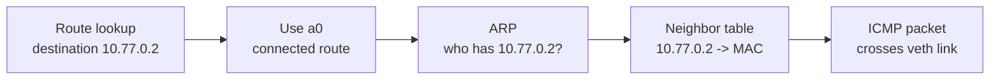

# Local Link Discovery and Packet Observation

??? info "Maintainer metadata"
    ```yaml
    chapter_id: part-01-11-local-link-observation
    status: draft
    safety_level: local-lab
    lab_id: experiments/labs/local-link-observation
    depends_on:
      - part-01-01-linux-router
      - part-01-02-addressing-prefixes-longest-match
    transcript: "pending; OrbStack validation blocked by VM start timeout"
    source_ids:
      - linux-ip-route
    tested_environment:
      host: macOS + OrbStack
      distro: pending validation transcript
      kernel: pending validation transcript
      bird: not used
      wireguard_tools: not used
    beginner_review:
      status: deferred
      note: Deferred until the lab can be validated and transcript-backed.
    technical_review:
      required: false
      status: not_required
      note: Local namespace, ARP, and packet-capture lab; no real-network procedure.
    ```

## Reader Starting Point

This chapter assumes you know what a namespace, interface, address, prefix, connected route, route lookup, and local link are.

You have already used this idea:

> If two addresses are on the same local link, Linux can send directly through the interface instead of sending to another router.

Now we will slow down and look at what "send directly" actually means.

## New Terms

| Term | Plain-language meaning | Concrete example in this chapter |
| --- | --- | --- |
| ARP | The IPv4 question a machine asks on a local link: "Who has this IP address?" | `pocket-link-a` asks who has `10.77.0.2`. |
| Neighbor table | Linux's cache of local-link IP-to-link-layer mappings. | `ip -n pocket-link-a neigh show` after a ping. |
| MAC address | The link-layer address used on an Ethernet-like link. | A veth interface has a MAC address that ARP can discover. |
| Packet capture | Recording packets seen on an interface. | `tcpdump` watching `b0` inside `pocket-link-b`. |
| ICMP | A protocol used by `ping` to send echo requests and replies. | `ping -c 1 10.77.0.2` sends ICMP. |
| NDP | IPv6's neighbor-discovery system. | Later IPv6 labs use NDP where this IPv4 lab uses ARP. |

## Question

When Linux says a destination is reachable through a local interface, what else has to happen before packets cross the link?

## Hypothesis

If `pocket-link-a` and `pocket-link-b` are on the same `/30` link, then route lookup should choose the local veth interface.

Before the first packet can be delivered, `pocket-link-a` must learn the link-layer destination for `10.77.0.2`. On IPv4 Ethernet-like links, that means ARP. After ARP succeeds, the neighbor table should contain an entry and later pings should not need to ask the same ARP question again immediately.

## Mental Model

Route lookup answers a routing question:

```text
Where should Linux try to send this packet?
```

Neighbor discovery answers a local-link delivery question:

```text
What link-layer destination should this packet use on that interface?
```

Packet capture answers an observation question:

```text
What packets did this interface actually see?
```

Those are related, but they are not the same check.



## Why This Matters

Earlier chapters used "on-link" and "connected route" as if the link was a simple pipe. That was fine at first, but real troubleshooting needs more precision.

A route can be correct while local-link delivery is broken. A packet capture can prove a packet crossed one interface without proving the application worked. A service can be down even though ARP, routing, and packet movement are all healthy.

This chapter gives you the missing layer between route lookup and application success.

## Safety Boundaries

Safety level: local lab.

- The lab uses two temporary Linux network namespaces.
- The lab creates one veth pair.
- The lab uses only `10.77.0.0/30`, a local teaching prefix.
- The lab does not change host routes.
- The lab does not start network services.
- The lab writes temporary packet captures under `/tmp/local-link-observation`.
- Rollback deletes both namespaces and removes the temporary capture files.

Before the lab, capture the host baseline:

```sh
ip netns list
ip route get 1.1.1.1
```

## Lab Requirements

Run this chapter inside the Linux lab environment from a root shell. The commands below are written without `sudo` so they stay readable and match the validation transcript.

Check the required tools:

```sh
id
ip -V
tcpdump --version
```

Expected observations:

- `id` should show `uid=0(root)`. If it does not, enter a root lab shell before continuing.
- `ip -V` should print the installed `iproute2` version.
- `tcpdump --version` should print the installed `tcpdump` version.

The repeatable validation script lives at:

```text
experiments/labs/local-link-observation/run.sh
```

The validation transcript for this experiment is pending.

The current blocker is an OrbStack VM startup timeout while recreating `pocket-internet-lab`. Maintainers should replace this note with a tracked transcript path after the lab runs successfully.

## What You Will Build

You will create two namespaces connected by one veth pair:

```text
pocket-link-a a0 10.77.0.1/30  <---- veth ---->  10.77.0.2/30 b0 pocket-link-b
```

There is no router in this lab. Both addresses are on the same local link.

## Step 1: Clean Up Any Old Lab State

Remove old copies of the lab namespaces and capture directory:

```sh
ip netns delete pocket-link-a 2>/dev/null || true
ip netns delete pocket-link-b 2>/dev/null || true
rm -rf /tmp/local-link-observation
```

Check that no lab namespaces remain:

```sh
ip netns list | grep -E '^(pocket-link-a|pocket-link-b)( |$)' || true
```

No output is the expected clean state.

## Step 2: Create The Namespaces And Link

Create two network namespaces:

```sh
ip netns add pocket-link-a
ip netns add pocket-link-b
```

Create one veth pair and move one end into each namespace:

```sh
ip link add a0 type veth peer name b0
ip link set a0 netns pocket-link-a
ip link set b0 netns pocket-link-b
```

## Step 3: Add Addresses And Bring The Link Up

Add one address on each end:

```sh
ip -n pocket-link-a addr add 10.77.0.1/30 dev a0
ip -n pocket-link-b addr add 10.77.0.2/30 dev b0
```

Bring up loopback and the veth interfaces:

```sh
ip -n pocket-link-a link set lo up
ip -n pocket-link-a link set a0 up
ip -n pocket-link-b link set lo up
ip -n pocket-link-b link set b0 up
```

## Step 4: Inspect The Connected Route

Look at the routes Linux created from the interface addresses:

```sh
ip -n pocket-link-a route
ip -n pocket-link-b route
```

You should see one connected route in each namespace:

```text
10.77.0.0/30 dev a0 proto kernel scope link src 10.77.0.1
10.77.0.0/30 dev b0 proto kernel scope link src 10.77.0.2
```

Ask `pocket-link-a` how it would reach `10.77.0.2`:

```sh
ip -n pocket-link-a route get 10.77.0.2
```

Read the answer as:

> To reach `10.77.0.2`, send directly through `a0` using source `10.77.0.1`.

Route lookup has not sent a packet. It has only selected the route.

## Step 5: Inspect The Neighbor Tables Before Traffic

Before any traffic, ask both namespaces what neighbors they know:

```sh
ip -n pocket-link-a neigh show
ip -n pocket-link-b neigh show
```

You should usually see no output. The route exists, but no packet has forced either side to learn the other side's link-layer address yet.

!!! note "Empty is useful evidence"

    An empty neighbor table does not mean the route is missing. It means Linux has not cached a local-link neighbor mapping yet.

## Step 6: Capture The First Packet Exchange

Create a temporary capture directory:

```sh
mkdir -p /tmp/local-link-observation
```

Start `tcpdump` inside `pocket-link-b`, watching interface `b0` for ARP or ICMP:

```sh
ip netns exec pocket-link-b timeout 8 tcpdump -n -e -i b0 -c 4 'arp or icmp' -l -U -w /tmp/local-link-observation/first-ping.pcap &
TCPDUMP_PID=$!
```

Give `tcpdump` a moment to start:

```sh
sleep 1
```

Now ping from `pocket-link-a` to `pocket-link-b`:

```sh
ip netns exec pocket-link-a ping -c 1 -W 2 10.77.0.2
```

Wait for the capture to finish:

```sh
wait "$TCPDUMP_PID"
```

Read the capture:

```sh
ip netns exec pocket-link-b tcpdump -n -e -r /tmp/local-link-observation/first-ping.pcap
```

You should see an ARP question, an ARP answer, and ICMP echo traffic.

Read that as:

> The route chose `a0`. ARP found the link-layer destination. Then ICMP crossed the link.

## Step 7: Inspect The Neighbor Tables After Traffic

Now check the neighbor table again:

```sh
ip -n pocket-link-a neigh show
ip -n pocket-link-b neigh show
```

You should see entries for the other side's IP address with a link-layer address and a state such as `REACHABLE`, `STALE`, or `DELAY`.

The exact state may vary. The important part is that the IP address now maps to a link-layer address on the local interface.

## Step 8: Capture A Warm-Neighbor Ping

Run another short capture, this time only for ICMP:

```sh
ip netns exec pocket-link-b timeout 8 tcpdump -n -e -i b0 -c 2 'icmp' -l -U -w /tmp/local-link-observation/second-ping.pcap &
TCPDUMP_PID=$!
sleep 1
ip netns exec pocket-link-a ping -c 1 -W 2 10.77.0.2
wait "$TCPDUMP_PID"
ip netns exec pocket-link-b tcpdump -n -e -r /tmp/local-link-observation/second-ping.pcap
```

This time, you should see ICMP echo request and reply traffic without needing to focus on ARP again.

That does not mean ARP is gone forever. Neighbor cache entries age out. It means Linux already had enough neighbor information for this immediate packet exchange.

## What The Checks Prove

| Check | What it proves | What it does not prove |
| --- | --- | --- |
| `ip route get 10.77.0.2` | Linux selected an outgoing interface and source address. | A packet crossed the link. |
| `ip neigh show` before traffic | No neighbor mapping is cached yet. | The route is missing. |
| `tcpdump` showing ARP | Local-link discovery happened. | The application works. |
| `tcpdump` showing ICMP | Ping packets crossed the observed interface. | Every future packet will succeed. |
| `ip neigh show` after traffic | Linux cached a local-link mapping. | The cache will stay valid forever. |

## NDP: The IPv6 Version Of This Idea

IPv6 does not use ARP. It uses Neighbor Discovery Protocol, usually shortened to NDP.

The beginner-level idea is the same:

> Before a machine can deliver to a neighbor on a local link, it needs a link-layer destination for that neighbor.

Do not memorize NDP details yet. The later IPv6 chapter will revisit this with IPv6 addresses. For now, keep the shape:

```text
IPv4 local-link delivery: route lookup -> ARP -> neighbor table -> packet crosses link
IPv6 local-link delivery: route lookup -> NDP -> neighbor table -> packet crosses link
```

## Troubleshooting Branches

If `tcpdump` is missing, install it inside the Linux lab environment and rerun the chapter. Do not install or change packet-capture tools on your macOS host for this lab.

If `ping` fails and `ip route get` looks correct, check the link state:

```sh
ip -n pocket-link-a link show a0
ip -n pocket-link-b link show b0
```

Both interfaces should be `UP`.

If `tcpdump` captures ARP requests but no ARP replies, the packet reached the observed interface, but the other side did not answer the local-link discovery question. Check the address on `b0`:

```sh
ip -n pocket-link-b addr show b0
```

If `tcpdump` captures nothing, check that it is running inside the right namespace and on the right interface:

```sh
ip -n pocket-link-b link show b0
```

## Rollback

Delete the namespaces and temporary capture files:

```sh
ip netns delete pocket-link-a 2>/dev/null || true
ip netns delete pocket-link-b 2>/dev/null || true
rm -rf /tmp/local-link-observation
```

Prove cleanup worked:

```sh
if ip netns list | grep -E '^(pocket-link-a|pocket-link-b)( |$)'; then
  echo 'leftover local-link namespaces found'
  exit 1
fi
echo 'no local-link namespaces remain'
```

Confirm the public default path still uses the normal host route:

```sh
ip route get 1.1.1.1
```

## Repeat With The Validation Script

After you have built the lab manually, you can rerun the repeatable script when you want a clean repeat or transcript:

```sh
bash experiments/labs/local-link-observation/run.sh
```

On macOS with OrbStack:

```sh
orb bash experiments/labs/local-link-observation/run.sh
```

Local reruns save transcripts under the ignored directory:

```text
experiments/transcripts/local/
```

## What You Can Now Explain

You can now explain:

- why route lookup is not proof that a packet crossed a link,
- why a connected route still needs local-link discovery before first delivery,
- what ARP contributes on IPv4 local links,
- what the neighbor table caches,
- why packet capture is evidence from one observation point, not the whole truth,
- why IPv6 will use NDP instead of ARP for a similar local-link job.

## Still Okay If Fuzzy

It is okay if these are still fuzzy:

- the exact meaning of every neighbor state,
- every field in a packet capture,
- IPv6 NDP message types,
- packet capture filters beyond the examples shown here.

Those details matter later, but not all at once. The important concept is the separation between route choice, local-link neighbor discovery, packet observation, and application behavior.

## Next We Need

Now that you can observe packets on a local link, the next safety gap is policy: a route can be correct and packets can reach a namespace, but a packet filter can still decide to drop them.

## References

- `linux-ip-route`
