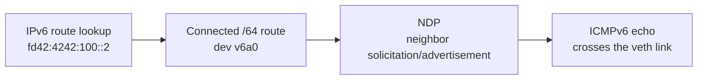

# IPv6 and ULA Foundation

??? info "Maintainer metadata"
    ```yaml
    chapter_id: part-01-12-ipv6-ula-foundation
    status: published-draft
    safety_level: local-lab
    lab_id: experiments/labs/ipv6-ula-foundation
    depends_on:
      - part-01-02-addressing-prefixes-longest-match
      - part-01-local-link-observation
    transcript: experiments/transcripts/ipv6-ula-foundation-20260620T000000Z.txt
    source_ids:
      - linux-ip-route
      - rfc-4193
    tested_environment:
      host: macOS + OrbStack
      distro: Ubuntu 24.04 noble
      kernel: 7.0.11-orbstack-00360-gc9bc4d96ac70
      bird: not used
      wireguard_tools: not used
    beginner_review:
      status: deferred
      note: Deferred in this pass; chapter is transcript-backed and ready for the next beginner review loop.
    technical_review:
      required: true
      status: deferred
      note: IPv6 commands are local-lab only; DN42-facing IPv6 guidance still needs current-source review.
    ```

## Reader Starting Point

This chapter assumes you know what an address, prefix, connected route, route lookup, local link, neighbor table, ARP, NDP, and packet capture are.

Pocket Internet has used IPv4 so far because it is easier to read at first:

```text
10.42.12.1/30
172.20.3.1/32
```

Real DN42 work will not stay that simple. IPv6 appears early in real routing communities, and DN42 uses IPv6 Unique Local Addresses, or ULA. This chapter gives you enough IPv6 to keep later DN42 chapters from feeling like a second unrelated book.

## New Terms

| Term | Plain-language meaning | Concrete example in this chapter |
| --- | --- | --- |
| IPv6 address | A 128-bit IP address, written in hexadecimal groups separated by colons. | `fd42:4242:100::1` |
| Hexadecimal | Base-16 notation using `0-9` and `a-f`. | `4242` and `fd42` are hexadecimal groups. |
| `::` compression | A shorthand that replaces one run of zero groups in an IPv6 address. | `fd42:4242:100::1` expands zeros in the middle. |
| ULA | Unique Local Address space for IPv6 private networks. | `fd42:4242:100::/64` is a lab-only ULA prefix here. |
| ICMPv6 | IPv6's control-message protocol family. | NDP and IPv6 ping use ICMPv6. |
| IPv6 route table | The route table Linux uses for IPv6 packets. | `ip -6 route` |

## Question

What changes when the same routing ideas use IPv6 addresses instead of IPv4 addresses?

## Hypothesis

The route lookup idea stays the same:

> Destination address in, selected route out.

The notation changes. The address size changes. Local-link discovery changes from ARP to NDP. Linux keeps IPv4 and IPv6 routes in separate views. But the core habit still holds: ask the route table what would happen, then prove packet movement with a real test.

## Mental Model

IPv4 in earlier labs:

```text
address: 10.77.0.1
prefix:  10.77.0.0/30
route:   10.77.0.0/30 dev a0
local discovery: ARP
```

IPv6 in this lab:

```text
address: fd42:4242:100::1
prefix:  fd42:4242:100::/64
route:   fd42:4242:100::/64 dev v6a0
local discovery: NDP
```

The shape is familiar:



## IPv6 Address Notation

IPv4 addresses are written in decimal:

```text
10.77.0.1
```

IPv6 addresses are written in hexadecimal groups:

```text
fd42:4242:100:0:0:0:0:1
```

That is long, so IPv6 allows one run of zero groups to be shortened with `::`:

```text
fd42:4242:100::1
```

Those two forms name the same address. The compact form is what you will normally see.

!!! note "Only one `::`"

    An IPv6 address can use `::` only once. If it appeared twice, you could not know how many zero groups belonged in each compressed spot.

## Prefix Lengths Still Matter

IPv6 prefixes use the same slash notation:

```text
fd42:4242:100::1/64
```

Read that as:

> The address is `fd42:4242:100::1`, and the local prefix is `fd42:4242:100::/64`.

The numbers are bigger than IPv4, but the routing idea is the same:

- a `/128` is one exact IPv6 address,
- a `/64` is the usual size for one IPv6 local link,
- a shorter prefix covers a broader range.

For this book, the first lightbulb is not the binary math. It is the habit:

> Address plus prefix length tells Linux both the local address and the connected neighborhood.

## What ULA Means

ULA stands for Unique Local Address. It is IPv6 space intended for private networks.

In this lab, we use:

```text
fd42:4242:100::/64
fd42:4242:200::1/128
```

These are teaching prefixes. They are not permission to announce anything to DN42.

ULA is similar to private IPv4 in spirit, but do not treat it as identical:

- ULA is IPv6, not IPv4 with longer addresses.
- ULA is not public Internet address space.
- ULA still needs routing if it crosses more than one link.
- Real DN42 IPv6 prefixes must come from DN42 registry and peer expectations, not from this lab.

## Why This Matters

DN42-facing chapters will eventually contain IPv6 prefixes, IPv6 neighbor behavior, IPv6 route filters, and IPv6 BIRD configuration. If those show up without a foundation, the reader has to learn routing and notation at the same time.

This chapter keeps the problem small:

- one IPv6 link,
- one ULA service loopback,
- one explicit IPv6 route,
- one packet capture of NDP and ICMPv6.

## Safety Boundaries

Safety level: local lab.

- The lab uses two temporary Linux network namespaces.
- The lab creates one veth pair and one dummy service interface.
- The lab uses lab-only ULA prefixes.
- The lab does not change host routes.
- The lab does not start network services.
- The lab does not touch DN42 peers or registry objects.
- Rollback deletes both namespaces and removes temporary packet captures.

Before the lab, capture the host baseline:

```sh
ip netns list
ip -6 route
```

## Lab Requirements

Run this chapter inside the Linux lab environment from a root shell. The commands below are written without `sudo` so they stay readable and match the validation transcript.

Check the required tools:

```sh
id
ip -V
tcpdump --version
```

Expected observations:

- `id` should show `uid=0(root)`. If it does not, enter a root lab shell before continuing.
- `ip -V` should print the installed `iproute2` version.
- `tcpdump --version` should print the installed `tcpdump` version.

The repeatable validation script lives at:

```text
experiments/labs/ipv6-ula-foundation/run.sh
```

The validated transcript for this experiment is:

```text
experiments/transcripts/ipv6-ula-foundation-20260620T000000Z.txt
```

## What You Will Build

You will create two namespaces connected by one IPv6 ULA link:

```text
pocket-v6-a v6a0 fd42:4242:100::1/64  <---- veth ---->  fd42:4242:100::2/64 v6b0 pocket-v6-b
```

Then you will add one service loopback inside `pocket-v6-b`:

```text
pocket-v6-b service0 fd42:4242:200::1/128
```

Finally, `pocket-v6-a` will learn an explicit IPv6 host route to that service address:

```text
fd42:4242:200::1/128 via fd42:4242:100::2 dev v6a0
```

## Step 1: Clean Up Any Old Lab State

Remove old copies of the lab namespaces and capture directory:

```sh
ip netns delete pocket-v6-a 2>/dev/null || true
ip netns delete pocket-v6-b 2>/dev/null || true
rm -rf /tmp/ipv6-ula-foundation
```

Check that no lab namespaces remain:

```sh
ip netns list | grep -E '^(pocket-v6-a|pocket-v6-b)( |$)' || true
```

No output is the expected clean state.

## Step 2: Create The Namespaces And Link

Create two network namespaces:

```sh
ip netns add pocket-v6-a
ip netns add pocket-v6-b
```

Create one veth pair and move one end into each namespace:

```sh
ip link add v6a0 type veth peer name v6b0
ip link set v6a0 netns pocket-v6-a
ip link set v6b0 netns pocket-v6-b
```

## Step 3: Reduce Address Setup Noise

IPv6 can perform Duplicate Address Detection when an address appears on a link. That is useful on real networks, but it adds extra packets while this lab is trying to show one clean NDP exchange.

Disable it inside these disposable namespaces:

```sh
ip netns exec pocket-v6-a sysctl -w net.ipv6.conf.all.accept_dad=0
ip netns exec pocket-v6-a sysctl -w net.ipv6.conf.default.accept_dad=0
ip netns exec pocket-v6-a sysctl -w net.ipv6.conf.v6a0.accept_dad=0
ip netns exec pocket-v6-b sysctl -w net.ipv6.conf.all.accept_dad=0
ip netns exec pocket-v6-b sysctl -w net.ipv6.conf.default.accept_dad=0
ip netns exec pocket-v6-b sysctl -w net.ipv6.conf.v6b0.accept_dad=0
```

This is not a host recommendation. It changes only the temporary lab namespaces.

## Step 4: Add IPv6 Addresses

Add one ULA address to each side of the link:

```sh
ip -n pocket-v6-a addr add fd42:4242:100::1/64 dev v6a0
ip -n pocket-v6-b addr add fd42:4242:100::2/64 dev v6b0
```

Add a dummy service interface inside `pocket-v6-b`:

```sh
ip -n pocket-v6-b link add service0 type dummy
ip netns exec pocket-v6-b sysctl -w net.ipv6.conf.service0.accept_dad=0
ip -n pocket-v6-b addr add fd42:4242:200::1/128 dev service0
```

Read the service address as:

> One exact IPv6 service address lives inside `pocket-v6-b`.

## Step 5: Bring Interfaces Up

Bring up loopback, the veth interfaces, and the service interface:

```sh
ip -n pocket-v6-a link set lo up
ip -n pocket-v6-a link set v6a0 up
ip -n pocket-v6-b link set lo up
ip -n pocket-v6-b link set v6b0 up
ip -n pocket-v6-b link set service0 up
```

## Step 6: Inspect IPv6 Addresses And Routes

Show the IPv6 addresses:

```sh
ip -n pocket-v6-a -6 addr show dev v6a0
ip -n pocket-v6-b -6 addr show dev v6b0
ip -n pocket-v6-b -6 addr show dev service0
```

Now show the IPv6 route tables:

```sh
ip -n pocket-v6-a -6 route
ip -n pocket-v6-b -6 route
```

You should see a connected `/64` route on the veth link. You should also see the `/128` service address as local state inside `pocket-v6-b`.

## Step 7: Inspect Route Lookup On The Local Link

Ask `pocket-v6-a` how it would reach the neighbor address:

```sh
ip -n pocket-v6-a -6 route get fd42:4242:100::2
```

Read the answer as:

> To reach `fd42:4242:100::2`, send directly through `v6a0` using source `fd42:4242:100::1`.

Then inspect the IPv6 neighbor table before traffic:

```sh
ip -n pocket-v6-a -6 neigh show
```

The route can exist before the neighbor table has a cached link-layer mapping.

## Step 8: Capture The First IPv6 Neighbor Discovery

Create a temporary capture directory:

```sh
mkdir -p /tmp/ipv6-ula-foundation
```

Start `tcpdump` inside `pocket-v6-b`, watching for ICMPv6:

```sh
ip netns exec pocket-v6-b timeout 8 tcpdump -n -e -i v6b0 -c 4 'icmp6' -l -U -w /tmp/ipv6-ula-foundation/first-v6-ping.pcap &
TCPDUMP_PID=$!
```

Give `tcpdump` a moment to start:

```sh
sleep 1
```

Ping the IPv6 neighbor:

```sh
ip netns exec pocket-v6-a ping -6 -c 1 -W 2 fd42:4242:100::2
```

Wait for the capture to finish:

```sh
wait "$TCPDUMP_PID"
```

Read the capture:

```sh
ip netns exec pocket-v6-b tcpdump -n -e -r /tmp/ipv6-ula-foundation/first-v6-ping.pcap
```

You should see neighbor solicitation, neighbor advertisement, and ICMPv6 echo traffic.

Read that as:

> The route chose `v6a0`. NDP found the link-layer destination. Then ICMPv6 crossed the link.

Now inspect the IPv6 neighbor tables:

```sh
ip -n pocket-v6-a -6 neigh show
ip -n pocket-v6-b -6 neigh show
```

## Step 9: Add A ULA Service-Loopback Route

At this point, `pocket-v6-a` knows how to reach the link address on `pocket-v6-b`, but it does not automatically know about the service loopback.

Add an explicit IPv6 host route:

```sh
ip -n pocket-v6-a -6 route add fd42:4242:200::1/128 via fd42:4242:100::2 dev v6a0
```

Ask Linux which route it would use:

```sh
ip -n pocket-v6-a -6 route get fd42:4242:200::1
```

Then prove the address is reachable:

```sh
ip netns exec pocket-v6-a ping -6 -c 1 -W 2 fd42:4242:200::1
```

The important idea is not that this service loopback is special. It is just an exact IPv6 destination. The routing habit is the same as IPv4:

> To reach a destination outside the connected prefix, add a route through a reachable next hop.

## Step 10: Show That IPv4 And IPv6 Routes Are Separate

Ask for the IPv4 route table:

```sh
ip -n pocket-v6-a route || true
```

Now ask for the IPv6 route table:

```sh
ip -n pocket-v6-a -6 route
```

The IPv6 routes do not appear in the IPv4 table. Later BIRD and DN42 examples must be explicit about which address family they are configuring.

## What The Checks Prove

| Check | What it proves | What it does not prove |
| --- | --- | --- |
| `ip -6 route` | Linux has IPv6 routes. | IPv4 routing works the same way in that namespace. |
| `ip -6 route get fd42:4242:100::2` | Linux selected the connected IPv6 route. | NDP has already resolved the neighbor. |
| `tcpdump` showing neighbor solicitation and advertisement | NDP happened on the local link. | Any real DN42 peer is configured correctly. |
| `ping -6 fd42:4242:200::1` | The explicit IPv6 host route reaches the service loopback. | The prefix is authorized outside this lab. |
| `ip route` versus `ip -6 route` | IPv4 and IPv6 route tables are separate views. | BIRD policy is correct for both families. |

## BIRD Configuration Shape

This lab does not start BIRD. That is deliberate.

For now, remember only this shape:

- IPv4 routes and IPv6 routes are different address families.
- BIRD configurations often need separate IPv4 and IPv6 channel blocks.
- A route filter that is correct for IPv4 is not automatically a complete IPv6 policy.
- Real DN42 IPv6 examples must be checked against current DN42 guidance before publication.

The point is to avoid the common trap: "I understand the IPv4 example, so IPv6 must be the same text with longer addresses." The routing concepts rhyme, but the configuration surface is not always identical.

## DN42 Connection

Pocket Internet has been IPv4-only so far. That was a teaching choice, not a model of real DN42 operation.

Before a real DN42 chapter uses IPv6, it must answer questions this lab does not answer:

- What exact DN42 IPv6 prefix is authorized?
- What registry object or peer expectation authorizes it?
- Which routes are imported and exported for IPv6?
- Are IPv4 and IPv6 filters both present?
- How is rollback proven for both address families?

This lab is the foundation, not the permission slip.

## Troubleshooting Branches

If `ping -6` says `Network is unreachable`, check the IPv6 route lookup:

```sh
ip -n pocket-v6-a -6 route get fd42:4242:100::2
```

If route lookup works but ping fails, check the link state:

```sh
ip -n pocket-v6-a link show v6a0
ip -n pocket-v6-b link show v6b0
```

If `tcpdump` captures neighbor solicitations but no neighbor advertisements, check the IPv6 address on `pocket-v6-b`:

```sh
ip -n pocket-v6-b -6 addr show dev v6b0
```

If the service-loopback ping fails, check the explicit route:

```sh
ip -n pocket-v6-a -6 route get fd42:4242:200::1
```

## Rollback

Delete the namespaces and temporary capture files:

```sh
ip netns delete pocket-v6-a 2>/dev/null || true
ip netns delete pocket-v6-b 2>/dev/null || true
rm -rf /tmp/ipv6-ula-foundation
```

Prove cleanup worked:

```sh
if ip netns list | grep -E '^(pocket-v6-a|pocket-v6-b)( |$)'; then
  echo 'leftover IPv6 lab namespaces found'
  exit 1
fi
echo 'no IPv6 lab namespaces remain'
```

Confirm the host IPv6 route table is still the host route table:

```sh
ip -6 route
```

## Repeat With The Validation Script

After you have built the lab manually, you can rerun the repeatable script when you want a clean repeat or transcript:

```sh
bash experiments/labs/ipv6-ula-foundation/run.sh
```

On macOS with OrbStack:

```sh
orb bash experiments/labs/ipv6-ula-foundation/run.sh
```

Local reruns save transcripts under the ignored directory:

```text
experiments/transcripts/local/
```

## What You Can Now Explain

You can now explain:

- why IPv6 addresses look different but still use prefix lengths,
- why `/128` is the IPv6 exact-address route,
- why `/64` is the normal local-link size in this lab,
- what ULA is and why lab ULA is not public or DN42 authorization,
- why IPv6 local-link discovery uses NDP instead of ARP,
- why `ip route` and `ip -6 route` are separate checks,
- why later BIRD/DN42 chapters must handle IPv4 and IPv6 deliberately.

## Still Okay If Fuzzy

It is okay if these are still fuzzy:

- binary IPv6 prefix math,
- every NDP message type,
- link-local IPv6 addresses,
- router advertisements,
- BIRD IPv6 channel syntax,
- real DN42 IPv6 registry workflow.

Those belong in later chapters. This chapter's job is to make IPv6 route lookup, ULA, and NDP feel connected to the routing habits you already practiced.

## Next We Need

Now that the book has a first IPv6 foundation, the next safety gap is filtering: a route can be correct, and local-link discovery can work, but policy can still decide whether a packet is allowed.

## References

- `linux-ip-route`
- `rfc-4193`
