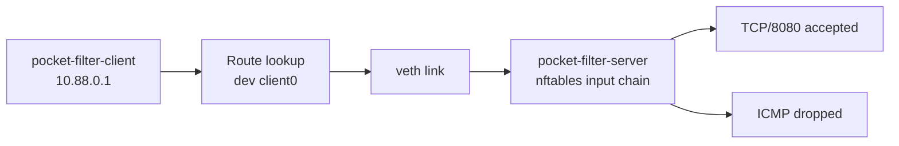

# Packet Filtering Foundation

??? info "Maintainer metadata"
    ```yaml
    chapter_id: part-01-13-packet-filtering-foundation
    status: published-draft
    safety_level: local-lab
    lab_id: experiments/labs/packet-filtering-foundation
    depends_on:
      - part-01-07-operate-service
      - part-01-11-local-link-observation
    transcript: experiments/transcripts/packet-filtering-foundation-20260620T000000Z.txt
    source_ids:
      - linux-ip-route
      - nftables-wiki
    tested_environment:
      host: macOS + OrbStack
      distro: Ubuntu 24.04 noble
      kernel: 7.0.11-orbstack-00360-gc9bc4d96ac70
      bird: not used
      wireguard_tools: not used
    beginner_review:
      status: deferred
      note: Deferred in this pass; chapter is transcript-backed and ready for the next beginner review loop.
    technical_review:
      required: true
      status: deferred
      note: Local nftables lab validated before publication; real-network firewall guidance requires later technical review.
    ```

## Reader Starting Point

This chapter assumes you know what a namespace, interface, address, prefix, route lookup, packet capture, service, listener, and port are.

You have already seen that several things can be true at the same time:

- Linux can have a route.
- Packets can cross a link.
- A service can be listening.

Now we add another decision point:

> Even when routing is correct, packet filtering policy can still allow or drop traffic.

## New Terms

| Term | Plain-language meaning | Concrete example in this chapter |
| --- | --- | --- |
| Packet filter | A rule system that inspects packets and decides what happens to them. | `nftables` rules inside `pocket-filter-server`. |
| nftables | Linux's modern packet-filtering framework. | `nft add rule ... tcp dport 8080 ... accept` |
| Rule | One packet-matching instruction and action. | Allow TCP destination port `8080` from `10.88.0.1`. |
| Chain | An ordered list of packet-filtering rules attached to a hook. | `input` chain for packets entering the server namespace. |
| Policy | The default action if no rule accepts or drops a packet first. | `policy drop` on the lab input chain. |
| Counter | A rule statistic showing how many packets matched. | `counter packets 1 bytes 84 drop` after a blocked ping. |

## Question

Can the route be correct while a firewall still blocks traffic?

## Hypothesis

If a client has a connected route to a server, route lookup should still choose the server link after a firewall rule is installed.

If the server's packet filter allows HTTP traffic to TCP port `8080`, `curl` should still work.

If the same packet filter drops ICMP echo requests, `ping` should fail even though route lookup is unchanged.

## Mental Model

Route lookup chooses a path:

```text
10.88.0.2 -> dev client0
```

Packet filtering decides whether a packet is allowed at a boundary:

```text
packet enters server0 -> input chain -> rule match -> accept or drop
```

Those checks answer different questions.



## Why This Matters

Without packet filtering, a reachable service is often reachable by anyone who has a route to it. That is not a safe habit for real networks.

The opposite mistake is also common: a route looks correct, so the reader keeps debugging routes even though a firewall is dropping the packet.

This chapter teaches the split:

- routing decides where the packet should go,
- listening decides whether an application is waiting,
- filtering decides whether policy allows the packet.

## Safety Boundaries

Safety level: local lab.

- The lab uses two temporary Linux network namespaces.
- The lab creates one veth pair.
- The lab starts one Python HTTP listener inside `pocket-filter-server`.
- The lab creates nftables rules only inside `pocket-filter-server`.
- The lab does not change host firewall rules.
- The lab does not disable any host firewall.
- Rollback deletes both namespaces and removes the namespace-local nftables state with them.

Before the lab, capture the host baseline:

```sh
ip netns list
ip route get 1.1.1.1
```

## Lab Requirements

Run this chapter inside the Linux lab environment from a root shell. The commands below are written without `sudo` so they stay readable and match the validation transcript.

Check the required tools:

```sh
id
ip -V
nft --version
python3 --version
curl --version
```

Expected observations:

- `id` should show `uid=0(root)`. If it does not, enter a root lab shell before continuing.
- `nft --version` should print the nftables command version.
- `python3 --version` and `curl --version` should print installed versions.

The repeatable validation script lives at:

```text
experiments/labs/packet-filtering-foundation/run.sh
```

The validated transcript for this experiment is:

```text
experiments/transcripts/packet-filtering-foundation-20260620T000000Z.txt
```

## What You Will Build

You will create two namespaces:

```text
pocket-filter-client client0 10.88.0.1/30  <---- veth ---->  10.88.0.2/30 server0 pocket-filter-server
```

Inside `pocket-filter-server`, you will start an HTTP listener:

```text
10.88.0.2:8080
```

Then you will add a namespace-local packet filter:

```text
allow TCP/8080 from 10.88.0.1
drop ICMP echo traffic
drop everything else by default
```

## Step 1: Clean Up Any Old Lab State

Remove old copies of the lab namespaces and files:

```sh
ip netns delete pocket-filter-client 2>/dev/null || true
ip netns delete pocket-filter-server 2>/dev/null || true
rm -rf /tmp/packet-filtering-foundation
```

Check that no lab namespaces remain:

```sh
ip netns list | grep -E '^(pocket-filter-client|pocket-filter-server)( |$)' || true
```

No output is the expected clean state.

## Step 2: Create The Namespaces And Link

Create the namespaces:

```sh
ip netns add pocket-filter-client
ip netns add pocket-filter-server
```

Create one veth pair and move one end into each namespace:

```sh
ip link add client0 type veth peer name server0
ip link set client0 netns pocket-filter-client
ip link set server0 netns pocket-filter-server
```

## Step 3: Add Addresses And Bring The Link Up

Add one address on each end:

```sh
ip -n pocket-filter-client addr add 10.88.0.1/30 dev client0
ip -n pocket-filter-server addr add 10.88.0.2/30 dev server0
```

Bring up loopback and the veth interfaces:

```sh
ip -n pocket-filter-client link set lo up
ip -n pocket-filter-client link set client0 up
ip -n pocket-filter-server link set lo up
ip -n pocket-filter-server link set server0 up
```

## Step 4: Start A Local HTTP Service

Create one small file for the service:

```sh
mkdir -p /tmp/packet-filtering-foundation/web
printf 'packet filtering lab ok\n' > /tmp/packet-filtering-foundation/web/index.html
```

Start the HTTP server inside the server namespace:

```sh
ip netns exec pocket-filter-server python3 -m http.server 8080 --bind 10.88.0.2 --directory /tmp/packet-filtering-foundation/web >/tmp/packet-filtering-foundation/http.log 2>&1 &
SERVER_PID=$!
sleep 1
```

Check that the listener exists:

```sh
ip netns exec pocket-filter-server ss -ltnp
```

## Step 5: Prove Routing And Service Reachability Before Filtering

Ask Linux which route the client will use:

```sh
ip -n pocket-filter-client route get 10.88.0.2
```

Ping the server:

```sh
ip netns exec pocket-filter-client ping -c 1 -W 2 10.88.0.2
```

Fetch the HTTP page:

```sh
ip netns exec pocket-filter-client curl -sS --max-time 3 http://10.88.0.2:8080/
```

At this point, routing works, ICMP works, and the service works.

## Step 6: Install A Namespace-Local nftables Filter

Create a table:

```sh
ip netns exec pocket-filter-server nft add table inet pocket_filter
```

Create an input chain with default drop policy:

```sh
ip netns exec pocket-filter-server nft add chain inet pocket_filter input '{ type filter hook input priority 0; policy drop; }'
```

Read that as:

> For packets entering this namespace, drop by default unless a later rule accepts them.

Allow loopback traffic:

```sh
ip netns exec pocket-filter-server nft add rule inet pocket_filter input iifname lo accept
```

Allow the intended HTTP traffic:

```sh
ip netns exec pocket-filter-server nft add rule inet pocket_filter input ip saddr 10.88.0.1 tcp dport 8080 counter accept
```

Drop ICMP echo traffic:

```sh
ip netns exec pocket-filter-server nft add rule inet pocket_filter input ip protocol icmp counter drop
```

Inspect the ruleset:

```sh
ip netns exec pocket-filter-server nft list ruleset
```

## Step 7: Prove Route Lookup Is Unchanged

Ask for the same route again:

```sh
ip -n pocket-filter-client route get 10.88.0.2
```

The route should still point to `client0`.

The packet filter did not remove the route. It added a policy decision at the server's input boundary.

## Step 8: Prove Intended Service Traffic Is Allowed

Fetch the page again:

```sh
ip netns exec pocket-filter-client curl -sS --max-time 3 http://10.88.0.2:8080/
```

This should still work because the filter accepts TCP destination port `8080` from `10.88.0.1`.

## Step 9: Prove Unrelated ICMP Traffic Is Denied

Try ping again:

```sh
ip netns exec pocket-filter-client ping -c 1 -W 2 10.88.0.2 || true
```

This should fail. That is the point of the lab.

Now inspect the ruleset counters:

```sh
ip netns exec pocket-filter-server nft list ruleset
```

You should see packet counters on the accept rule and the drop rule.

Read that as:

> Policy allowed the intended HTTP traffic and denied unrelated ICMP traffic.

## What The Checks Prove

| Check | What it proves | What it does not prove |
| --- | --- | --- |
| `ip route get 10.88.0.2` | The client still has a route to the server address. | The server will accept every packet. |
| `ss -ltnp` | A service is listening on TCP/8080. | The filter permits clients to reach it. |
| `curl` before filtering | Routing and service behavior work before policy is added. | The service is safely exposed. |
| `curl` after filtering | The intended traffic is allowed. | Other traffic is allowed. |
| failed `ping` after filtering | ICMP is denied by policy. | The route is broken. |
| nftables counters | Rules matched traffic. | The policy is production-complete. |

## Troubleshooting Branches

If `nft` is missing, install `nftables` inside the Linux lab environment. Do not change your macOS firewall for this lab.

If `curl` fails before filtering, do not debug nftables yet. Check the route and listener first:

```sh
ip -n pocket-filter-client route get 10.88.0.2
ip netns exec pocket-filter-server ss -ltnp
```

If `curl` fails after filtering, inspect the ruleset:

```sh
ip netns exec pocket-filter-server nft list ruleset
```

Check that the accept rule names the correct source address and destination port.

If `ping` still works after filtering, inspect rule order:

```sh
ip netns exec pocket-filter-server nft list chain inet pocket_filter input
```

Rules are checked in order. A broad accept rule before the ICMP drop rule could allow traffic you meant to block.

## Rollback

Stop the HTTP listener if it is still running:

```sh
kill "$SERVER_PID" 2>/dev/null || true
```

Delete the namespaces and temporary files:

```sh
ip netns delete pocket-filter-client 2>/dev/null || true
ip netns delete pocket-filter-server 2>/dev/null || true
rm -rf /tmp/packet-filtering-foundation
```

Prove cleanup worked:

```sh
if ip netns list | grep -E '^(pocket-filter-client|pocket-filter-server)( |$)'; then
  echo 'leftover packet-filter namespaces found'
  exit 1
fi
echo 'no packet-filter namespaces remain'
```

The nftables table lived inside `pocket-filter-server`. Deleting that namespace removes the lab filter state.

## Repeat With The Validation Script

After you have built the lab manually, you can rerun the repeatable script when you want a clean repeat or transcript:

```sh
bash experiments/labs/packet-filtering-foundation/run.sh
```

On macOS with OrbStack:

```sh
orb bash experiments/labs/packet-filtering-foundation/run.sh
```

Local reruns save transcripts under the ignored directory:

```text
experiments/transcripts/local/
```

## What You Can Now Explain

You can now explain:

- why route lookup is not proof that policy allows the packet,
- why a listening service is not the same thing as an exposed service,
- how an input packet filter can allow one traffic type and drop another,
- why counters are useful evidence,
- why host firewalls should not be disabled globally to make a lab pass,
- why DN42-facing services need explicit filtering and rollback.

## Still Okay If Fuzzy

It is okay if these are still fuzzy:

- nftables family and hook details,
- connection tracking,
- forwarding-chain versus input-chain policy,
- persistent firewall configuration,
- production firewall design.

Those are later operational topics. This chapter's job is smaller: separate route correctness from packet-filter policy.

## Next We Need

Now that routing, packet movement, services, IPv6 basics, and filtering have a foundation, the next major gap is naming: how a name becomes an address, and how DNS can fail separately from routing and services.

## References

- `linux-ip-route`
- `nftables-wiki`
