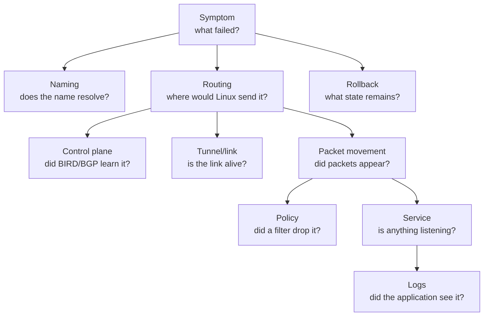

# Observability And Troubleshooting Foundation

??? info "Maintainer metadata"
    ```yaml
    chapter_id: part-01-15-observability-and-troubleshooting
    status: published-draft
    safety_level: conceptual-runbook
    lab_id: none
    depends_on:
      - part-01-05-bird-route-manager
      - part-01-07-operate-service
      - part-01-09-wireguard-link
      - part-01-local-link-observation
      - part-01-13-packet-filtering-foundation
      - part-01-14-dns-and-naming-foundation
    transcript: none
    source_ids:
      - linux-ip-route
      - bird-docs
      - wireguard-quickstart
      - nftables-wiki
      - rfc-1034
      - rfc-1035
    tested_environment:
      host: not applicable
      distro: not applicable
      kernel: not applicable
      bird: not executed
      wireguard_tools: not executed
    beginner_review:
      status: deferred
      note: Deferred in this pass; runbook should be reviewed with the full Pocket Internet section.
    technical_review:
      required: true
      status: deferred
      note: Command patterns are grounded in earlier validated labs; real DN42 operations require later technical review.
    ```

## Reader Starting Point

This chapter assumes you have worked through the Pocket Internet foundation chapters. You have seen namespaces, routes, BIRD, BGP, WireGuard, services, packet captures, packet filters, DNS, and rollback.

The problem is that those checks appeared chapter by chapter. Real troubleshooting does not arrive in chapter order.

It arrives as:

> Something does not work. Now what?

This chapter is a field guide for that moment.

## New Terms

| Term | Plain-language meaning | Concrete example |
| --- | --- | --- |
| Observability | The habit of using system evidence to understand what is happening. | Route tables, BIRD state, `wg show`, `ss`, DNS answers, logs, and packet captures. |
| Runbook | A reusable troubleshooting path. | Start from route lookup, then check control plane, tunnel state, service state, policy, and rollback. |
| Control plane | The system that decides or communicates reachability. | BGP sessions and BIRD route selection. |
| Data plane | The system that actually forwards packets. | Linux route lookup, interfaces, tunnels, and packet filters. |
| Symptom | The visible failure that started the investigation. | `curl` times out, `ping` fails, or a BGP session is down. |
| Rollback proof | Evidence that cleanup removed the state a lab created. | `ip netns list` shows no lab namespaces. |

## The Rule

Do not debug "the network."

Debug one question at a time:

```text
name -> address -> route -> packet movement -> policy -> listener -> application reply
```

Or, for dynamic routing:

```text
neighbor session -> route learned -> route exported to Linux -> packet forwarded
```

Each command should answer one question. If you cannot say what a command proves, slow down before running the next one.

## The Troubleshooting Map



The map is not a strict order. It is a set of doors. Pick the door that matches the symptom, then make the smallest useful observation.

## Start With The Symptom

Write down the exact failure before changing anything:

```text
From: pocket-as1
To:   http://172.20.3.1:8080/
Tool: curl
Observed: connection timed out
Time: 2026-06-20 09:45 UTC
```

That feels fussy until you compare two failures that look similar:

- `Could not resolve host` points toward DNS or resolver behavior.
- `No route to host` points toward route lookup or interface state.
- `Connection refused` often means a host replied but no listener accepted the connection.
- `Connection timed out` often means packets or replies disappeared somewhere.
- A BGP session stuck down points toward neighbor reachability, local configuration, or tunnel state.

The first error message is evidence. Keep it.

## Route Lookup

Use route lookup before packet tests:

```sh
ip -n pocket-as1 route get 172.20.3.1 from 172.20.1.1
```

What this proves:

- Linux found a route for that destination.
- Linux chose an outgoing interface and source address.
- If a next hop appears, Linux knows which next router should receive the packet.

What this does not prove:

- the next hop is alive,
- a packet crossed the link,
- BIRD installed the route correctly in every namespace,
- a firewall will allow the packet,
- the service is listening,
- the return path works.

Use route lookup for public Internet sanity checks too:

```sh
ip route get 1.1.1.1
```

For DN42-facing work, this check matters because ordinary Internet traffic should not unexpectedly leave through a lab tunnel or DN42 peer.

Introduced in:

- [Linux as a Router](01-linux-networking.md)
- [Addresses, Prefixes, and Longest Match](02-addressing-and-subnets.md)
- [Pocket Internet Route Selection](04-routing-tables.md)

## Linux Route Tables

Inspect the route table when route lookup surprises you:

```sh
ip -n pocket-as1 route
ip -n pocket-as1 route show 172.20.3.1
ip -n pocket-v6-a -6 route
```

What this proves:

- which routes currently exist in the Linux forwarding table,
- whether a route is connected, static, or installed by BIRD with `proto bird`,
- whether IPv4 and IPv6 are being handled in separate route tables.

What this does not prove:

- why BIRD chose or rejected a route,
- whether the route was advertised to a neighbor,
- whether packets can pass a firewall,
- whether the destination service is healthy.

If a route is present in BIRD but absent from Linux, look at BIRD's kernel export path. If a route is absent from BIRD too, look at BGP, direct, or static protocol state.

Introduced in:

- [BIRD as a Route Manager](05-bird-as-route-manager.md)
- [BGP Before DN42](06-bgp-before-dn42.md)
- [IPv6 and ULA Foundation](12-ipv6-ula-foundation.md)

## BIRD And BGP Control Plane

Use BIRD checks when the question is:

> Did the routing daemon learn, select, or export this route?

Common checks:

```sh
ip netns exec pocket-as1 birdc -s /tmp/pocket-internet-bgp/pocket-as1.ctl show protocols
ip netns exec pocket-as1 birdc -s /tmp/pocket-internet-bgp/pocket-as1.ctl show route
ip netns exec pocket-as1 birdc -s /tmp/pocket-internet-bgp/pocket-as1.ctl show route 172.20.3.1/32
```

The `-s` option points `birdc` at the control socket for the BIRD process started by that lab. The socket path changes by lab, so copy it from the chapter you are troubleshooting.

For a specific BGP protocol, use the protocol name from the lab configuration. Protocol names such as `to_as2` are local labels chosen in the BIRD config, not universal BIRD keywords:

```sh
ip netns exec pocket-as1 birdc -s /tmp/pocket-internet-bgp/pocket-as1.ctl show protocols all to_as2
```

What this proves:

- whether BIRD is running and reachable through `birdc`,
- whether a BGP session is up or down,
- whether BIRD knows a route,
- which protocol learned the route,
- whether BIRD selected a route as best.

What this does not prove:

- Linux actually installed that route,
- packets can cross the selected next hop,
- WireGuard or veth links are working,
- a service is listening,
- export policy is safe for real DN42.

For DN42-facing work, route export deserves its own check before trusting it:

```sh
birdc -s <bird_control_socket> show route export <dn42_bgp_protocol_name>
```

That command shape belongs in later DN42 chapters with the real socket path, protocol name, and expected output. The important habit starts here: inspect what you intend to announce before you rely on it.

Introduced in:

- [BIRD as a Route Manager](05-bird-as-route-manager.md)
- [BGP Before DN42](06-bgp-before-dn42.md)
- [Run BGP Over WireGuard](10-bgp-over-wireguard.md)

## WireGuard Tunnel State

Use WireGuard checks when a route points through a tunnel or a BGP session runs over WireGuard:

```sh
ip netns exec pocket-as2 wg show
ip -n pocket-as2 link show wg23
ip -n pocket-as2 route get 10.42.23.2
```

What this proves:

- the WireGuard interface exists,
- the peer has an expected public key,
- a recent handshake may have happened,
- transfer counters move when traffic crosses the tunnel,
- Linux can route to the overlay neighbor.

What this does not prove:

- BGP is established,
- the peer accepts the route you want,
- `AllowedIPs` covers every intended destination,
- MTU is correct for larger packets,
- DN42 import/export policy is safe.

If route lookup points at WireGuard but counters do not move, the packet may not be entering the tunnel. If counters move one way but not the other, think about return path, peer policy, `AllowedIPs`, and packet filters.

Introduced in:

- [Links, Tunnels, Underlays, and Overlays](08-links-tunnels-underlays-overlays.md)
- [Build and Verify a WireGuard Link](09-wireguard-as-a-link.md)
- [Run BGP Over WireGuard](10-bgp-over-wireguard.md)

## Name Resolution

Use DNS checks when the symptom mentions a name:

```sh
ip netns exec pocket-dns-client getent hosts www.pocket.test
cat /etc/netns/pocket-dns-client/resolv.conf
tail -n 20 /tmp/dns-and-naming-foundation/dnsmasq.log
```

What this proves:

- the name resolved to an address,
- the namespace resolver file points at the expected nameserver,
- the lab nameserver saw or answered a query.

What this does not prove:

- the resolved address has a route,
- a service is listening on that address,
- a packet filter allows the service,
- public DNS or DN42 split DNS is correctly configured.

If the address works but the name fails, debug DNS. If the name resolves but the address fails, debug routing, policy, or service state.

Introduced in:

- [DNS And Naming Foundation](14-dns-and-naming-foundation.md)

## Listener And Service State

Use listener checks when routing and naming look correct but application traffic fails:

```sh
ip netns exec pocket-as3 ss -ltnp
ip netns exec pocket-as1 curl -sS --connect-timeout 2 --max-time 4 http://172.20.3.1:8080/
tail -n 20 /tmp/pocket-internet-service/http.log
```

What this proves:

- whether a process is listening,
- which address and port it is bound to,
- whether an application request succeeds,
- whether the service saw the source address.

What this does not prove:

- the route is the best or safest route,
- BGP policy is correct,
- a firewall will allow other sources,
- the service is safe to expose outside the lab.

`Connection refused` and `timeout` are different clues. Refused usually means the destination replied that no listener accepted the connection. Timeout means the packet or reply likely disappeared, or a filter silently dropped it.

Introduced in:

- [Operate a Service Inside Pocket Internet](07-operate-a-service.md)
- [Packet Filtering Foundation](13-packet-filtering-foundation.md)

## Packet Movement

Use packet capture when you need to know whether packets appeared at a specific interface:

```sh
ip netns exec pocket-link-b tcpdump -n -i b0 icmp
```

What this proves:

- packets were observed at that interface,
- packet fields such as source, destination, and protocol matched what you expected,
- local-link discovery or application traffic happened at the capture point.

What this does not prove:

- packets reached every later hop,
- the application processed the request,
- replies returned successfully,
- a different interface saw the same traffic.

A packet capture is a witness at one place. It is not the whole story.

Introduced in:

- [Local Link Discovery and Packet Observation](11-local-link-observation.md)

## Packet Filtering And Policy

Use packet-filter checks when route lookup is correct but traffic is allowed for one flow and dropped for another:

```sh
ip netns exec pocket-filter-server nft list ruleset
ip netns exec pocket-filter-server nft list ruleset -a
```

What this proves:

- which packet-filtering rules exist in that namespace,
- whether a chain has a default policy such as `drop`,
- whether counters incremented for matching packets.

What this does not prove:

- routing is correct,
- BIRD selected the intended path,
- the service is healthy,
- a different namespace or host firewall has no rules.

Counters are useful because they connect policy to evidence. If a drop counter increments when a test fails, you have a strong lead. If it does not increment, the packet may never have reached that hook or rule.

Introduced in:

- [Packet Filtering Foundation](13-packet-filtering-foundation.md)

## Rollback Proof

Every lab should end by proving what it removed:

```sh
ip netns list
ip route
ip netns exec pocket-as2 wg show
```

Use only the checks that match the lab. A local namespace lab usually needs namespace cleanup proof. A namespace-local WireGuard lab needs `wg show` inside the namespace before cleanup and no matching namespace after cleanup. A BIRD lab needs process and route cleanup proof. A DN42-facing chapter will need stricter import, export, tunnel, route, resolver, service, and public-route sanity checks.

What rollback proof proves:

- the expected temporary objects are gone,
- later labs are less likely to inherit confusing state,
- a real-network chapter has stopped the risky behavior it started.

What rollback proof does not prove:

- no unrelated host state changed,
- no external peer saw an earlier bad announcement,
- no service was reachable during the lab window.

That is why later DN42-facing work must be more conservative than Pocket Internet labs.

Introduced in:

- [Safety](../safety.md)
- Every transcript-backed lab in Part 1

## A Practical Debugging Order

When you do not know where to start, use this order:

1. Record the exact symptom.
2. If a name is involved, resolve the name.
3. Run route lookup for the address.
4. Inspect the Linux route table if lookup surprises you.
5. If the route should be dynamic, inspect BIRD.
6. If a tunnel is involved, inspect WireGuard.
7. Check listener state with `ss`.
8. Run one application test with a timeout.
9. Use packet capture only when you need interface-level evidence.
10. Inspect packet-filter policy if packets disappear or one flow works while another fails.
11. Prove rollback after cleanup.

This order is not law. It is a way to avoid guessing.

## What Each Check Does Not Prove

| Check | Good evidence for | Not evidence for |
| --- | --- | --- |
| `ip route get` | Chosen route, interface, source address | Packet crossed, service is up, policy allows |
| `ip route` | Current Linux forwarding table | BIRD reason, application health |
| `birdc show protocols` with the correct socket | BIRD/BGP session state | Kernel route installed, packet crossed |
| `birdc show route` with the correct socket | BIRD route knowledge and selection | Service reachability |
| `wg show` in the namespace or host where the interface lives | WireGuard peer, handshake, counters | BGP policy, DNS, service state |
| `getent hosts` | Name-to-address result | Route exists, service is listening |
| `ss -ltnp` | Listener address and port | Remote reachability |
| `curl` | Application success or failure | Root cause by itself |
| `tcpdump` | Packets seen at one interface | End-to-end success |
| `nft list ruleset` | Local packet-filter rules and counters | Routing correctness |
| cleanup checks | Expected temporary state removed | No external effect ever happened |

## Checkpoint

You can now explain:

- why troubleshooting should separate naming, routing, control plane, tunnel state, packet movement, policy, service state, and rollback,
- what common inspection commands prove,
- what those same commands do not prove,
- why DN42-facing chapters need stronger proof than local Pocket Internet labs.

Still okay if fuzzy:

- production monitoring systems,
- long-term metrics and alerting,
- DN42 looking-glass operation,
- route collector workflows.

Next we need:

- a full Pocket Internet section review,
- beginner and technical review passes over the section as a coherent learning path,
- later DN42 chapters that reuse this runbook before touching real peers.
