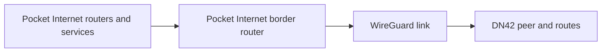

# Pocket Internet to DN42 Interconnect

Pocket Internet is a lab. DN42 is the bridge to a living network.

The interconnect is the point where packets stop being purely local lab traffic and start crossing into a shared routing ecosystem. That makes it the most important safety boundary in the book.

## Reader Starting Point

This is a later design page. It is here so the project has a clear destination, not because a new reader should implement it immediately.

Before implementing this design, the reader should already understand:

- route lookup,
- forwarding,
- return path,
- WireGuard as a link,
- BIRD and BGP at a basic level,
- import and export filters,
- authorized prefixes.

For now, read this page as a map of where Pocket Internet is going.

## Border Terms

- Border router: the router where Pocket Internet meets DN42.
- Outbound reachability: Pocket Internet sends traffic toward DN42.
- Inbound reachability: DN42 sends traffic toward a selected Pocket Internet service.
- Return path: the route a reply packet uses to get back to the original sender.
- Route advertisement: telling another router that you can carry traffic for a prefix.
- Import filter: a rule for which routes you accept from a neighbor.
- Export filter: a rule for which routes you announce to a neighbor.
- Route leak: accidentally announcing or accepting routes that should not cross the border.
- Authorized prefix: an address block you are allowed to announce.

## Goal

The first interconnect goal is outbound reachability:

```text
Pocket Internet service or host -> Pocket Internet border -> DN42 peer -> DN42 service
```

Inbound reachability is a later goal and must be authorized:

```text
DN42 node -> DN42 peer -> Pocket Internet border -> selected Pocket Internet service
```

The book should not imply that every lab address can be advertised to DN42. Only authorized prefixes should ever be exported.

## Border Model

Use a dedicated border namespace or router.



The border has two jobs:

- speak the Pocket Internet side of the lab,
- speak the DN42 side of the real peer.

Keeping those roles visible makes route leaks easier to reason about.

## Design Principles

- Pocket Internet to DN42 is a border, not a shortcut.
- Do not install a default route into DN42 unless a chapter explicitly proves why it is safe.
- Do not advertise routes into DN42 unless the prefix is authorized and filters are explicit.
- Start with outbound-only reachability from Pocket Internet toward DN42.
- Treat return path as a first-class concept.
- Prefer explicit import and export filters over permissive examples.
- Include rollback and "what could leak?" checks in every interconnect chapter.

## Return Path

A packet path is useful only if the reply can get back.

Outbound traffic from Pocket Internet to DN42 has two routing questions:

- Does Pocket Internet know how to send the packet to the border?
- Does DN42 know how to send the reply back to the source?

If the source address is private lab-only space, DN42 will not know how to return the packet. A later chapter must either use an authorized DN42 prefix, translate at the border, or choose a test where return reachability is intentionally out of scope.

## Route Advertisement

Export policy is the line between a lab and a route leak.

Before any route is advertised toward DN42, the chapter must show:

- which prefix is being advertised,
- why that prefix is authorized,
- which filter permits it,
- which filter rejects everything else,
- how to verify what BIRD will export,
- how to roll the change back.

## What This Enables

The advanced payoff is services crossing the boundary:

- Pocket Internet can reach selected DN42 services when return routing is valid.
- DN42 can reach selected Pocket Internet services only after the reader owns or is authorized to advertise the relevant prefix.
- The reader can compare lab routing behavior with real routing behavior instead of treating DN42 as a separate recipe.
