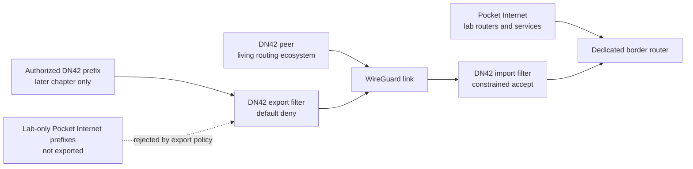

# Pocket Internet to DN42 Border

??? info "Maintainer metadata"
    ```yaml
    chapter_id: pocket-internet-dn42-border
    status: design-page
    safety_level: dn42-facing
    lab_id: none
    depends_on:
      - part-01-pocket-internet-foundations
      - later dn42 current-source refresh
    transcript: none
    source_ids:
      - dn42-getting-started
      - dn42-registry
      - dn42-network-settings
      - dn42-wireguard
      - dn42-bird2
    tested_environment:
      host: not applicable
      distro: not applicable
      kernel: not applicable
      bird: research required before implementation
      wireguard_tools: research required before implementation
    beginner_review:
      status: deferred
      note: Safety/design page; beginner review required before converting into procedure.
    technical_review:
      required: true
      status: pending
      note: Required before any DN42-facing commands, filters, or advertisements are published.
    ```

!!! warning "Design page - not a beginner lab"
    This page is a mandatory safety contract for later DN42 chapters. It is not an implementation guide, and it does not contain a complete peering procedure. Real DN42 commands must be refreshed against current sources, technically reviewed, tested, and paired with rollback before publication.

Pocket Internet is the lab. DN42 is the living network beyond the lab.

The border is where local lab reasoning meets shared routing practice. It should teach containment before connection.

This page is not a promise that the book will publish Pocket Internet routes into DN42 by default. The safer default is to keep Pocket Internet local, then use the border model to make real DN42 setup feel intuitive instead of magical.

!!! note "Default export stance"

    Pocket Internet prefixes and AS labels are lab-only unless a later DN42 chapter replaces them with authorized resources. The default border design sends no Pocket Internet routes into DN42. Any exception must name the authorized prefix, show the exact export filter, and include rollback.

## Reader Starting Point

This is a later design page. It is here so the project has a clear destination, not because a new reader should implement it immediately.

Before implementing this design, the reader should already understand:

- route lookup,
- forwarding,
- return path,
- WireGuard as a link,
- BIRD and BGP at a basic level,
- import and export filters,
- authorized prefixes.

For now, read this page as a map of where Pocket Internet is going.

## Border Terms

- Border router: the router where Pocket Internet meets DN42.
- Outbound reachability: Pocket Internet sends traffic toward DN42.
- Inbound reachability: DN42 sends traffic toward a selected service behind the border.
- Return path: the route a reply packet uses to get back to the original sender.
- Route advertisement: telling another router that you can carry traffic for a prefix.
- Import filter: a rule for which routes you accept from a neighbor.
- Export filter: a rule for which routes you announce to a neighbor.
- Route leak: accidentally announcing or accepting routes that should not cross the border.
- Authorized prefix: an address block you are allowed to announce.
- Lab-only prefix: an address block used only inside the local lab.

## Goal

The first goal is border literacy:

```text
Pocket Internet side -> border router -> DN42 side
```

The reader should be able to explain what is allowed to cross that boundary, what is blocked, and how to prove both.

Outbound reachability is a later design question:

```text
Pocket Internet service or host -> Pocket Internet border -> DN42 peer -> DN42 service
```

Inbound reachability is a later goal and must be authorized:

```text
DN42 node -> DN42 peer -> Pocket Internet border -> selected Pocket Internet service
```

The book should not imply that lab addresses can be advertised to DN42. Only authorized DN42 resources should ever be exported toward a DN42 peer.

## Border Model

Use a dedicated border namespace or router.



The border has two jobs:

- speak the Pocket Internet side of the lab,
- speak the DN42 side of the real peer.

Keeping those roles visible makes route leaks easier to reason about.

The important asymmetry is deliberate: DN42-facing import and export policy live at the border. Lab-only Pocket Internet prefixes do not cross the export filter by default.

## Design Principles

- Pocket Internet to DN42 is a border, not a shortcut.
- Pocket Internet remains the laboratory; it is not the thing being published by default.
- Do not install a default route into DN42 unless a chapter explicitly proves why it is safe.
- Do not advertise routes into DN42 unless the prefix is authorized and filters are explicit.
- Start with containment: no default route into DN42 and no Pocket Internet route export.
- Treat outbound reachability as a deliberate design, not a default assumption.
- Treat return path as a first-class concept.
- Prefer explicit import and export filters over permissive examples.
- Include rollback and "what could leak?" checks in every border chapter.

## Mandatory Border Checklist

Every later DN42-facing chapter must satisfy this checklist before it shows commands that touch a real peer, route table, tunnel, resolver path, or service exposure.

| Check | Required proof |
| --- | --- |
| No default route into DN42 | Show `ip route get 1.1.1.1` before and after the change, and confirm it still uses the normal public Internet path. |
| No Pocket Internet lab prefix export | Show that lab-only prefixes such as `172.20.0.0/16` and lab AS labels are absent from DN42-facing export policy. |
| Authorized prefix identified | Name the exact DN42 prefix or address being used and the registry/source that authorizes it. |
| Import filter default deny or constrained accept | Show the import policy rejects unexpected routes, especially default routes, unless a chapter explicitly proves why an exception is safe. |
| Export filter default deny | Show the export policy rejects everything by default and permits only the authorized prefix or route under discussion. |
| Route export dry-run shown | Show what the routing daemon would export before relying on it. |
| Rollback command shown | Show the exact command or config restore that stops the export, disables the session, or removes the route. |
| Public Internet sanity check shown | Show normal public Internet routing still avoids DN42 after the change. |

The checklist is intentionally repetitive. At a real border, repetition is cheaper than a route leak.

## Required Evidence Shapes

The exact commands will depend on the later chapter's environment and must be technically reviewed. The chapter must still include evidence with these shapes.

Public Internet route sanity check:

```sh title="Confirm public Internet traffic does not use DN42"
ip route get 1.1.1.1
```

Expected interpretation:

- the selected route uses the normal public Internet interface,
- the selected route does not use a DN42 tunnel,
- the selected route does not use a Pocket Internet lab interface.

Route export dry-run or export inspection:

```sh title="Inspect routes selected for export to the DN42 peer"
birdc show route export <dn42_bgp_protocol_name>
```

Expected interpretation:

- only authorized prefixes appear,
- lab-only prefixes do not appear,
- default routes do not appear unless the chapter explicitly proves and justifies that exception.

Rollback shape:

```sh title="Rollback shape - replace placeholders in real chapters"
birdc disable <dn42_bgp_protocol_name>
ip route get 1.1.1.1
```

Expected interpretation:

- the DN42-facing session or export path is stopped,
- normal public Internet routing remains normal,
- no unexpected DN42, public, or lab-only routes remain installed.

These are evidence shapes, not a complete procedure. A later chapter may use different commands if the platform or routing daemon differs, but it must prove the same things.

## Return Path

A packet path is useful only if the reply can get back.

Outbound traffic from Pocket Internet to DN42 has two routing questions:

- Does Pocket Internet know how to send the packet to the border?
- Does DN42 know how to send the reply back to the source?

If the source address is private lab-only space, DN42 will not know how to return the packet. A later chapter must either use an authorized DN42 prefix, translate at the border, or choose a test where return reachability is intentionally out of scope.

That is why outbound reachability is not the default first action. Without a valid return path, "send packets toward DN42" can become confusing rather than instructive.

## Route Advertisement

Export policy is the line between a lab and a route leak.

Before any route is advertised toward DN42, the chapter must show:

- which prefix is being advertised,
- why that prefix is authorized,
- which filter permits it,
- which filter rejects everything else,
- how to verify what BIRD will export,
- how to roll the change back.

For the default learning path, Pocket Internet routes are not exported toward DN42. The real DN42 chapters should use authorized DN42 resources and normal peer expectations instead of asking DN42 to accept arbitrary lab topology.

## What This Enables

The advanced payoff is understanding the boundary well enough to operate safely:

- The reader can configure a real DN42 node without treating BGP, filters, and kernel routes as recipes.
- Pocket Internet can remain a private testbed for concepts before real DN42 changes.
- Services can cross the boundary only after return path, authorization, filtering, and rollback are explicit.
- The reader can compare lab routing behavior with real routing behavior instead of treating DN42 as a separate recipe.
