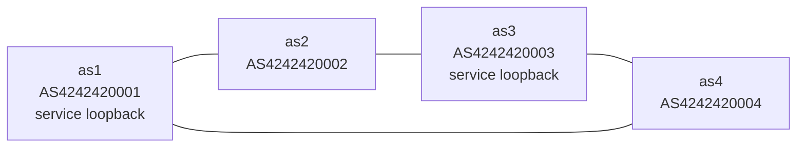

# Pocket Internet

??? info "Maintainer metadata"
    ```yaml
    chapter_id: pocket-internet-overview
    status: published-foundation
    safety_level: conceptual
    lab_id: none
    depends_on:
      - none
    transcript: none
    source_ids: []
    tested_environment:
      host: not applicable
      distro: not applicable
      kernel: not applicable
      bird: not used
      wireguard_tools: not used
    beginner_review:
      status: deferred
      note: Overview page; no formal beginner review record for this metadata pass.
    technical_review:
      required: false
      status: not_required
      note: Conceptual overview; no commands or real-network procedure.
    ```

Pocket Internet is the laboratory for this book. It is not the destination.

The guiding question is:

> How does an Internet emerge from a collection of computers exchanging routes?

Pocket Internet answers that question in a controlled environment.

The first version is simple: we build several small computers and routers inside one Linux machine. They get links between them, addresses on those links, and route tables that decide where packets go.

!!! note "Teaching simplification"
    Pocket Internet is IPv4-only in the current labs. That is a deliberate simplification, not a claim that real DN42 or public Internet routing can ignore IPv6. IPv6 and ULA belong on the path before real DN42 peering chapters become implementation-ready.

Later chapters add the pieces one at a time:

- BIRD, so route tables can be updated by a routing program,
- BGP, so routers can tell each other which addresses they can reach,
- WireGuard, so one local lab link can become a tunnel,
- DN42, so the lab can connect to a living network.

DN42 is the bridge from this laboratory to a living network. The end game is not to build a small lab and stop. The end game is to understand every component well enough to approach DN42 safely, reason about the boundary, and operate services on a real routed network.

## Mental Model



!!! note "Lab-only resources"

    The `AS424242000x` labels and Pocket Internet service addresses are local teaching resources. They make the lab look like the routing systems used later, but they are not authorization to announce anything into DN42. Until a DN42 chapter explicitly replaces them with authorized resources and explicit filters, Pocket Internet routes stay inside the lab.

Each namespace owns:

- its own interfaces,
- its own addresses,
- its own routing table,
- its own loopback addresses,
- its own BIRD instance when BGP is introduced,
- its own services when service reachability is introduced.

## Mapping

| Pocket Internet piece | Real networking idea | Later DN42 equivalent |
| --- | --- | --- |
| Linux namespace | A separate Linux networking world | A VPS, router, home gateway, or lab machine |
| veth pair | A fake cable with two ends | Physical link, virtual link, or tunnel |
| WireGuard link | An encrypted tunnel used like a link | Common DN42 peer tunnel |
| Loopback address | Stable address that stays inside one router | Address from an authorized DN42 prefix |
| Static route | Manually configured reachability | Useful baseline before dynamic routing |
| BIRD instance | Program that manages routes | DN42 BGP speaker |
| BGP session | Conversation where routers exchange reachability | DN42 peer session |
| tcpdump and logs | Visibility into packet and routing behavior | Operational troubleshooting tools |

## Learning Progression

1. Start with a host and one network stack.
2. Add links, addresses, prefixes, connected routes, and forwarding.
3. Expand into multiple routers.
4. Add loopback service addresses and static routes.
5. Break links and repair routing by hand.
6. Add longest-prefix match and route-selection experiments.
7. Add BIRD and BGP so routers exchange reachability.
8. Withdraw routes and observe convergence.
9. Build and verify a WireGuard point-to-point link.
10. Run BGP over that WireGuard link and keep the same routing model.
11. Build a border between Pocket Internet and DN42.
12. Route selected Pocket Internet traffic toward DN42.
13. Operate services across the lab-to-real-network boundary when routing and policy allow.

## Design Rule

New labs should reuse the Pocket Internet topology when possible. A one-off lab is acceptable only when it teaches a primitive that the topology depends on.

This keeps the book from becoming a pile of unrelated recipes. Each chapter adds one new behavior to the same small Internet.

## Validated Labs

- [Pocket Internet with Static Routes](part-01-first-principles/03-pocket-internet-static-routing.md): four AS-shaped namespaces, service loopbacks, static routes, link failure, and manual route repair.
- [Build and Verify a WireGuard Link](part-01-first-principles/09-wireguard-as-a-link.md): two AS-shaped namespaces, a local veth underlay, a WireGuard overlay link, route lookup checks, handshake inspection, and rollback.
- [Run BGP Over WireGuard](part-01-first-principles/10-bgp-over-wireguard.md): four AS-shaped namespaces, a local WireGuard AS2-AS3 link, BIRD/BGP over the overlay, and service-loopback traffic across the tunnel.

## Interconnect

Pocket Internet eventually gets a border to DN42. That border must be explicit and conservative:

- no accidental default route into DN42,
- no unauthorized route advertisement into DN42,
- no Pocket Internet route export by default,
- outbound reachability before inbound exposure,
- return path treated as a first-class requirement,
- rollback tested before any real peering change.

See [Pocket Internet to DN42 Border](pocket-internet-dn42-interconnect.md).
