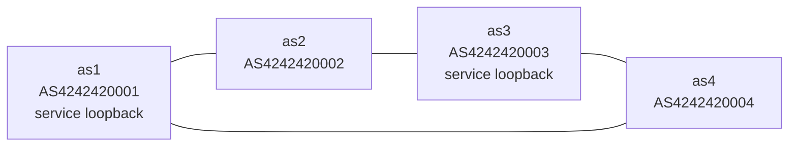

# Toy DN42

Toy DN42 is the local-first teaching environment for this book.

Before a reader touches public DN42 peers, they should build a small Internet on one Linux machine. The local version uses Linux network namespaces as routers, veth pairs as links, loopback addresses as advertised services, and BIRD as the routing speaker.

The point is not to pretend that one laptop is the Internet. The point is to make the same mechanics visible, safe, repeatable, and cheap to break.

## Mental Model

Each namespace owns:

- its own interfaces,
- its own addresses,
- its own routing table,
- its own loopback addresses,
- its own BIRD instance when BGP is introduced,
- its own services when service reachability is introduced.

## Mapping

| Toy DN42 piece | Real networking idea | Later DN42 equivalent |
| --- | --- | --- |
| Linux namespace | Router or host with its own network stack | A VPS, router, home gateway, or lab machine |
| veth pair | Local point-to-point link | Physical link, virtual link, or tunnel |
| WireGuard link | Encrypted point-to-point-ish overlay link | Common DN42 peer tunnel |
| Loopback address | Stable service or router identity address | Address from the operator's DN42 prefix |
| Static route | Manually configured reachability | Useful baseline before dynamic routing |
| BIRD instance | Routing control plane | DN42 BGP speaker |
| BGP session | Exchange of reachability between ASes | DN42 peer session |
| tcpdump and logs | Visibility into packet and routing behavior | Operational troubleshooting tools |

## Learning Progression

1. Build one routed path with namespaces, veth links, addresses, routes, and forwarding.
2. Expand the lab into a four-router Toy DN42 topology with static routes.
3. Add loopback service addresses and prove end-to-end reachability.
4. Break a link and observe why static routes do not adapt.
5. Add BIRD and BGP so routers exchange reachability.
6. Withdraw a route and observe convergence.
7. Add a second path and observe route selection.
8. Change policy intentionally with local preference or filters.
9. Replace one veth link with WireGuard and keep the same routing model.
10. Move from Toy DN42 to real DN42 registry objects, real peers, real filters, DNS, and services.

## Design Rule

New labs should reuse the Toy DN42 topology when possible. A one-off lab is acceptable only when it teaches a primitive that the topology depends on.

This keeps the book from becoming a pile of unrelated recipes. Each chapter adds one new behavior to the same small Internet.

